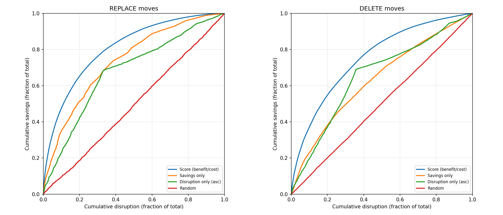

# Balanced Consolidation: Scoring Moves by Savings and Disruption

## Motivation

Today, Karpenter's consolidation is all-or-nothing. `WhenEmptyOrUnderutilized` consolidates any node where pods can be repacked more cheaply, regardless of how little is saved or how many pods are disrupted. `WhenEmpty` consolidates only nodes with no pods. A move that saves $0.02/day by evicting a pod with a 30-minute warm-up cache is treated the same as a move that saves $5/day by evicting a stateless proxy.

Terminating a non-empty node requires evicting running pods and starting replacements. Customers report cases where the disruption is not worth the savings. Related issues:

- Nodes at 93-99% CPU utilization disrupted instead of lightly utilized ones ([aws#8868](https://github.com/aws/karpenter-provider-aws/issues/8868), [kubernetes-sigs#2319](https://github.com/kubernetes-sigs/karpenter/issues/2319))
- Multi-hour consolidation loops replacing the same instance types with no net savings ([aws#8536](https://github.com/aws/karpenter-provider-aws/issues/8536), [aws#6642](https://github.com/aws/karpenter-provider-aws/issues/6642), [aws#7146](https://github.com/aws/karpenter-provider-aws/issues/7146))
- Rapid node churn where consolidation deletes nodes that are immediately re-provisioned ([kubernetes-sigs#1019](https://github.com/kubernetes-sigs/karpenter/issues/1019), [kubernetes-sigs#735](https://github.com/kubernetes-sigs/karpenter/issues/735), [kubernetes-sigs#1851](https://github.com/kubernetes-sigs/karpenter/issues/1851))
- `consolidateAfter` not preventing disruption of well-packed nodes ([kubernetes-sigs#2705](https://github.com/kubernetes-sigs/karpenter/issues/2705), [aws#3577](https://github.com/aws/karpenter-provider-aws/issues/3577))
- Direct requests for a savings threshold or utilization-based consolidation gating ([kubernetes-sigs#2883](https://github.com/kubernetes-sigs/karpenter/issues/2883), [kubernetes-sigs#1440](https://github.com/kubernetes-sigs/karpenter/issues/1440), [kubernetes-sigs#1686](https://github.com/kubernetes-sigs/karpenter/issues/1686), [kubernetes-sigs#1430](https://github.com/kubernetes-sigs/karpenter/issues/1430), [aws#5218](https://github.com/aws/karpenter-provider-aws/issues/5218))

This RFC calls each consolidation action a *move*. A move deletes one or more nodes, along with pod eviction and optional replacement node creation. We propose a new `consolidationPolicy` value, `Balanced`, that scores each move and rejects moves where the disruption outweighs the savings. A `consolidationThreshold` parameter (default 2) controls the tradeoff.

## Alternatives Considered

Five approaches were considered and rejected. Each fails to account for something the scoring approach captures.

### Cost Improvement Factor

Require a minimum price improvement ratio (e.g., old_price / new_price >= 2). Considered for spot consolidation ([spot-consolidation.md](https://github.com/kubernetes-sigs/karpenter/blob/main/designs/spot-consolidation.md)). A move that saves 50% of a node's cost passes a 2x factor whether it disrupts 2 default-cost pods or 20 high-cost pods. The factor ignores disruption entirely.

### Absolute Dollar Threshold

Require savings to exceed a fixed dollar amount (e.g., $1/day) ([kubernetes-sigs#2883](https://github.com/kubernetes-sigs/karpenter/issues/2883), [kubernetes-sigs#1440](https://github.com/kubernetes-sigs/karpenter/issues/1440)). Two moves that each save $1/day and disrupt 4 default-cost pods: on a $50/day NodePool with 40 pods, this saves 2% of cost for 10% of disruption. On a $5,000/day NodePool with 4000 pods, the same $1 saves 0.02% for 0.1% of disruption. A $1 threshold approves both. The threshold does not scale with NodePool size.

### Utilization-Based Threshold

Exclude nodes above a resource utilization percentage (e.g., 70%) from consolidation, like CA's `scale-down-utilization-threshold` ([kubernetes-sigs#1686](https://github.com/kubernetes-sigs/karpenter/issues/1686), [aws#5218](https://github.com/aws/karpenter-provider-aws/issues/5218)). This is the most frequently requested alternative. A node at 40% utilization running one pod with `pod-deletion-cost: 2147483647` (a model-serving pod with a 2-hour warm-up cache) and a node at 40% running ten stateless pods both pass a 70% threshold. The utilization threshold cannot distinguish them.

### Selective Consolidation Type Disable

Disable single-node consolidation (replace) while keeping multi-node and emptiness consolidation ([kubernetes-sigs#1430](https://github.com/kubernetes-sigs/karpenter/issues/1430), [kubernetes-sigs#684](https://github.com/kubernetes-sigs/karpenter/issues/684), [PR #1433](https://github.com/kubernetes-sigs/karpenter/pull/1433)). An m7i.2xlarge ($9.68/day) running 2 pods requesting 2 vCPU total could replace to an m7i.large ($2.42/day), saving $7.26/day for 2 pods of disruption. Disabling replace blocks this move along with every other replace, regardless of the savings-to-disruption ratio.

### Separate Disruption Cost Annotation

A dedicated `karpenter.sh/disruption-cost` annotation separate from the existing `EvictionCost` inputs. This would let application developers independently control eviction ordering and consolidation gating. We prefer reusing existing parameters. `controller.kubernetes.io/pod-deletion-cost` and pod priority already express disruption cost. A separate annotation could be introduced later if eviction ordering and consolidation gating need to diverge.

### Related Work

- [PR #2562](https://github.com/kubernetes-sigs/karpenter/pull/2562): `ConsolidationPriceImprovementFactor` field (0.0-1.0) with operator-level default and NodePool override. Cost Improvement Factor with a different UX.
- [PR #2893](https://github.com/kubernetes-sigs/karpenter/pull/2893): Decision ratio with a configurable `DecisionRatioThreshold` (default 1.0). Same scoring approach as this RFC but exposes the threshold from day one.
- [PR #2901](https://github.com/kubernetes-sigs/karpenter/pull/2901): External health signal probes on NodePools that block disruption when a probe fails. Orthogonal and complementary.
- [PR #2894](https://github.com/kubernetes-sigs/karpenter/pull/2894): Controller that automatically manages `controller.kubernetes.io/pod-deletion-cost` based on pluggable ranking strategies. Complementary.

## Proposal

### Proposed Spec

```yaml
apiVersion: karpenter.sh/v1
kind: NodePool
metadata:
  name: default
spec:
  disruption:
    consolidationPolicy: Balanced
    consolidationThreshold: 2.0
    consolidateAfter: 30s
    budgets:
    - nodes: 10%
```

`Balanced` scores each consolidation move and approves it when `score >= 1/consolidationThreshold`.

The three consolidation policies sit on a spectrum from conservative to aggressive:

| Policy | Behavior |
|---|---|
| `WhenEmpty` | Only empty nodes (emptiness controller, no scoring) |
| `Balanced` | Savings must justify disruption |
| `WhenEmptyOrUnderutilized` | Any positive savings |

`WhenEmpty` and `WhenEmptyOrUnderutilized` are implemented by their existing controllers. `Balanced` uses the scoring formula. The spectrum is conceptual — `WhenEmpty` and `WhenEmptyOrUnderutilized` are not special cases of the formula. They remain separate code paths.

`consolidationThreshold` controls how aggressively `Balanced` consolidates. Higher values approve more moves. At the default of 2, a move passes when its disruption fraction is at most 2x its savings fraction. The parameter accepts any positive real number (k=2.5 sits between k=2 and k=3). Validation rejects zero, negative values, and `consolidationThreshold` without `consolidationPolicy: Balanced`.

If an operator enables `BalancedConsolidation`, sets `consolidationPolicy: Balanced`, then disables the feature gate during rollback, the controller falls back to `WhenEmptyOrUnderutilized` behavior and sets a `ConsolidationPolicyUnsupported` status condition on the NodePool. The condition message directs the operator to change the policy or re-enable the gate. This avoids reconcile failures while making the fallback visible.

### How Scoring Works

The score compares a move's savings and disruption as fractions of NodePool totals.

#### Per-Pod Disruption Cost

[`EvictionCost`](../pkg/utils/disruption/disruption.go) starts at 1.0 per pod and adds two terms:

1. **Pod deletion cost** ([`controller.kubernetes.io/pod-deletion-cost`](https://kubernetes.io/docs/concepts/workloads/controllers/replicaset/#pod-deletion-cost)), divided by 2^27, range -16 to +16. Default 0. The ReplicaSet controller uses this for scale-down ordering; Karpenter reuses it as a disruption signal.
2. **Pod priority**, divided by 2^25, range -64 to +30. Default 0. Higher-priority pods increase their node's disruption cost.

With neither set, per-pod disruption cost is 1.0. `EvictionCost` clamps to [-10, 10]. The scoring path clamps negative values to 0 via `max(0, EvictionCost(pod))` in the per-node formula (see [NodePool Totals](#nodepool-totals)). Other consumers of `EvictionCost` (eviction ordering) still see negatives. Scoring range per pod: [0, 10].

#### Default Behavior: Savings vs. Pod Count

Most clusters today do not set `pod-deletion-cost`. When every pod has default disruption cost 1.0, the score reduces to savings-versus-pod-count. It still rejects marginal moves, but the ability to distinguish expensive-to-restart pods from cheap ones is inactive until operators or automation ([PR #2894](https://github.com/kubernetes-sigs/karpenter/pull/2894)) set per-pod costs.

#### NodePool Totals

The score normalizes savings and disruption against NodePool totals.

```
nodepool_cost = sum(node.price for node in nodepool.nodes)
nodepool_total_disruption_cost = sum(node.disruption_cost for node in nodepool.nodes)
```

Each node's disruption cost is 1.0 (per-node baseline) plus `sum(max(0, EvictionCost(pod)))` for its pods. The baseline eliminates division-by-zero for empty nodes. It is not a calibrated estimate of cordon/drain overhead. A 10-pod node has disruption cost 11; the baseline is 9% of the total. A node whose only pod has `EvictionCost = -10` has disruption cost 1.0, same as an empty node.

For cross-NodePool moves, the source pool's totals, policy, and budget govern scoring. Cross-pool DELETEs require scheduling simulation to confirm pods fit on the destination. The destination pool's budget is not consumed (it absorbs pods, not loses a node). The source pool's policy governs regardless of the destination's policy; otherwise a permissive destination could override a conservative source.

NodePool totals are snapshotted once per cycle. Later moves in the same cycle use stale totals. A move that scored 1.5 against a 100-node snapshot still passes against a 98-node pool. Moves near the boundary could flip; the next cycle corrects.

#### Calculation

```
savings = sum(deleted_node.price) - sum(created_node.price)   # price = Karpenter's pricing model (on-demand, current spot, or on-demand/10M for ODCRs)
disruption_cost = sum(max(0, EvictionCost(pod)) for pod in evicted_pods)

savings_fraction = savings / nodepool_total_cost
disruption_fraction = disruption_cost / nodepool_total_disruption_cost

score = savings_fraction / disruption_fraction
```

`evicted_pods` is all pods on deleted source nodes. Every pod is evicted regardless of where it lands. The disruption cost counts every eviction.

A move is approved when `score >= 1/k`, where k is `consolidationThreshold` (default 2). At k=2, `score >= 0.5`. Both sides are dimensionless fractions, so the score is scale-invariant (see [Scale Invariance](#scale-invariance)).

**Division-by-zero handling.** With the per-node baseline of 1.0, `disruption_cost` is always positive for any node, eliminating the zero-disruption special case. The remaining edge cases:

| savings | nodepool_total_cost | nodepool_total_disruption_cost | decision |
|---|---|---|---|
| positive | positive | positive | compute score normally |
| zero | any | any | reject (no benefit) |
| negative | any | any | reject (net loss) |
| near-zero | near-zero (ODCR pool) | any | compute normally; the 1/10M divisor cancels and the score equals the on-demand price ratio |
| any | any | zero | cannot happen (per-node baseline ensures > 0) |

See [Edge Cases](#edge-cases) for worked examples.

Feasibility checks (PDBs, `karpenter.sh/do-not-disrupt`, scheduling constraints) filter which moves can be generated. `consolidateAfter` determines which nodes are candidates. Scoring evaluates which feasible moves are worth executing. Disruption budgets gate how many execute per cycle.

### Move Score as Ranking Function

When multiple moves pass the threshold and a disruption budget limits how many execute, the score determines execution order. Today, `WhenEmptyOrUnderutilized` ranks by disruption alone (lowest first). Score-based ranking accounts for both savings and disruption. Greedy-by-ratio is the standard knapsack heuristic, [optimal for the continuous case](https://en.wikipedia.org/wiki/Continuous_knapsack_problem#Solution) and near-optimal for the discrete case when items are small relative to the budget.



The graphs show REPLACE and DELETE moves from a simulated cluster: 5000 pods with log-normal CPU/memory requests, packed across c7i/m7i/r7i instances, after 10 rounds of workload churn. Each curve shows cumulative savings vs. cumulative disruption under a different ranking strategy. At every disruption level, score-based ranking delivers more savings than the alternatives (see [`balanced-consolidation-ranking.py`](scripts/balanced-consolidation-ranking.py)).

### Edge Cases

#### Empty Nodes

An empty node has disruption cost 1.0 (baseline only). A DELETE saves the full node cost against a small disruption fraction. Empty DELETEs always pass. No special case needed.

#### Single-Node Pool

A single-node pool DELETE scores exactly 1.0 (`savings_fraction = 1.0`, `disruption_fraction = 1.0`). This passes the default threshold. Deleted pods become unschedulable and trigger a new provisioning cycle. See [Open Questions](#open-questions) for whether the formula should have a floor on pool size.

#### Near-Zero-Cost Nodes (ODCRs, Reserved Capacity)

Karpenter prices ODCRs and reserved instances at on-demand price divided by a large constant, keeping the most expensive ODCR cheaper than the cheapest spot node (see the provider's pricing implementation for the exact divisor). Within an ODCR-only pool, the divisor cancels in the score (it divides both savings and total cost). Scores equal the on-demand price ratios, so ODCR pools consolidate normally. This is correct: replacing an expensive reservation with a cheaper one frees capacity. The divided values are small but well within float64 precision.

When a positive-cost source node is consolidated and its pods land on an ODCR destination node, this is a DELETE from the source pool's perspective. The score reflects the source pool's cost structure. The destination node's near-zero cost does not affect the score.

### Candidate Filtering

Move generation is expensive (find a destination, compute replacement costs, verify scheduling). A node's best possible score is its delete ratio: a DELETE saving the full node cost with no replacement.

```
delete_ratio = (node.price / nodepool_cost) / (node.disruption_cost / nodepool_total_disruption_cost)
```

If this ratio is below 1/k, this node is not a good consolidation candidate. A DELETE saves the full node cost — a REPLACE saves strictly less because the replacement has positive cost. If the best case (DELETE) doesn't pass, nothing will. The system skips move generation for that node.

This filter applies to single-node consolidation. A group of individually-failing nodes could produce a passing batch if their combined savings outweigh combined disruption. The filter misses these opportunities. Evaluating all multi-node combinations is exponential, so the implementation takes single-node savings first and attempts multi-node moves only when single-node opportunities are exhausted.

The NodePool totals only need to be sensible relative to each other. The implementation may cache totals or estimate them from a subset of nodes, as long as cost and disruption are estimated from the same sample.

### Interaction with Existing Features

Existing feasibility checks (disruption budgets, PDBs, `consolidateAfter`, `do-not-disrupt`) are unchanged. Scoring applies only to consolidation, not to spot interruptions, expiration, or drift.

**Consolidation cycling loops.** The scoring filter is the primary mechanism that breaks cycling loops ([aws#8536](https://github.com/aws/karpenter-provider-aws/issues/8536), [aws#6642](https://github.com/aws/karpenter-provider-aws/issues/6642), [aws#7146](https://github.com/aws/karpenter-provider-aws/issues/7146)). A same-type REPLACE that saves $0 scores 0 and is rejected at any threshold. A near-zero-savings move with meaningful disruption scores below 1/k and is also rejected. These are the moves that produce multi-hour loops under `WhenEmptyOrUnderutilized`, where any positive savings (including rounding-error savings) triggers a replace. The `consolidateAfter` cooldown on destination nodes (described below) provides a secondary damping effect between rounds but is not sufficient on its own to prevent cycling.

`consolidateAfter` determines candidacy: a node whose last pod event is within the `consolidateAfter` window is not a candidate. Non-candidate nodes still contribute to the denominators, preventing the post-replacement cycle from being artificially aggressive. When a move executes, pods landing on the destination node reset its `consolidateAfter` timer, temporarily removing it from candidacy. This provides a natural cooldown between consolidation rounds.

### Observability

Approved and rejected moves are surfaced as events. Single-node moves emit on the NodeClaim. Multi-node moves emit on the NodePool (the score describes the move, not any single node).

- `ConsolidationApproved`: `"score %.2f >= threshold %.2f (consolidationThreshold: %.1f, savings %.1f%%, disruption %.1f%%)"`
- `ConsolidationRejected`: `"score %.2f < threshold %.2f (consolidationThreshold: %.1f, savings %.1f%%, disruption %.1f%%)"`

Scored moves are also logged at DEBUG level.

A Prometheus histogram `karpenter_consolidation_score` records scores by decision and NodePool, with buckets {0.1, 0.25, 0.33, 0.5, 1.0, 2.0, 5.0, 10.0}. A counter `karpenter_consolidation_moves_total` by decision and NodePool tracks move volume.

How to use these: if `moves_total{decision="rejected"}` is high and the histogram shows most rejected scores clustered just below the threshold, the operator's k is slightly too conservative — raising it by 0.5 would capture those moves. If `moves_total{decision="approved"}` is zero and `moves_total{decision="rejected"}` is also zero, there are no candidates (the cluster is well-packed or `consolidateAfter` hasn't elapsed). If approved moves are high but savings aren't materializing, kube-scheduler divergence may be undoing the moves (check for rapidly churning NodeClaims).

## Examples

All examples use the default `consolidationThreshold` of 2. The NodePool has 10 nodes: eight m7i.xlarge (4 vCPU, 16 GiB, $4.84/day) and two m7i.2xlarge (8 vCPU, 32 GiB, $9.68/day). Total NodePool cost is $58.08/day. The NodePool runs 80 pods with total disruption cost 80.

### Oversized Node (approved)

One m7i.2xlarge runs 3 pods requesting 1.5 vCPU and 6 GiB total. Disruption cost is 3. These pods fit on an m7i.large at $2.42/day. Savings is $7.26.

```
savings_fraction = 7.26 / 58.08 = 12.5%
disruption_fraction = 3 / 80 = 3.75%
score = 0.125 / 0.0375 = 3.33 > 0.5 --> approved
```

### Spare Capacity Delete (approved)

One m7i.xlarge runs 4 pods requesting 1.5 vCPU and 6 GiB. Disruption cost is 4. Another node has spare capacity. Savings is $4.84 (full node cost, no replacement needed).

```
savings_fraction = 4.84 / 58.08 = 8.3%
disruption_fraction = 4 / 80 = 5.0%
score = 0.083 / 0.05 = 1.67 > 0.5 --> approved
```

### Marginal Move (rejected)

One m7i.xlarge runs 8 pods requesting 1.8 vCPU and 7 GiB. Disruption cost is 8. The pods fit on an m7i.large at $2.42/day. Savings is $2.42.

```
savings_fraction = 2.42 / 58.08 = 4.2%
disruption_fraction = 8 / 80 = 10.0%
score = 0.042 / 0.10 = 0.42 < 0.5 --> rejected
```

### Well-Packed Node (rejected)

One m7i.xlarge runs 10 pods requesting 3.5 vCPU and 14 GiB. The smallest fitting replacement is another m7i.xlarge. Savings is $0. No threshold approves this move.

### Uniform Pool Replace (approved)

All 10 nodes are m7i.xlarge ($4.84/day each, $48.40/day total, 80 pods, disruption cost 80). One node's 8 pods fit on an m7i.large ($2.42/day). Savings is $2.42.

```
savings_fraction = 2.42 / 48.40 = 5.0%
disruption_fraction = 8 / 80 = 10.0%
score = 0.05 / 0.10 = 0.50 >= 0.5 --> approved
```

The replacement costs exactly half the original. In a uniform pool, this is the boundary at k=2: a replace that saves less than half the source node's cost is rejected. In a heterogeneous pool, the threshold depends on pool-level fractions, not per-node percentage. At k=1, the score simplifies to `1 - replacement_price / node_price`, which never reaches 1.0. k=2 is the smallest value that makes uniform-pool REPLACEs viable.

### Scale Invariance

The same oversized-node scenario on a 100-node NodePool ($580.80/day total cost, 800 total disruption cost) produces the same score:

```
savings_fraction = 7.26 / 580.80 = 1.25%
disruption_fraction = 3 / 800 = 0.375%
score = 0.0125 / 0.00375 = 3.33
```

The threshold produces the same decision regardless of NodePool size.

### Heterogeneous Disruption Cost

Two m7i.xlarge nodes each run 4 pods and can be deleted (pods fit on other nodes). Both save $4.84/day. Node A runs 4 stateless proxies with default disruption cost (total 4). Node B runs 1 stateless proxy (cost 1) and 3 model-serving pods with `pod-deletion-cost: 2147483647` (cost ~10 each, total 31). The NodePool total disruption cost is 107 (76 default-cost pods + node B's 31).

**Node A (approved):**

```
savings_fraction = 4.84 / 58.08 = 8.3%
disruption_fraction = 4 / 107 = 3.7%
score = 0.083 / 0.037 = 2.24 > 0.5 --> approved
```

**Node B (rejected):**

```
savings_fraction = 4.84 / 58.08 = 8.3%
disruption_fraction = 31 / 107 = 29.0%
score = 0.083 / 0.29 = 0.29 < 0.5 --> rejected
```

Same savings, same node count, same pod count. The score rejects node B because the model-serving pods are expensive to restart. This is the score's main advantage over alternatives that ignore disruption cost: it distinguishes nodes where disruption is cheap from nodes where it is not.

### Cross-NodePool: On-Demand and Spot

A cluster has two NodePools. The On-Demand pool has 10 m7i.xlarge nodes at $4.84/day each ($48.40/day total, 80 pods, total disruption cost 80). The Spot pool has 10 m7i.xlarge nodes at $1.45/day each ($14.50/day total, 80 pods, total disruption cost 80).

One node in each pool runs 3 pods requesting 1 vCPU. Disruption cost is 3. The pods can be absorbed by other nodes. This is a DELETE of the source node.

**On-Demand pool DELETE:**

```
savings_fraction = 4.84 / 48.40 = 10.0%
disruption_fraction = 3 / 80 = 3.75%
score = 0.10 / 0.0375 = 2.67 > 0.5 --> approved
```

**Spot pool DELETE:**

```
savings_fraction = 1.45 / 14.50 = 10.0%
disruption_fraction = 3 / 80 = 3.75%
score = 0.10 / 0.0375 = 2.67 > 0.5 --> approved
```

Both moves score identically because each node represents the same fraction of its pool's cost and disrupts the same fraction of its pool's pods.

If the Spot pool node instead runs 8 pods with disruption cost 8:

```
savings_fraction = 1.45 / 14.50 = 10.0%
disruption_fraction = 8 / 80 = 10.0%
score = 0.10 / 0.10 = 1.0 > 0.5 --> approved
```

The move is approved. To reach the 0.5 boundary, each of the 8 pods would need disruption cost 2 (disruption fraction 20%, score 0.50).

## Why k=2

The scoring formula has one free parameter: `consolidationThreshold` (k). We chose k=2 by exhaustive enumeration.

### State Space

We enumerate configurations in a bounded space using on-demand prices from three instance families in us-east-1: c7i (compute-optimized), m7i (general-purpose), and r7i (memory-optimized), medium through 4xlarge (15 price points). 1 to 6 nodes per pool, 0 to 4 pods per node, per-pod disruption cost in {1, 2, 5, 10} (max per-node disruption cost: 4 pods x 10 = 40). For each configuration, we evaluate every candidate move (Delete and Replace to every cheaper price) at every k from 1 through 5. Three families matter because cross-family replacement ratios are not power-of-2.

Properties 1-4, 6, and 7 are algebraic properties of the ratio formula and hold for any pod count — the enumeration is a sanity check, not the proof. Properties 5 and 8 are empirical results bounded by the enumerated price structure and pod counts.

### What a good scoring function does

Eight properties define what we want from the scoring formula. The first seven are about the formula itself. The eighth is about what happens over time: a REPLACE creates a new node, and that node might itself be a consolidation candidate. An m7i.xlarge replaces to m7i.large, which replaces to c7i.medium, and so on. We call this sequence a **churn chain**. A good scoring function produces churn chains that converge (reach a stable instance type) rather than cycle.

1. **Monotonicity in savings.** Cheaper replacement never makes approval harder.
2. **Monotonicity in disruption.** Higher disruption never makes approval easier.
3. **Empty nodes always deletable.** Zero disruption, positive savings: always approved.
4. **Zero-savings moves never approved.** Same-price replacement scores zero.
5. **Replaces work in uniform pools.** The minimum useful k is the smallest value where meaningful replaces pass.
6. **Skewed disruption differentiates.** High-disruption pods make their node harder to approve.
7. **Fleet size independence.** Pool size cancels algebraically in uniform pools.
8. **Bounded churn.** Churn chains converge and terminate quickly.

Properties 1-4, 6, and 7 hold at all k values (structural properties of the ratio). Properties 5 and 8 select k.

### Results

| k | min score (1/k) | approved replace pairs | new pairs vs k-1 | max churn chain |
|---|-----------------|----------------------|-----------------|-----------------|
| 1 | 1.000 | 0 | — | 0 |
| 2 | 0.500 | 78 | 78 | 4 steps |
| 3 | 0.333 | 86 | 8 | 4 steps |
| 4 | 0.250 | 95 | 9 | 9 steps |
| 5 | 0.200 | 100 | 5 | 9 steps |

At k=1, no replace is ever approved in a uniform pool. The score for a uniform-pool replace simplifies to `1 - replacement_price / node_price`, which requires a free replacement to reach 1.0.

k=2 is the smallest integer where uniform-pool REPLACEs pass. Within a single family, prices follow power-of-2 scaling, so every replacement ratio is 0.5 or less and k>=3 adds nothing. Across families, k=3 opens 8 additional cross-family pairs (e.g., c7i.large → m7i.medium at 43% savings, score 0.43) without increasing the max churn chain. k=4 opens 9 more pairs but allows 9-step churn chains that zigzag through all three families. Max chain lengths are confirmed by exhaustive DFS over all approved replacement paths, not a greedy heuristic (see [`balanced-consolidation-properties.py`](scripts/balanced-consolidation-properties.py)).

k=2 is the right default. It is the smallest value that makes within-family REPLACEs viable, and it captures all cross-family pairs where the replacement costs less than half the original. The 8 additional cross-family pairs at k=3 are available to operators who set `consolidationThreshold: 3` (see [`balanced-consolidation-properties.py`](scripts/balanced-consolidation-properties.py)).

## API Choices

### Consolidation Aggressiveness Tuning [Recommended: consolidationThreshold]

`consolidationThreshold` exposes k directly. A move passes when its disruption fraction is at most k times its savings fraction. Higher k approves more moves. k=2 for within-family replaces, k=3 for cross-family. Real-valued. Scoring properties hold for all k > 0.

Two alternatives were considered:

**Named presets (Low/Medium/High).** A `consolidationAggressiveness` enum mapping to k values (e.g., Low=1, Medium=2, High=3). This hides the math but limits choices to three points. Not preferred because the direct parameter is equally simple and more flexible.

**Continuous slider (0-100).** A percentage-based field mapping to a log-scale threshold. This adds a nonlinear transformation that obscures the underlying math. Not preferred.

### Per-NodePool vs. Per-Cluster Normalization [Recommended: Per-NodePool]

The score denominators (total cost, total disruption cost) could be computed per-NodePool or across the entire cluster. This proposal recommends per-NodePool.

Per-NodePool normalization matches Karpenter's existing architecture (policies, budgets, `consolidateAfter` are already per-NodePool). Per-cluster normalization would dilute small pool scores: a single node representing 10% of its own pool becomes 0.1% of the cluster.

Con: scores reflect relative efficiency within a pool, not absolute dollar impact. A score of 2.0 in a $50/hr pool and 2.0 in a $10,000/hr pool look identical. This does not affect behavior but limits cross-pool comparison.

### New consolidationPolicy Value with consolidationThreshold

No behavior change for existing users. Migration: change `WhenEmptyOrUnderutilized` to `Balanced`.

Con: `WhenEmpty` and `WhenEmptyOrUnderutilized` describe behavior; `Balanced` describes character. Alternatives: `Scored` (exposes implementation), `CostWeighted` (implies cost-only), `WhenWorthIt` (too informal). `Balanced` is the least-bad option.

## Backward Compatibility

- `WhenEmptyOrUnderutilized` and `WhenEmpty` are unchanged. Existing NodePool specs continue to work.
- Per-pod disruption cost is computed from the existing `controller.kubernetes.io/pod-deletion-cost` annotation and pod priority via `EvictionCost`. Pods without these inputs default to disruption cost 1.0, matching current behavior (all pods are equal).

## Open Questions

- **Is k=2 the right default?** [Why k=2](#why-k2) explains why k=2 is the smallest value that makes uniform-pool REPLACEs viable. We do not know whether k=2 works well across diverse workloads. The feature gate and opt-in rollout exist to answer this empirically.

- **Should single-node pools be exempt from scoring?** A single-node pool DELETE scores 1.0 and passes, making all pods unschedulable until provisioning creates a replacement. Disruption budgets (`nodes: 0`) prevent this today. The formula could refuse by requiring pool size > 1, but that adds a special case for something disruption budgets already handle.

- **How many customers use `pod-deletion-cost` today?** If few do, the score reduces to savings-versus-pod-count. [PR #2894](https://github.com/kubernetes-sigs/karpenter/pull/2894) would automate annotation.

- **Move quality tracking.** Annotate moved pods with the move's score. Track re-disruption rate (pods evicted again within minutes). High re-disruption means the threshold is too aggressive.

- **Async move generation.** Scoring enables a shift from synchronous per-cycle consolidation to a continuous pipeline: generate, score, enqueue by priority, execute as budget allows. This eliminates the per-cycle timeout problem.


## Frequently Asked Questions

### What happens in a uniformly inefficient cluster where no single REPLACE clears the threshold?

Every REPLACE scores low (e.g., 0.2 for a one-tier downsize) and is rejected. DELETEs still work: a DELETE of a node whose pods fit elsewhere scores 1.0 in a uniform pool. The system consolidates by deleting nodes, not replacing them. Operators who want all feasible moves can use `WhenEmptyOrUnderutilized`.

### Does the score account for kube-scheduler pod placement?

No. The score assumes pods land on the intended destination. In practice, kube-scheduler may scatter pods across existing nodes instead of packing onto the replacement. The replacement ends up nearly empty and becomes a consolidation candidate itself.

This exists in all consolidation modes. The cost threshold concentrates the remaining moves onto higher-impact candidates. The system self-corrects: a nearly-empty replacement scores as a trivial DELETE next cycle. Cascades terminate because each round has strictly fewer displaced nodes.

Configuring kube-scheduler with `MostAllocated` scoring reduces divergence.

### Why doesn't the score account for reserved instance or ODCR opportunity cost?

See [Near-Zero-Cost Nodes](#near-zero-cost-nodes-odcrs-reserved-capacity). The 1/10M factor cancels in the score, so ODCR pools consolidate using on-demand price ratios. Real opportunity cost (what freed capacity is worth to the organization) is a different question that requires billing API integration. This RFC defers opportunity-cost modeling.

### Where is the score visible?

See [Observability](#observability). DEBUG logs, NodeClaim events, and a Prometheus histogram.

### Will this become the default consolidation policy?

Not at launch. `Balanced` is opt-in behind a feature gate. Whether it becomes the default is a community decision deferred to GA graduation.

### Does constraining maximum node size improve this proposal?

Rejections are driven by high disruption fraction relative to savings fraction. A 50-pod node in a 500-pod pool has 10% disruption fraction regardless of instance type. Constraining maximum node size reduces the per-node share of pool disruption, making moves easier to approve. The formula works correctly regardless of node size. Operators can manage node size through NodePool instance-type constraints today.

## Rollout

Standard feature gate pattern (SpotToSpotConsolidation, NodeOverlay).

- **Alpha**: disabled by default. `--feature-gates BalancedConsolidation=true` to opt in.
- **Beta**: enabled by default. Disable if issues arise.
- **GA**: gate removed. Whether `Balanced` becomes the default policy is a separate decision.
