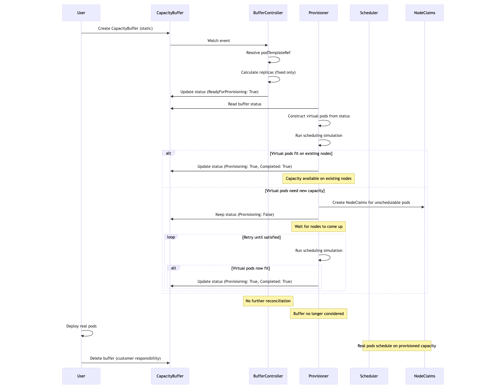

#  RFC : Capacity Buffer Support For Karpenter

# Problem

Karpenter provisions nodes just-in-time based on pending pod demand. This creates scheduling latency as pods wait for node provisioning. Users need two capabilities that don't exist today:

1. **Spare Capacity (Active Strategy)**: Pre-provision capacity so pods schedule immediately, maintaining buffer dynamically as workloads scale
2. **Capacity Request (Static Strategy)**: Request capacity once and wait for confirmation before admitting workloads (needed for Kueue integration)

**Existing Workarounds:**

Users maintain spare capacity through balloon pods, pause containers, or Static NodePools. These approaches have limitations:

- **Balloon pods**: Hard to maintain, create scheduler overhead through preemption
- **Static NodePools**: Operate at node-level, require manual capacity planning, no workload awareness
- **No standard API**: Not compatible with other autoscalers

**What's Missing:**

A pod-level capacity abstraction where users specify workload requirements and Karpenter determines optimal node configuration automatically. Integration with batch systems like Kueue requires a Static Capacity Request. These systems need to request a specific block of capacity once, receive a confirmation that the capacity exists, and then admit workloads.


The feature has been requested multiple times by the community:
- [#749](https://github.com/kubernetes-sigs/karpenter/issues/749)
- [#987](https://github.com/aws/karpenter-provider-aws/issues/987)
- [#3240](https://github.com/aws/karpenter-provider-aws/issues/3240)
- [#3384](https://github.com/aws/karpenter-provider-aws/issues/3384)
- [#4409](https://github.com/aws/karpenter-provider-aws/issues/4409)

# Goals

- Support the Kubernetes SIG Autoscaling CapacityBuffer API (`autoscaling.x-k8s.io/v1alpha1`)
- Provide pod-level capacity abstraction where users specify pod requirements and Karpenter determines optimal node configuration
- Implement two provisioning strategies:
  - **Active strategy**: Continuously maintain spare capacity that scales with workload changes
  - **Static strategy**: One-time capacity request with completion semantics for external systems
- Maintain buffer capacity through virtual pods that participate in scheduling simulation every provisioning cycle
- Preserve buffer capacity during disruption operations (consolidation, drift, expiration)

# Non-Goals

- Optimizing scheduling simulation performance for Virtual pods
- Initial implementation will only support same-namespace references for `scalableRef` and `podTemplateRef`
- Guaranteed capacity reservation: Buffers do not provide hard guarantees that capacity is reserved exclusively for specific workloads. Any pod that can schedule on buffer capacity may use it.
- Adding `expireAfter` field to the API in initial implementation (requires upstream sig-autoscaling consensus)


# Proposal

Support the Kubernetes SIG Autoscaling CapacityBuffer API (`autoscaling.x-k8s.io/v1alpha1`). This provides:

- Standard API compatible with Cluster Autoscaler
- Pod-level abstraction (specify pod requirements, not node requirements)
- Two provisioning strategies: active (spare capacity) and static (capacity request)
- Integration with external admission controllers

**Buffer Controller:**
1. Watches CapacityBuffer CRDs filtered by provisioning strategy
2. Resolves pod template from `scalableRef` or `podTemplateRef`
3. Calculates replica count from `replicas`, `percentage`, or `limits`
4. Writes to buffer status: `replicas` + `podTemplateRef`
5. Updates status conditions based on strategy

**Provisioner:**
1. Reads buffer status for active buffers
2. Constructs virtual pods in-memory (not actual pod objects)
3. Runs scheduling simulation: Can these virtual pods fit on existing nodes?
   - Yes → Virtual pods can be placed on existing capacity, set `Provisioning: True`
   - No → Create NodeClaims, keep `Provisioning: False` until nodes are available
4. Only sets buffer status to `Provisioning: True` when virtual pods can be successfully placed on existing cluster capacity without creating new NodeClaims

**Key Point:** Virtual pods are reconstructed every provisioning loop from buffer status. No pod objects are created. The `Provisioning: True` status reflects actual available capacity in the cluster, ensuring the status accurately represents whether buffer capacity is ready for use even if NodeClaims fail to provision. This allows external systems like Kueue to reliably determine when capacity is actually available.


## Provisioning Strategies

### Active Capacity (`buffer.x-k8s.io/active-capacity`) - Default


**Behavior:**
- Maintains dynamic spare capacity continuously
- Reacts to workload scaling and template changes
- Buffer size adjusts with deployment size
- Provisioner checks buffer status every provisioning cycle
- Virtual pods reconstructed each cycle to maintain capacity

**Use Cases:**
- Spare capacity / headroom for burst workloads

**Lifecycle:**
1. User creates buffer with active strategy
2. Buffer controller resolves template and calculates replicas
3. Every provisioning cycle, provisioner attempts to provision capacity
4. Status updated to `Provisioning: True` only when virtual pods can be placed on existing nodes (without new NodeClaims)
5. Buffer continuously maintains capacity, reacting to workload changes
6. User deletes buffer when no longer needed

### Static Capacity (`buffer.x-k8s.io/static-capacity`)




**Behavior:**
- Maintains fixed capacity as one-time request
- Ignores workload scaling and template changes after initial provisioning
- Buffer size remains constant and no more changes are allowed to the spec
- After capacity is provisioned, status moves to `Completed: True`
- Once completed, buffer is no longer acted upon by provisioner
- Capacity is preserved during disruption for a configurable grace period (default 1 hour)
- After grace period, capacity can be automatically consolidated
- Customer can delete buffer manually at any time

**Restrictions:**
- MUST use `podTemplateRef` (NOT `scalableRef`)
- MUST use `replicas` or `limits` (NOT `percentage`)
- Spec is immutable after creation (enforced via CEL validation)

**Rationale:** Static strategy represents a one-time immutable capacity request. The `scalableRef` and `percentage` fields imply continuous tracking of workload changes and dynamic recalculation, which conflicts with static semantics. Static buffers should define fixed capacity requirements upfront using `podTemplateRef` and explicit `replicas` or resource `limits`.

**Use Cases:**
- Capacity request pattern (Kueue integration)
- External systems requesting capacity confirmation

**Lifecycle:**
1. User creates buffer with static strategy using `podTemplateRef` + `replicas`/`limits`
2. Buffer controller resolves template and calculates replicas
3. Provisioner attempts to provision capacity
4. Status updated to `Provisioning: True` only when virtual pods can be placed on existing nodes (without new NodeClaims)
5. Status updated to `Completed: True` once capacity is satisfied
6. Buffer no longer considered by provisioner for new capacity
7. Capacity preserved during disruption for grace period (default 1 hour, configurable)
8. After grace period expires, capacity can be consolidated automatically
9. User can delete buffer manually at any time

## Supported References

**scalableRef (Active Strategy Only):**
- `apps/v1/Deployment`
- `apps/v1/StatefulSet`
- `apps/v1/ReplicaSet`
- `batch/v1/Job`
- Custom resources with scale subresource

**podTemplateRef (Both Strategies):**
- `core/v1/PodTemplate`

## CapacityBuffer Status Conditions
The CapacityBuffer uses standard Kubernetes conditions to report its state:

ReadyForProvisioning (Applies to: Active & Static)
- True: Pod template is successfully resolved and target replicas are calculated.
- False: Missing references (ScalableRefNotFound, PodTemplateNotFound), validation errors, or calculation failures.

Provisioning (Applies to: Active & Static)
- True: Capacity is actually available. Virtual pods fit onto existing nodes without requiring new NodeClaims.
- False: Virtual pods don't fit; new NodeClaims are required, limits prevent scaling (InsufficientCapacity), or provisioning failed.

Completed (Applies to: Static only)
- True: The static buffer's one-time provisioning is finished and the virtual pods are placed. The buffer is now idle and must be manually deleted.
- Note: This is never set for Active strategy buffers, as they remain continuously active.

## Replica Calculation

When both `replicas` and `percentage` are specified, use minimum:

```
result = min(replicas, percentage * currentReplicas / 100)
```

This matches Cluster Autoscaler behavior.

**Static Strategy Restriction:**
- Static strategy only supports fixed `replicas` or `limits`
- Percentage-based sizing not supported (creates ambiguity about when to recalculate)

If only limits are specified, the system will generate the maximum number of chunks (based on podTemplateRef) allowed within those constraints.

**Static Strategy Restrictions:**

Static strategy ONLY supports:
- Fixed `replicas` count, OR
- Resource `limits` (which determines maximum chunks that fit)

Static strategy does NOT support:
- `percentage` field (percentage-based sizing requires tracking workload changes)
- `scalableRef` (implies dynamic workload tracking)

**Rationale:** The `percentage` field and `scalableRef` both imply continuous tracking of workload changes and recalculation of buffer size. This conflicts with the static strategy's core semantics: a one-time immutable capacity request. Static buffers represent a fixed capacity allocation that doesn't change after initial provisioning, making percentage-based or workload-tracking approaches inappropriate.


### Provisioner Integration

**Responsibilities:**
- Read buffer status for active buffers (skip completed static buffers)
- Construct virtual pods in-memory from buffer status
- Combine virtual pods with pending user pods
- Pass combined pod list to simulate scheduling
- Update buffer status with provisioning state
- For static buffers: mark as completed if virtual pods have capacity on the cluster

**Virtual Pod Construction:**
- Virtual pods reconstructed every provisioning loop from buffer status
- Pods created in-memory only (NOT stored in etcd or cluster state)
- Deterministic UUIDs assigned for logging and observability
- No API server or etcd overhead

### Disruption Integration

**Responsibilities:**
- Include virtual buffer pods in consolidation simulation to prevent premature capacity removal
- Treat buffer pods like real pods during scheduling simulation
- Reject consolidation if buffer pods can't fit after node removal
- Provide lower disruption cost for buffer pods

**Active Buffers:**
- Virtual pods always included in disruption simulation
- Capacity continuously preserved as buffer reacts to workload changes
- Buffer remains active until explicitly deleted

**Static Buffers:**
- Virtual pods included in disruption simulation for a grace period after `Completed: True`
- Default grace period: 1 hour
- After grace period expires, buffer is no longer considered and capacity can be consolidated
- Grace period prevents consolidation from immediately removing capacity before workloads use it


**Future: expireAfter Field**

We propose adding an `expireAfter` field to the upstream CapacityBuffer API (sig-autoscaling) that would apply to both active and static strategies:
- Allows per-buffer control over capacity lifecycle
- More flexible than global configuration
- Users can set different expiration times for different buffers based on workload patterns
- Once buffer expires, it is no longer considered for provisioning or disruption protection

Until upstream consensus is reached:
- Static buffers use a configurable grace period (default 1 hour) via Karpenter settings
- Active buffers are always preserved until manually deleted


# Design Considerations

## Karpenter's Single-Loop Architecture

Karpenter uses a single provisioning loop for all scheduling decisions. This design provides several critical guarantees:
- Multiple loops could make conflicting scheduling decisions that lead to over-provisioning or resource contention.
- Cluster state needs to be consistent across scheduling decisions. A single loop ensures all scheduling decisions are made with the same view of cluster state.
- Prevents race conditions where multiple loops provision capacity for the same pods, leading to wasted resources.
- Allows optimal batching of pods for better bin-packing and more efficient node selection.

This single-loop design has important implications for buffer pods:
- All pods (real + buffer) are scheduled together in one coherent decision, ensuring optimal resource utilization.
- Cluster state remains consistent during scheduling, preventing race conditions in capacity tracking.
- The singleton pattern helps with buffer pod tracking since there's no risk of concurrent provisioning loops interfering with each other.

### Performance Trade-offs

A large number of virtual pods might increase the latency of scheduling simulation. The time to simulate and schedule grows with the number of pods being considered. We will look into improving this after running benchmarking to understand real-world performance characteristics.

**Current Approach: Stateless Virtual Pod Construction**

We reconstruct virtual pods from buffer status every provisioning cycle rather than maintaining persistent state. This approach prioritizes correctness and simplicity over performance:

**Pros:**
- No stale state: Virtual pods always reflect current buffer status
- Simpler implementation: No need to track virtual pod lifecycle

**Rationale for Current Approach:**

We are intentionally not optimizing prematurely. The cost of over-provisioning far outweighs the cost of slightly longer scheduling simulation times.
We will benchmark these targets in real-world scenarios and optimize if scheduling latency becomes a bottleneck.

## Virtual Pod Creation

Virtual pods are created in-memory (not stored in cluster state) with deterministic UUIDs for observability purposes. This provides unique identifiers for tracking buffer pods through the provisioning and disruption lifecycle.
Virtual pods are NOT stored in etcd or cluster state. They exist only in-memory during the provisioning cycle. This avoids overhead on the API server and etcd while still providing the observability benefits of unique identifiers.

**Future Consideration:** If we implement stateful virtual pod management (caching pods between cycles), the deterministic UUIDs will enable efficient state tracking without recreating pod identities.


## Open Questions

**Q: Should static strategy support percentage?**
A: No. Creates ambiguity about when to recalculate. Static strategy should only support fixed `replicas` or `limits`.

**Q: How does Karpenter determine when capacity is provisioned?**
A: Buffer status is set to `Provisioning: True` only when virtual pods can be successfully placed on existing cluster capacity without creating new NodeClaims. This ensures the status reflects actual available capacity, not pending capacity. For static strategy, `Completed: True` is also set once capacity is satisfied. This allows external systems like Kueue to reliably determine when capacity is actually ready for use, even if NodeClaim provisioning fails.

**Q: Can users switch strategies on existing buffers?**
A: No. Static strategy buffers are immutable (enforced via CEL validation) to prevent confusion and ensure predictable behavior. Once a buffer is created with a specific strategy, the strategy cannot be changed. Users must delete and recreate the buffer if they need a different strategy. Active strategy buffers allow spec updates (e.g., changing replicas or percentage) but the strategy itself cannot be changed.

**Q: What happens if buffer can't be satisfied due to NodePool limits?**
A: Buffer status reflects actual provisioned replicas may be less than requested. It is retried until replicas are satisfied. For static case, it will be retried until replicas are satisfied once. In future we can make the retry configurable.

**Q: How long should static buffer capacity be preserved during disruption?**
A: Static buffers are protected from consolidation for a configurable grace period after reaching `Completed: True`. The default grace period is 1 hour. After the grace period expires, the buffer is no longer considered and capacity can be consolidated automatically. Users can also manually delete buffers at any time. We propose adding an `expireAfter` field to the upstream CapacityBuffer API (sig-autoscaling) for per-buffer control, but this requires upstream consensus and would apply to both active and static strategies.

## Data Models

### CapacityBuffer CRD


```go
type CapacityBuffer struct {
	// Standard Kubernetes object metadata.
	metav1.TypeMeta   `json:",inline"`
	metav1.ObjectMeta `json:"metadata,omitempty" protobuf:"bytes,1,opt,name=metadata"`

	// Spec defines the desired characteristics of the buffer.
	// +kubebuilder:validation:Required
	Spec CapacityBufferSpec `json:"spec" protobuf:"bytes,2,opt,name=spec"`

	// Status represents the current state of the buffer and its readiness for autoprovisioning.
	// +optional
	Status CapacityBufferStatus `json:"status,omitempty" protobuf:"bytes,3,opt,name=status"`
}

type CapacityBufferSpec struct {
	// ProvisioningStrategy defines how the buffer is utilized.
	// "buffer.x-k8s.io/active-capacity" is the default strategy, where the buffer actively scales up the cluster by creating placeholder pods.
	// +kubebuilder:default="buffer.x-k8s.io/active-capacity"
	// +optional
	ProvisioningStrategy *string `json:"provisioningStrategy,omitempty" protobuf:"bytes,1,opt,name=provisioningStrategy"`

	// PodTemplateRef is a reference to a PodTemplate resource in the same namespace
	// that declares the shape of a single chunk of the buffer. The pods created
	// from this template will be used as placeholder pods for the buffer capacity.
	// Exactly one of `podTemplateRef`, `scalableRef` should be specified.
	// +optional
	// +kubebuilder:validation:Xor=podTemplateRef,scalableRef
	PodTemplateRef *LocalObjectRef `json:"podTemplateRef,omitempty" protobuf:"bytes,2,opt,name=podTemplateRef"`

	// ScalableRef is a reference to an object of a kind that has a scale subresource
	// and specifies its label selector field. This allows the CapacityBuffer to
	// manage the buffer by scaling an existing scalable resource.
	// Exactly one of `podTemplateRef`, `scalableRef` should be specified.
	// +optional
	// +kubebuilder:validation:Xor=podTemplateRef,scalableRef
	ScalableRef *ScalableRef `json:"scalableRef,omitempty" protobuf:"bytes,3,opt,name=scalableRef"`

	// Replicas defines the desired number of buffer chunks to provision.
	// If neither `replicas` nor `percentage` is set, as many chunks as fit within
	// defined resource limits (if any) will be created. If both are set, the maximum
	// of the two will be used.
	// +optional
	// +kubebuilder:validation:Minimum=0
	// +kubebuilder:validation:ExclusiveMinimum=false
	Replicas *int32 `json:"replicas,omitempty" protobuf:"varint,4,opt,name=replicas"`

	// Percentage defines the desired buffer capacity as a percentage of the
	// `scalableRef`'s current replicas. This is only applicable if `scalableRef` is set.
	// The absolute number of replicas is calculated from the percentage by rounding up to a minimum of 1.
	// For example, if `scalableRef` has 10 replicas and `percentage` is 20, 2 buffer chunks will be created.
	// +optional
	// +kubebuilder:validation:Minimum=0
	// +kubebuilder:validation:ExclusiveMinimum=false
	Percentage *int32 `json:"percentage,omitempty" protobuf:"varint,5,opt,name=percentage"`

	// Limits, if specified, will limit the number of chunks created for this buffer
	// based on total resource requests (e.g., CPU, memory). If there are no other
	// limitations for the number of chunks (i.e., `replicas` or `percentage` are not set),
	// this will be used to create as many chunks as fit into these limits.
	// +optional
	Limits *ResourceList `json:"limits,omitempty" protobuf:"bytes,6,opt,name=limits"`
}

// CapacityBufferStatus defines the observed state of CapacityBuffer.
type CapacityBufferStatus struct {
	// PodTemplateRef is the observed reference to the PodTemplate that was used
	// to provision the buffer. If this field is not set, and the `conditions`
	// indicate an error, it provides details about the error state.
	// +optional
	PodTemplateRef *LocalObjectRef `json:"podTemplateRef,omitempty" protobuf:"bytes,1,opt,name=podTemplateRef"`

	// Replicas is the actual number of buffer chunks currently provisioned.
	// +optional
	Replicas *int32 `json:"replicas,omitempty" protobuf:"varint,2,opt,name=replicas"`

	// PodTemplateGeneration is the observed generation of the PodTemplate, used
	// to determine if the status is up-to-date with the desired `spec.podTemplateRef`.
	// +optional
	PodTemplateGeneration *int64 `json:"podTemplateGeneration,omitempty" protobuf:"varint,3,opt,name=podTemplateGeneration"`

	// Conditions provide a standard mechanism for reporting the buffer's state.
	// The "Ready" condition indicates if the buffer is successfully provisioned
	// and active. Other conditions may report on various aspects of the buffer's
	// health and provisioning process.
	// +optional
	// +patchMergeKey=type
	// +patchStrategy=merge
	// +listType=map
	// +listMapKey=type
	Conditions []metav1.Condition `json:"conditions,omitempty" patchStrategy:"merge" patchMergeKey:"type" protobuf:"bytes,4,rep,name=conditions"`
	// ProvisioningStrategy defines how the buffer should be utilized.
	// +optional
	ProvisioningStrategy *string `json:"provisioningStrategy,omitempty" protobuf:"bytes,5,opt,name=provisioningStrategy"`
}

```

### Validation Rules

The CapacityBuffer CRD enforces static strategy restrictions through CEL validation rules:

**Static Strategy Restrictions:**

1. **Must use podTemplateRef (not scalableRef):**
```
// CEL validation rule
self.provisioningStrategy == "buffer.x-k8s.io/static-capacity" ? 
  has(self.podTemplateRef) && !has(self.scalableRef) : true
```

2. **Cannot use percentage field:**
```
// CEL validation rule
self.provisioningStrategy == "buffer.x-k8s.io/static-capacity" ? 
  !has(self.percentage) : true
```

3. **Spec immutability for static buffers:**
```
// CEL validation rule on update
self.provisioningStrategy == "buffer.x-k8s.io/static-capacity" ? 
  self.spec == oldSelf.spec : true
```


## Examples

### Example 1: Active Buffer with Fixed Replicas

**Use Case:** Maintain 5 spare pods for a web application to handle traffic spikes.

```yaml
apiVersion: autoscaling.x-k8s.io/v1alpha1
kind: CapacityBuffer
metadata:
  name: web-app-buffer
  namespace: production
spec:
  provisioningStrategy: "buffer.x-k8s.io/active-capacity"
  scalableRef:
	apiGroup: apps
	kind: Deployment
	name: web-app
  replicas: 5
```

### Example 2: Active Buffer with Percentage

**Use Case:** Maintain 20% spare capacity for a microservice that scales frequently.

```yaml
apiVersion: autoscaling.x-k8s.io/v1alpha1
kind: CapacityBuffer
metadata:
  name: api-service-buffer
  namespace: production
spec:
  provisioningStrategy: "buffer.x-k8s.io/active-capacity"
  scalableRef:
	apiGroup: apps
	kind: Deployment
	name: api-service
  percentage: 20
  replicas: 10  # Cap at 10 pods maximum
```


### Example 3: Static Buffer

**Use Case:** Request capacity before admitting a batch of ML training jobs. Capacity will be protected for the configured grace period (default 1 hour).

```yaml
apiVersion: v1
kind: PodTemplate
metadata:
  name: ml-training-template
  namespace: ml-workloads
template:
  spec:
	containers:
	- name: trainer
	  image: ml-trainer:v2
	  resources:
		requests:
		  cpu: "8"
		  memory: "32Gi"
		  nvidia.com/gpu: "1"
	nodeSelector:
	  node-type: gpu
---
apiVersion: autoscaling.x-k8s.io/v1alpha1
kind: CapacityBuffer
metadata:
  name: ml-training-capacity
  namespace: ml-workloads
spec:
  provisioningStrategy: "buffer.x-k8s.io/static-capacity"
  podTemplateRef:
	name: ml-training-template
  replicas: 10
```


### Example 4: Active Buffer with Resource Limits

**Use Case:** Maintain spare capacity up to a specific resource limit.

```yaml
apiVersion: v1
kind: PodTemplate
metadata:
  name: worker-template
  namespace: workers
template:
  spec:
	containers:
	- name: worker
	  image: worker:latest
	  resources:
		requests:
		  cpu: "2"
		  memory: "4Gi"
---
apiVersion: autoscaling.x-k8s.io/v1alpha1
kind: CapacityBuffer
metadata:
  name: worker-buffer
  namespace: workers
spec:
  provisioningStrategy: "buffer.x-k8s.io/active-capacity"
  podTemplateRef:
	name: worker-template
  limits:
	cpu: "20"
	memory: "40Gi"
```


### Testing Strategy

For testing, we will add comprehensive integration tests to ensure the feature works correctly across different scenarios:
- Active buffer scales with deployment
- Static buffer completes and becomes immutable
- Buffer respects NodePool limits
- Consolidation preserves active buffer capacity
- Static buffer retry until satisfied

### Observability

Controller-runtime metrics already provide baseline visibility into reconcile performance and errors. We will have status fields to let customers know the status of the buffer.


# Alternatives

### Alternative 1: Balloon Pods/Deployments

**Pros:**
- Simple to implement (no new CRDs or controllers)
- Works with any Kubernetes cluster
- Actual pods visible in cluster

**Cons:**
- **Scheduler overhead from preemption**: When real pods need capacity, the scheduler must preempt balloon pods, which adds latency and computational overhead. The scheduler evaluates preemption candidates, selects victims, evicts pods, and waits for termination before scheduling real pods.
- **Manual maintenance**: Users must manually size balloon pods to match workload requirements and update them when workload specs change
- **No workload awareness**: Balloon pods don't automatically adapt to deployment scaling or template changes
- **Resource waste**: Balloon pods consume actual pod objects, etcd storage, and kubelet resources
- **Difficult to manage at scale**: With multiple node types or instance families, users need separate balloon deployments for each, creating management overhead
- **No standard API**: Each user implements their own balloon pod strategy, making it hard to integrate with external systems like Kueue

**Why CapacityBuffer is better:**
- Virtual pods avoid scheduler preemption overhead (no actual pods to evict)
- Automatic adaptation to workload changes (active strategy)
- Pod-level abstraction with automatic node selection
- Standard API compatible with Cluster Autoscaler
- Clear semantics for capacity requests (static strategy)


## References

- [Cluster Autoscaler Buffer Proposal](https://github.com/kubernetes/autoscaler/blob/master/cluster-autoscaler/proposals/buffers.md)
- [CapacityBuffer CRD](https://github.com/kubernetes/autoscaler/tree/master/cluster-autoscaler/apis/capacitybuffer)
- [Karpenter Issue #2571](https://github.com/kubernetes-sigs/karpenter/issues/2571)
