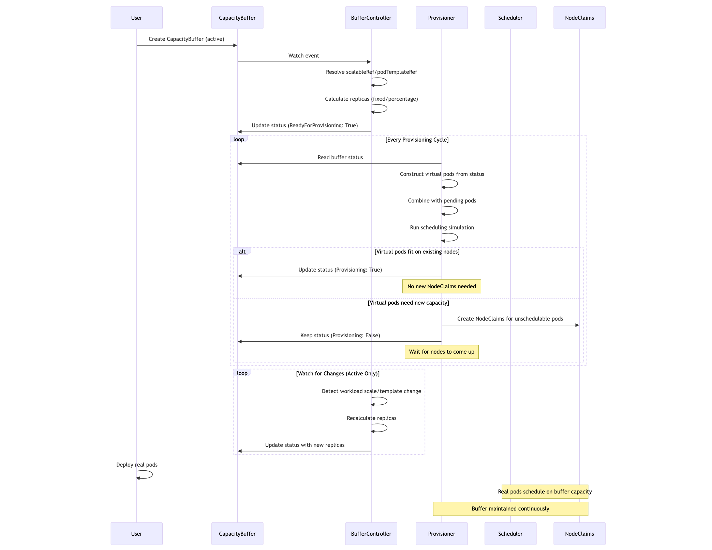

#  RFC : Capacity Buffer Support For Karpenter

# Problem

Karpenter provisions nodes just-in-time based on pending pod demand. This creates scheduling latency as pods wait for node provisioning. Users need the ability to pre-provision spare capacity so pods can schedule immediately, with the buffer dynamically maintaining capacity as workloads scale.

**Existing Workarounds:**

Users maintain spare capacity through balloon pods, pause containers, or NodePools with fixed capacity. These approaches have limitations:

- **Balloon pods**: Hard to maintain, create scheduler overhead through preemption
- **Fixed NodePools**: Operate at node-level, require manual capacity planning, no workload awareness
- **No standard API**: Not compatible with other autoscalers

**What's Missing:**

A pod-level capacity abstraction where users specify workload requirements and Karpenter determines optimal node configuration automatically. This should dynamically adjust as workloads scale and integrate with the standard Kubernetes SIG Autoscaling CapacityBuffer API.

The feature has been requested multiple times by the community:
- [#749](https://github.com/kubernetes-sigs/karpenter/issues/749)
- [#987](https://github.com/aws/karpenter-provider-aws/issues/987)
- [#3240](https://github.com/aws/karpenter-provider-aws/issues/3240)
- [#3384](https://github.com/aws/karpenter-provider-aws/issues/3384)
- [#4409](https://github.com/aws/karpenter-provider-aws/issues/4409)

# Goals

- Support the Kubernetes SIG Autoscaling CapacityBuffer API (`autoscaling.x-k8s.io/v1alpha1`)
- Provide pod-level capacity abstraction where users specify pod requirements and Karpenter determines optimal node configuration
- Implement active buffer strategy: Continuously maintain spare capacity that scales with workload changes
- Maintain buffer capacity through virtual pods that participate in scheduling simulation every provisioning cycle
- Preserve buffer capacity during disruption operations (consolidation, drift, expiration)

# Non-Goals

- Optimizing scheduling simulation performance for Virtual pods (will measure and optimize if needed)
- Initial implementation will only support same-namespace references for `scalableRef` and `podTemplateRef`
- Guaranteed capacity reservation: Buffers do not provide hard guarantees that capacity is reserved exclusively for specific workloads. Any pod that can schedule on buffer capacity may use it.
- Static capacity strategy: One-time capacity request pattern for batch systems like Kueue (deferred to future work)
- Adding `expireAfter` field to the API in initial implementation (requires upstream sig-autoscaling consensus)

# Future Work

**Static Capacity Strategy:**

After the initial active buffer implementation, we will implement static capacity strategy to support batch systems like Kueue. Static strategy will provide:
- One-time capacity request with completion semantics
- Integration with external admission controllers

This is deferred to allow us to:
- Validate the active buffer implementation first
- Gather user feedback on the core functionality
- Drive consensus with sig-autoscaling on static strategy semantics

**fulfilledBy Field (Capacity Tracking):**

We propose adding a `fulfilledBy` field to track which pods are consuming buffer capacity. This would provide:

**Functionality:**
- Selector-based mechanism to identify pods that fulfill buffer capacity
- Automatic tracking of buffer capacity consumption as matching pods schedule
- Status field showing which pods are currently using buffer capacity
- Enables more intelligent buffer sizing and capacity planning

**Use Cases:**
- Visibility into which workloads are using pre-provisioned capacity
- Automatic buffer adjustment as matching pods consume capacity
- Better integration with batch schedulers that need to know capacity allocation
- Debugging and observability for capacity utilization

**Example:**
```yaml
apiVersion: autoscaling.x-k8s.io/v1alpha1
kind: CapacityBuffer
metadata:
  name: web-app-buffer
spec:
  provisioningStrategy: "buffer.x-k8s.io/active-capacity"
  scalableRef:
	apiGroup: apps
	kind: Deployment
	name: web-app
  replicas: 5
  fulfilledBy:  # Future field
	matchLabels:
	  app: web-app
	  tier: frontend
status:
  replicas: 5
  fulfilledBy:  # Future status field
	- name: web-app-abc123
	  namespace: production
	  uid: 12345-67890
	  resources:
		cpu: "1"
		memory: "2Gi"
	- name: web-app-def456
	  namespace: production
	  uid: 67890-12345
	  resources:
		cpu: "1"
		memory: "2Gi"
```

**Implementation Considerations:**
- Requires tracking pod-to-buffer mappings in memory
- Need to handle pod lifecycle events (creation, deletion, updates)
- Should work with both `scalableRef` and `podTemplateRef`
- Performance impact of selector evaluation on every pod event

**Rationale for Deferring:**
- Adds complexity to initial implementation
- Requires careful design around selector semantics
- Can be added incrementally without breaking existing buffers
- Want to validate core buffer functionality first before adding tracking

# Proposal

Support the Kubernetes SIG Autoscaling CapacityBuffer API (`autoscaling.x-k8s.io/v1alpha1`) with active buffer strategy. This provides:

- Standard API compatible with Cluster Autoscaler
- Pod-level abstraction (specify pod requirements, not node requirements)
- Dynamic spare capacity that scales with workload changes
- Integration with Karpenter's provisioning and disruption systems

To achieve this we will 

**Add a new Buffer Controller:**
1. Watches CapacityBuffer CRDs
2. Resolves pod template from `scalableRef` or `podTemplateRef`
3. Calculates replica count from `replicas`, `percentage`, or `limits`
4. Writes to buffer status: `replicas` + `podTemplateRef`
5. Updates status conditions

**Make changes to existing Provisioner:**
1. Reads buffer status for active buffers
2. Constructs virtual pods in-memory (not actual pod objects)
3. Runs scheduling simulation: Can these virtual pods fit on existing nodes?
   - Yes → Virtual pods can be placed on existing capacity, set `Provisioning: True`
   - No → Create NodeClaims, keep `Provisioning: False` until nodes are available
4. Only sets buffer status to `Provisioning: True` when virtual pods can be successfully placed on existing cluster capacity without creating new NodeClaims

**Key Point:** Virtual pods are reconstructed every provisioning loop from buffer status. No pod objects are created. The `Provisioning: True` status reflects actual available capacity in the cluster, ensuring the status accurately represents whether buffer capacity is ready for use even if NodeClaims fail to provision. This allows external systems like Kueue to reliably determine when capacity is actually available.


## Provisioning Strategies

## Active Capacity Buffer



**Behavior:**
- Maintains dynamic spare capacity continuously
- Reacts to workload scaling and template changes
- Buffer size adjusts with deployment size when using `percentage`
- Provisioner checks buffer status every provisioning cycle
- Virtual pods reconstructed each cycle to maintain capacity
- Buffer remains active until explicitly deleted

**Use Cases:**
- Spare capacity / headroom for burst workloads
- Pre-warming capacity for predictable traffic spikes
- Reducing pod scheduling latency for critical applications

**Lifecycle:**
1. User creates buffer (provisioningStrategy defaults to `buffer.x-k8s.io/active-capacity`)
2. Buffer controller resolves template and calculates replicas
3. Every provisioning cycle, provisioner attempts to provision capacity
4. Status updated to `Provisioning: True` only when virtual pods can be placed on existing nodes (without new NodeClaims)
5. Buffer continuously maintains capacity, reacting to workload changes
6. User deletes buffer when no longer needed

## Supported References

**scalableRef:**
- `apps/v1/Deployment`
- `apps/v1/StatefulSet`
- `apps/v1/ReplicaSet`
- `batch/v1/Job`
- Custom resources with scale subresource

**podTemplateRef:**
- `core/v1/PodTemplate`

### Caveat: ScalableRef Pod Template Resolution

The scale subresource offers a selector to find pods created by a given resource. In the initial implementation, we will assume that all pods are homogeneous with an exception to admission hook changes. Therefore, we will take the most recent pod matching this selector to derive the pod template.

**Important Limitation:** This means that the buffer will not initialize until at least one pod of the target workload exists in the cluster. The buffer controller needs an actual pod to extract the template from.

**Future Improvements:**
- We can predict the pod spec for known workload definitions (like Deployment, Job, or ReplicaSet) by directly reading the workload's pod template spec, eliminating the need for an existing pod
- We can implement better support for popular community-owned controllers like LeaderWorkerSet where the assumption that all pods are homogeneous is incorrect

**Current Assumption:** The implementation assumes that pods run as part of a scale subresource are homogeneous (identical pod specs across all replicas).

## CapacityBuffer Status Conditions

The CapacityBuffer uses standard Kubernetes conditions to report its state:

**ReadyForProvisioning:**
- True: Pod template is successfully resolved and target replicas are calculated
- False: Missing references (ScalableRefNotFound, PodTemplateNotFound), validation errors, or calculation failures

**Provisioning:**
- True: Capacity is actually available. Virtual pods fit onto existing nodes without requiring new NodeClaims
- False: Virtual pods don't fit; new NodeClaims are required, limits prevent scaling (InsufficientCapacity), or provisioning failed

## Replica Calculation

When both `replicas` and `percentage` are specified, use minimum to match Cluster Autoscaler behavior. When only `limits` is specified then we determine the chunks that fit based on the ref.


## Provisioner Integration

**Responsibilities:**
- Read buffer status for active buffers
- Construct virtual pods in-memory from buffer status
- Combine virtual pods with pending user pods
- Pass combined pod list to simulate scheduling
- Update buffer status with provisioning state

**Virtual Pod Construction:**
- Virtual pods reconstructed every provisioning loop from buffer status
- Pods created in-memory only (NOT stored in etcd or cluster state)
- Deterministic UUIDs assigned for logging and observability
- No API server or etcd overhead

## Disruption Integration

**Responsibilities:**
- Include virtual buffer pods in consolidation simulation to prevent premature capacity removal
- Treat buffer pods like real pods during scheduling simulation
- Reject consolidation if buffer pods can't fit after node removal
- Provide lower disruption cost for buffer pods
	- During consolidation, Karpenter prefers to disrupt nodes with buffer pods over nodes with real workloads
	- Real workloads are prioritized for stability; buffer capacity is more flexible

**Active Buffers:**
- Virtual pods always included in disruption simulation
- Capacity continuously preserved as buffer reacts to workload changes
- Buffer remains active until explicitly deleted
- Virtual pods included in disruption simulation for a grace period after `Completed: True`
- Default grace period: 1 hour
- After grace period expires, buffer is no longer considered and capacity can be consolidated
- Grace period prevents consolidation from immediately removing capacity before workloads use it
	- The grace period is tracked from the timestamp when `Completed: True` condition is set in the buffer status. This ensures:
		- Time starts only after capacity is actually available
		- Buffers that take longer to provision don't have reduced protection time


## Design Considerations

### Karpenter's Single-Loop Architecture

Karpenter uses a single provisioning loop for all scheduling decisions. This single-loop design has important implications for buffer pods:
- All pods (real + buffer) are scheduled together in one coherent decision, ensuring optimal resource utilization.
- Cluster state remains consistent during scheduling, preventing race conditions in capacity tracking.
- The singleton pattern helps with buffer pod tracking since there's no risk of concurrent provisioning loops interfering with each other.

### Performance Trade-offs

A large number of virtual pods might increase the latency of scheduling simulation. The time to simulate and schedule grows with the number of pods being considered. We will look into improving this after running benchmarking to understand real-world performance characteristics.

**Current Approach: Stateless Virtual Pod Construction**

We reconstruct virtual pods from buffer status every provisioning cycle rather than maintaining persistent state. This approach prioritizes correctness and simplicity over performance:

**Pros:**
- No stale state: Virtual pods always reflect current buffer status
- Simpler implementation: No need to track virtual pod lifecycle

**Rationale for Current Approach:**

We are intentionally not optimizing prematurely. The cost of over-provisioning far outweighs the cost of slightly longer scheduling simulation times.
We will benchmark these targets in real-world scenarios and optimize if scheduling latency becomes a bottleneck.

### Virtual Pod Creation

Virtual pods are created in-memory (not stored in cluster state) with deterministic UUIDs for observability purposes. This provides unique identifiers for tracking buffer pods through the provisioning and disruption lifecycle.
Virtual pods are NOT stored in etcd or cluster state. They exist only in-memory during the provisioning cycle. This avoids overhead on the API server and etcd while still providing the observability benefits of unique identifiers.

**Future Consideration:** If we implement stateful virtual pod management (caching pods between cycles), the deterministic UUIDs will enable efficient state tracking without recreating pod identities.


## Open Questions

**Q: How does Karpenter determine when capacity is provisioned?**
A: Buffer status is set to `Provisioning: True` only when virtual pods can be successfully placed on existing cluster capacity without creating new NodeClaims. This ensures the status reflects actual available capacity, not pending capacity. This allows external systems to reliably determine when capacity is actually ready for use, even if NodeClaim provisioning fails.

**Q: Can users update buffer specs?**
A: Yes, active buffers allow spec updates (e.g., changing replicas or percentage). The buffer controller will recalculate and update the status, and the provisioner will adjust capacity accordingly in the next cycle.

**Q: What happens if buffer can't be satisfied due to NodePool limits?**
A: Buffer status reflects actual provisioned replicas may be less than requested. The provisioner will continue to retry provisioning in subsequent cycles. In the future, we can make the retry behavior configurable.


## Data Models

### CapacityBuffer CRD


```go
type CapacityBuffer struct {
	// Standard Kubernetes object metadata.
	metav1.TypeMeta   `json:",inline"`
	metav1.ObjectMeta `json:"metadata,omitempty" protobuf:"bytes,1,opt,name=metadata"`

	// Spec defines the desired characteristics of the buffer.
	// +kubebuilder:validation:Required
	Spec CapacityBufferSpec `json:"spec" protobuf:"bytes,2,opt,name=spec"`

	// Status represents the current state of the buffer and its readiness for autoprovisioning.
	// +optional
	Status CapacityBufferStatus `json:"status,omitempty" protobuf:"bytes,3,opt,name=status"`
}

type CapacityBufferSpec struct {
	// ProvisioningStrategy defines how the buffer is utilized.
	// "buffer.x-k8s.io/active-capacity" is the default strategy, where the buffer actively scales up the cluster by creating placeholder pods.
	// +kubebuilder:default="buffer.x-k8s.io/active-capacity"
	// +optional
	ProvisioningStrategy *string `json:"provisioningStrategy,omitempty" protobuf:"bytes,1,opt,name=provisioningStrategy"`

	// PodTemplateRef is a reference to a PodTemplate resource in the same namespace
	// that declares the shape of a single chunk of the buffer. The pods created
	// from this template will be used as placeholder pods for the buffer capacity.
	// Exactly one of `podTemplateRef`, `scalableRef` should be specified.
	// +optional
	// +kubebuilder:validation:Xor=podTemplateRef,scalableRef
	PodTemplateRef *LocalObjectRef `json:"podTemplateRef,omitempty" protobuf:"bytes,2,opt,name=podTemplateRef"`

	// ScalableRef is a reference to an object of a kind that has a scale subresource
	// and specifies its label selector field. This allows the CapacityBuffer to
	// manage the buffer by scaling an existing scalable resource.
	// Exactly one of `podTemplateRef`, `scalableRef` should be specified.
	// +optional
	// +kubebuilder:validation:Xor=podTemplateRef,scalableRef
	ScalableRef *ScalableRef `json:"scalableRef,omitempty" protobuf:"bytes,3,opt,name=scalableRef"`

	// Replicas defines the desired number of buffer chunks to provision.
	// If neither `replicas` nor `percentage` is set, as many chunks as fit within
	// defined resource limits (if any) will be created. If both are set, the maximum
	// of the two will be used.
	// +optional
	// +kubebuilder:validation:Minimum=0
	// +kubebuilder:validation:ExclusiveMinimum=false
	Replicas *int32 `json:"replicas,omitempty" protobuf:"varint,4,opt,name=replicas"`

	// Percentage defines the desired buffer capacity as a percentage of the
	// `scalableRef`'s current replicas. This is only applicable if `scalableRef` is set.
	// The absolute number of replicas is calculated from the percentage by rounding up to a minimum of 1.
	// For example, if `scalableRef` has 10 replicas and `percentage` is 20, 2 buffer chunks will be created.
	// +optional
	// +kubebuilder:validation:Minimum=0
	// +kubebuilder:validation:ExclusiveMinimum=false
	Percentage *int32 `json:"percentage,omitempty" protobuf:"varint,5,opt,name=percentage"`

	// Limits, if specified, will limit the number of chunks created for this buffer
	// based on total resource requests (e.g., CPU, memory). If there are no other
	// limitations for the number of chunks (i.e., `replicas` or `percentage` are not set),
	// this will be used to create as many chunks as fit into these limits.
	// +optional
	Limits *ResourceList `json:"limits,omitempty" protobuf:"bytes,6,opt,name=limits"`
}

// CapacityBufferStatus defines the observed state of CapacityBuffer.
type CapacityBufferStatus struct {
	// PodTemplateRef is the observed reference to the PodTemplate that was used
	// to provision the buffer. If this field is not set, and the `conditions`
	// indicate an error, it provides details about the error state.
	// +optional
	PodTemplateRef *LocalObjectRef `json:"podTemplateRef,omitempty" protobuf:"bytes,1,opt,name=podTemplateRef"`

	// Replicas is the actual number of buffer chunks currently provisioned.
	// +optional
	Replicas *int32 `json:"replicas,omitempty" protobuf:"varint,2,opt,name=replicas"`

	// PodTemplateGeneration is the observed generation of the PodTemplate, used
	// to determine if the status is up-to-date with the desired `spec.podTemplateRef`.
	// +optional
	PodTemplateGeneration *int64 `json:"podTemplateGeneration,omitempty" protobuf:"varint,3,opt,name=podTemplateGeneration"`

	// Conditions provide a standard mechanism for reporting the buffer's state.
	// The "Ready" condition indicates if the buffer is successfully provisioned
	// and active. Other conditions may report on various aspects of the buffer's
	// health and provisioning process.
	// +optional
	// +patchMergeKey=type
	// +patchStrategy=merge
	// +listType=map
	// +listMapKey=type
	Conditions []metav1.Condition `json:"conditions,omitempty" patchStrategy:"merge" patchMergeKey:"type" protobuf:"bytes,4,rep,name=conditions"`
	// ProvisioningStrategy defines how the buffer should be utilized.
	// +optional
	ProvisioningStrategy *string `json:"provisioningStrategy,omitempty" protobuf:"bytes,5,opt,name=provisioningStrategy"`
}

```


## Examples

### Example 1: Active Buffer with Fixed Replicas

**Use Case:** Maintain 5 spare pods for a web application to handle traffic spikes.

```yaml
apiVersion: autoscaling.x-k8s.io/v1alpha1
kind: CapacityBuffer
metadata:
  name: web-app-buffer
  namespace: production
spec:
  provisioningStrategy: "buffer.x-k8s.io/active-capacity"
  scalableRef:
	apiGroup: apps
	kind: Deployment
	name: web-app
  replicas: 5
```

### Example 2: Active Buffer with Percentage

**Use Case:** Maintain 20% spare capacity for a microservice that scales frequently.

```yaml
apiVersion: autoscaling.x-k8s.io/v1alpha1
kind: CapacityBuffer
metadata:
  name: api-service-buffer
  namespace: production
spec:
  provisioningStrategy: "buffer.x-k8s.io/active-capacity"
  scalableRef:
	apiGroup: apps
	kind: Deployment
	name: api-service
  percentage: 20
  replicas: 10  # Cap at 10 pods maximum
```


### Example 3: Active Buffer with PodTemplate

**Use Case:** Maintain spare capacity for batch processing jobs. Capacity will be continuously maintained until buffer is deleted.

```yaml
apiVersion: v1
kind: PodTemplate
metadata:
  name: batch-job-template
  namespace: batch-workloads
template:
  spec:
	containers:
	- name: processor
	  image: batch-processor:v2
	  resources:
		requests:
		  cpu: "4"
		  memory: "16Gi"
	nodeSelector:
	  workload-type: batch
---
apiVersion: autoscaling.x-k8s.io/v1alpha1
kind: CapacityBuffer
metadata:
  name: batch-job-capacity
  namespace: batch-workloads
spec:
  provisioningStrategy: "buffer.x-k8s.io/active-capacity"
  podTemplateRef:
	name: batch-job-template
  replicas: 5
```


### Example 4: Active Buffer with Resource Limits

**Use Case:** Maintain spare capacity up to a specific resource limit.

```yaml
apiVersion: v1
kind: PodTemplate
metadata:
  name: worker-template
  namespace: workers
template:
  spec:
	containers:
	- name: worker
	  image: worker:latest
	  resources:
		requests:
		  cpu: "2"
		  memory: "4Gi"
---
apiVersion: autoscaling.x-k8s.io/v1alpha1
kind: CapacityBuffer
metadata:
  name: worker-buffer
  namespace: workers
spec:
  provisioningStrategy: "buffer.x-k8s.io/active-capacity"
  podTemplateRef:
	name: worker-template
  limits:
	cpu: "20"
	memory: "40Gi"
```


## Testing Strategy

For testing, we will add comprehensive integration tests to ensure the feature works correctly across different scenarios:
- Active buffer scales with deployment changes
- Active buffer reacts to percentage-based sizing
- Buffer respects NodePool limits
- Consolidation preserves active buffer capacity
- Buffer status accurately reflects provisioning state
- Virtual pod construction and lifecycle
- Multiple buffers with different configurations

## Observability

Controller-runtime metrics already provide baseline visibility into reconcile performance and errors. We will have status fields to let customers know the status of the buffer.


# Alternatives

### Alternative 1: Balloon Pods/Deployments


**Why CapacityBuffer is better:**
- Virtual pods avoid scheduler preemption overhead (no actual pods to evict)
- Automatic adaptation to workload changes
- Pod-level abstraction with automatic node selection
- Standard API compatible with Cluster Autoscaler
- Clear semantics for maintaining spare capacity


## References

- [Cluster Autoscaler Buffer Proposal](https://github.com/kubernetes/autoscaler/blob/master/cluster-autoscaler/proposals/buffers.md)
- [CapacityBuffer CRD](https://github.com/kubernetes/autoscaler/tree/master/cluster-autoscaler/apis/capacitybuffer)
- [Karpenter Issue #2571](https://github.com/kubernetes-sigs/karpenter/issues/2571)
