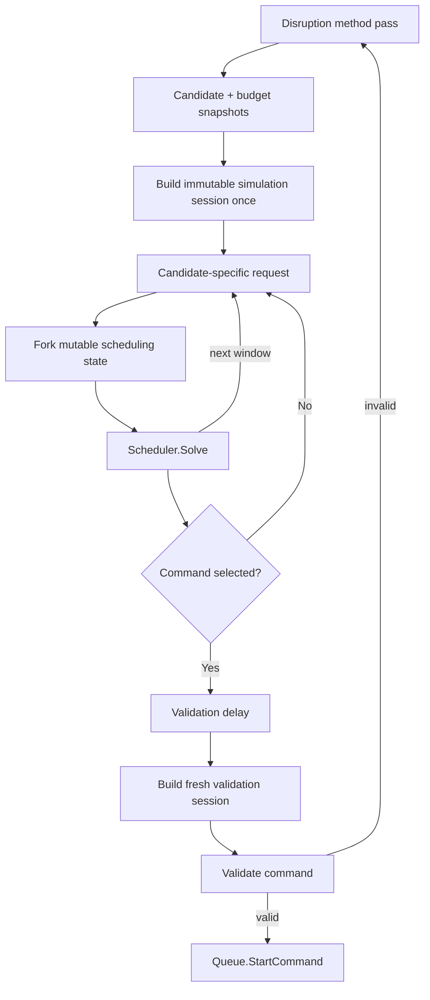

# Consolidation Simulation Efficiency

Reuse immutable scheduling inputs within one disruption method pass so consolidation does not
rebuild cluster-wide scheduler state for every candidate window.

## Motivation

Consolidation repeatedly calls `SimulateScheduling` while searching for a command. Every call
currently pays cluster-sized setup costs:

1. copy the cluster node snapshot;
2. list or resolve scheduler catalog inputs;
3. rebuild topology state;
4. rebuild NodeClaim templates and daemon overhead groups;
5. rebuild existing-node scheduling representations; and
6. create fresh mutable scheduler state before calling `Solve`.

Most of this work is independent of the candidate or candidate window being evaluated.

[High CPU usage during node consolidation at scale
(#2972)](https://github.com/kubernetes-sigs/karpenter/issues/2972) measured the effect on a
500-node cluster. `NewScheduler` accounted for 78.85% of `SimulateScheduling` CPU,
`DeepCopyNodes` accounted for 18.95%, and `Scheduler.Solve` accounted for 1.12%. Allocations
during construction also drove GC load.

The candidate window is small compared with the state rebuilt around it. Reusing immutable
prepared state therefore saves more CPU than optimizing `Solve`.

[PR #3240](https://github.com/kubernetes-sigs/karpenter/pull/3240) explored removing repeated
deep copies through copy-on-write cluster state. Its reported end-to-end improvement was
about 12-29%, which fits deep copy being a real cost but smaller than scheduler
construction. It also made the high-churn pod update path about 1.6 times slower and required
copy-on-write correctness across every cluster-state mutation. This RFC keeps deep-copy
removal as a complementary optimization rather than making it a prerequisite.

### Use Cases

1. **Multi-node binary search.** A method pass evaluates several overlapping windows from the
   same candidate and cluster snapshots. Each window should pay for candidate-specific state,
   not reconstruct identical NodePool, instance-type, daemon, existing-node, and topology
   inputs.
2. **Single-node consolidation at scale.** A cluster with hundreds of candidates may run one
   simulation per candidate. Prepared cluster-wide state should be reused while preserving a
   fresh mutable solve for every candidate.
3. **Long-running method passes.** A method may spend tens of seconds searching. It needs one
   consistent snapshot for the pass and defined behavior when that snapshot goes stale, instead
   of rereading shared mutable state on every scheduler build.
4. **Validation after selection.** A command selected from reusable evaluation state must
   still be revalidated against fresh cluster, pod, PDB, provider, topology, and DRA state
   after the validation delay.

### Non-Goals

- Changing candidate ordering, binary search, scoring, consolidation policy, or selected
  commands.
- Parallelizing candidate simulations.
- Sharing a mutable `Scheduler`, `Topology`, `ExistingNode`, allocator, or reservation manager
  between simulations.
- Caching scheduler state across disruption passes, controller replicas, or process restarts.
- Removing the validation delay or replacing validation with snapshot generation checks.
- Redesigning `Cluster` around copy-on-write state or removing `DeepCopyNodes` globally.
- Changing CRDs, disruption budgets, PDB handling, or `terminationGracePeriod`.
- Optimizing scheduling algorithms inside `Solve`.
- Reusing evaluation state for provisioning.

## Proposal

Introduce a pass-scoped `SimulationSession` that owns one coherent snapshot and prepared,
immutable scheduler inputs. Every candidate simulation forks fresh mutable state from the
session. The session is discarded when the method pass completes.

The first version targets consolidation evaluation. Validation always creates a new session
after the validation delay. Drift replacement may adopt the same abstraction later. Its
current `driftReplacementSimulator` already reuses one catalog for a whole pass and runs a
fresh solve per simulation.

There are no user-facing API changes. The change ships behind the alpha
`DisruptionSimulationReuse` feature gate, disabled by default.

### Proposed Spec

There are no CRD, annotation, or CLI additions other than the standard feature gate:

```text
--feature-gates DisruptionSimulationReuse=true
```

The internal interface is small:

```go
// Provisioner constructs the session so scheduling internals do not leak into disruption.
func (p *Provisioner) NewSimulationSession(
	ctx context.Context,
	nodes state.StateNodes,
	opts ...scheduling.Options,
) (*scheduling.SimulationSession, error)

type SimulationRequest struct {
	Pods                   []*corev1.Pod
	CandidateNames         sets.Set[string]
	DeletingPodUIDs        sets.Set[types.UID]
	AdditionalExcludedPods []*corev1.Pod
	AccountingNodeNames    sets.Set[string]
}

func (s *SimulationSession) Simulate(
	ctx context.Context,
	request SimulationRequest,
) (Results, error)
```

The exact ownership of these types may change during implementation. The split of
responsibility will not change. Disruption owns the session lifetime and supplies
candidate-specific inputs. Provisioning and scheduling own construction and forking.

### How It Works

#### Session lifetime

`Controller.disrupt` continues to discover candidates and build one disruption budget mapping.
When a method needs its first scheduling simulation, it lazily creates a session from the same
pass-level node snapshot.



The session is not created for methods or passes that emit commands without simulation.

#### Immutable prepared state

The session owns immutable state that every fork can share safely:

- a deep-copied `StateNode` snapshot taken once per pass;
- managed NodePools ordered by weight;
- provider instance types filtered by pass-level availability and launch back-off;
- immutable NodeClaim template bases and initial requirement filtering;
- DaemonSet pod compatibility and daemon overhead groups;
- NodePool-to-instance-type indexes;
- topology domain groups derived from NodePools and instance types;
- an inverse anti-affinity index over the pass snapshot;
- immutable existing-node template data: requirements, capacity, taints, labels, daemon
  overhead, initialization state, and instance type; and
- pass-level caches for namespace selectors and topology selector counts.

The session never exposes these objects for mutation. The implementation must split types
that currently mix mutable and immutable fields into an immutable base and a per-fork overlay.

Taking one deep copy per pass isolates the session from live cluster state without requiring
copy-on-write correctness across every cluster mutation. It also limits the scope of the first
implementation. Removing the remaining per-pass copy is a separate optimization.

#### Mutable per-simulation fork

Every `Simulate` call creates fresh mutable state:

- `newNodeClaims`;
- existing-node host-port and volume usage overlays;
- `remainingResources`, adjusted for candidate and accounting exclusions;
- reservation manager state;
- topology owner sets, mutable domain counts, and preference-relaxation state;
- pod data and resolved volume requirements;
- DRA allocation state and resource-claim memoization;
- scheduling preferences;
- pod errors and result accumulators; and
- batch-ledger deltas where applicable.

Fork cost must scale with changed candidate and pod state where possible. It must not rerun
NodePool-instance-type filtering, daemon compatibility, or cluster-wide topology discovery.

#### Topology baseline and deltas

Topology is the most correctness-sensitive reusable state. The session caches only immutable
facts:

- domain groups;
- namespace-selector resolution;
- inverse anti-affinity selectors;
- immutable baseline counts from the pass snapshot; and
- lazily computed selector-count baselines keyed by deduplicated topology-group hash.

A fork clones the small mutable count maps for the groups active in that simulation. It then
subtracts pods on candidate and deleting nodes, registers topology groups owned by the pods
being scheduled, and applies later scheduling records to its private overlay. Preference
relaxation may replace owners or groups only in that overlay.

No two solves share a raw `Topology` instance.

#### Existing-node templates

`calculateExistingNodeClaims` currently repeats daemon compatibility and immutable requirement
construction for all nodes. The session prepares one immutable template per node.

A fork:

1. excludes candidate nodes;
2. selects accounting nodes;
3. creates lightweight mutable usage overlays for remaining destination nodes; and
4. reuses immutable requirements, capacity, taints, daemon overhead, and instance-type data.

`ExistingNode.Add` continues to mutate only fork-local host-port, volume, resource, topology,
and DRA state.

#### Dynamic inputs

The first implementation preserves current read timing for inputs that can change during a
long pass:

- pending pods;
- current PDB limits;
- volume topology;
- deleting-node pods;
- DRA claims, slices, and allocated devices; and
- live candidate activity checks.

Each simulation reads these inputs unless differential testing shows that a pass-level
snapshot produces the same behavior. The session may cache immutable transformations keyed by
resource version, but it must not freeze their source data without saying so.

This leaves some work in each simulation on purpose. Correctness and behavioral equivalence
take priority over caching as much as possible.

#### Validation

Validation runs the same steps whether or not evaluation reused a session:

1. wait for the existing validation delay;
2. refresh candidates and budgets;
3. take a fresh node snapshot;
4. rebuild a fresh session, including catalog and topology baseline;
5. run the validation simulation; and
6. perform the final candidate refresh.

Nothing reuses evaluation state after the delay. Validation is still the check that catches
changes made during search.

#### Stale and live-state checks

The existing checks remain:

- skip a candidate already deleting before scheduler construction;
- check candidate activity after `Solve`;
- reject commands whose refreshed candidates, budgets, or scheduling results changed; and
- let `Queue.StartCommand` atomically reject candidates already in another command.

An optional cluster scheduling generation counter could end a session early when relevant
state changes during a pass. It cannot replace validation. If added, the counter must
increment for node, NodeClaim, pod-binding, nomination, deletion, and scheduler-relevant
configuration changes. A generation mismatch returns a typed retryable error rather than
continuing with partially refreshed state.

### Interaction with Existing Features

- **Multi-node consolidation.** One session is shared across binary-search windows and
  NodePool/architecture attempts in a pass. Each window still gets a fresh mutable fork.
- **Single-node consolidation.** All candidate evaluations in one pass share immutable
  prepared state. We expect the largest benefit here at scale, because the simulation count can
  approach the candidate count.
- **Emptiness.** Delete-only commands do not build a session. Emptiness validation behavior is
  unchanged.
- **Dynamic drift.** Its current replacement simulator and `SchedulerCatalog` remain unchanged
  initially. A later refactor may implement them through `SimulationSession`.
- **Static drift.** It does not schedule and is unaffected.
- **Disruption budgets.** The budget mapping remains a pass snapshot. Session reuse does not
  change admission or decrement behavior.
- **PDBs and `do-not-disrupt`.** Candidate construction and validation are unchanged. Current
  PDB state remains a dynamic simulation input in the first version.
- **Topology.** All mutable topology state is fork-local. Inverse anti-affinity remains
  included in the immutable baseline and per-fork deltas.
- **DRA.** Device allocation is fork-local. A shared immutable device catalog may be added only
  if resource-version invalidation is explicit.
- **Reserved capacity.** `ReservationManager` is forked per simulation; reservations from one
  speculative window cannot leak into another.
- **Launch back-off.** Provider availability is captured when the session catalog is built.
  Real replacement admission still rechecks and reserves offerings in `Queue.StartCommand`.
- **Capacity buffers.** Pending virtual pods remain part of each simulation's current pod
  input and keep existing nomination behavior.

### Observability

The disruption performance metrics
([#3288](https://github.com/kubernetes-sigs/karpenter/issues/3288)) remain the primary
before/after comparison where they are deployed:

- `karpenter_voluntary_disruption_simulation_duration_seconds`;
- `karpenter_voluntary_disruption_simulation_phase_duration_seconds`;
- `karpenter_voluntary_disruption_simulation_input_count`;
- `karpenter_voluntary_disruption_simulation_work_count`;
- `karpenter_voluntary_disruption_simulations_total`;
- `karpenter_voluntary_disruption_candidates_evaluated_per_pass`;
- `karpenter_voluntary_disruption_validation_duration_seconds`;
- `karpenter_voluntary_disruption_passes_total`; and
- validation, queue-rejection, selected-candidate, and opportunity coverage metrics.

Where those metrics are not deployed, the existing
`karpenter_voluntary_disruption_decision_evaluation_duration_seconds` histogram,
`failed_validations_total`, `decisions_total`, and `consolidation_timeouts_total` provide a
coarser comparison. The decision evaluation histogram times a whole method pass, including
candidate discovery and, when a command is found, the 15-second validation delay.

Add:

| Signal | Type | Purpose |
| ------ | ---- | ------- |
| `karpenter_voluntary_disruption_simulation_session_duration_seconds` | histogram by `method`, `stage=build\|fork` | Separates one-time session preparation from per-simulation fork cost. |
| `karpenter_voluntary_disruption_simulation_session_total` | counter by `method`, `outcome=created\|stale\|fallback` | Tracks reuse, stale-session retries, and legacy fallback without object labels. |
| `karpenter_voluntary_disruption_simulation_session_shared_input_count` | histogram by bounded `kind` | Measures nodes, templates, topology groups, and other state prepared once per session. |

### Edge Cases

- **Cluster changes during a long search.** The session keeps using its pass snapshot. Live
  activity checks skip deleting candidates, and fresh validation catches changes before a
  command enters the queue.
- **NodePool or instance types change.** Evaluation may finish against the pass snapshot.
  Validation rebuilds the catalog and rejects an obsolete command.
- **A PDB changes between windows.** PDB state is refreshed per simulation in the first
  version. Validation still performs the final check.
- **Pending pods arrive during search.** Each simulation reads the current pending set, so the
  session reuses cluster-wide state without freezing which pods are pending.

## Alternatives Considered

### Alternative 1: Remove deep copies with copy-on-write cluster state

[PR #3240](https://github.com/kubernetes-sigs/karpenter/pull/3240) replaces repeated deep copies
with copy-on-write mutation and generation-cached snapshots. It directly reduces copying,
allocation, GC, and read-lock contention.

It is complementary but rejected as the primary solution:

- scheduler and topology construction remain the dominant measured phases;
- reported end-to-end gains were about 12-29%, not enough to resolve the repeated
  construction problem;
- every cluster-state write path becomes part of snapshot correctness; and
- the benchmarked pod update path became about 1.6 times slower.

The session design cuts deep copies from one per simulation to one per pass without global
copy-on-write state.

### Alternative 2: Cache a complete `Scheduler`

Rejected because `Solve` mutates NodeClaims, existing-node usage, remaining resources,
topology counts, preferences, reservations, DRA allocation, and pod caches. Correctly resetting
all fields is equivalent to implementing a fork, with a larger risk that someone adds a mutable
field later and forgets to reset it.

### Alternative 3: Global scheduler cache

Cache prepared state across reconciles and invalidate it from cluster events. Rejected for the
first version because NodePools, provider offerings, DaemonSets, pods, PDBs, volumes, DRA,
reservations, nomination, and deletion all contribute invalidation rules. Pass-scoped reuse
captures most repeated work while making lifetime and ownership explicit.

### Alternative 4: Parallelize candidate simulations

Rejected because it multiplies CPU, memory, API reads, and speculative reservation work; makes
ordering nondeterministic; and does not remove repeated construction. It may reduce one pass's
wall time while worsening the scale problem described by #2972.

### Alternative 5: Optimize candidate ordering or reduce search depth

This is useful and compatible with sessions, particularly for multi-node. Rejected as the
primary solution because
it trades evaluation coverage for performance and leaves every remaining simulation
cluster-sized. Current QA coverage is already low, so reducing search depth first would hide
rather than remove the cost.

### Alternative 6: Reuse evaluation state for validation

Rejected. Validation exists to observe state changes during search and the validation delay.
Reusing the evaluation session would make validation rerun the search against the same stale
snapshot it is meant to check.

## Backward Compatibility

- No NodePool, NodeClaim, or Pod configuration changes.
- The feature gate defaults off during alpha. With the gate off, the controller runs the
  existing simulation path unchanged.
- Candidate ordering, scoring, timeout, command shape, and queue behavior remain unchanged.
- Validation always uses fresh state under both paths.
- A typed session-preparation failure falls back to or retries through the legacy path during
  alpha.
- The new metrics are alpha and additive.
- Removing the gate restores legacy construction without data migration.

## Testing and Rollout

### Differential correctness

Build a reusable test harness that runs legacy and session simulations from the same snapshot
and compares:

- schedulable result;
- normalized pod errors;
- existing-node pod placements;
- number of new NodeClaims;
- NodePool, requirements, resources, taints, labels, and instance-type options on each new
  NodeClaim;
- DRA allocations;
- reservation behavior; and
- final consolidation decision after filtering and scoring.

Comparison ignores nondeterministic identifiers and ordering that is not part of the scheduler
contract. Any semantic difference needs an explanation and separate approval as a
behavior change.

Run the harness over:

- single- and multi-node consolidation;
- delete and replace commands;
- overlapping binary-search windows;
- initialized and in-flight nodes;
- daemon overhead, host ports, and volumes;
- required and preferred affinity and anti-affinity;
- topology spread and inverse anti-affinity;
- pending and deleting pods;
- PDB changes;
- NodePool limits, weights, `minValues`, and reserved offerings;
- DRA devices and claims;
- context cancellation; and
- randomized cluster mutation sequences under the race detector.

### Performance

Add benchmarks at 100, 250, 500, and 1,000 nodes with:

- one, ten, and all nodes eligible;
- one, ten, and fifty candidate windows per pass;
- narrow and broad NodePool-instance-type catalogs;
- low and high DaemonSet counts;
- no topology, spread, anti-affinity, and inverse anti-affinity workloads; and
- schedulable and unschedulable candidate pods.

Report CPU, wall time, allocations, retained memory, and GC. Report session build, fork, and
solve separately.

### Rollout

1. Land immutable preparation and fork APIs with legacy behavior.
2. Run differential tests in CI and benchmark both paths.
3. Enable the gate in a large cluster to gather metrics.
4. Compare at least 72 hours covering normal workload churn and several selected commands.
5. Enable by default only after beta criteria are met.

### Rollout results

On cluster A, with the same image before and after the gate change:

| Measure | Gate off | Gate on |
| ------- | -------- | ------- |
| Mean evaluation simulation duration | 3.58 s | 0.41 s |
| Evaluation simulations over 5 s | 11.8% | 0% |
| Scheduler construction per simulation | 2.45 s | 0.063 s |
| Topology construction per simulation | 1.47 s | 0.066 s |
| `Solve` per simulation | 0.26 s | 0.21 s |
| Multi-node passes per hour | baseline | about 2x |
| Multi-node validation rejection rate | 27.4% | 28.1% |

Scheduler plus topology construction fell by about 97%, and the remaining simulation time is
mostly `Solve`, as intended. Daily mean evaluation simulation durations held for the next six
days: 0.36-0.45 s on cluster A, 0.66-0.92 s on cluster B, and 0.18-0.34 s on cluster C.

#### Multi-node pass duration across the fleet

Wave 1 compares the seven days before rollout with the seven days after. Each cell shows the
before value, then the after value.

| Cluster | Nodes | Passes under 10 s | Passes over 60 s | Passes per hour |
| ------- | ----- | ----------------- | ---------------- | --------------- |
| A | ~235 | 1.3% → 63% | 8.5% → 0.5% | 53 → 124 |
| B | ~900 | 1.3% → 0.5% | 94.5% → 0.9% | 28 → 78 |
| C | ~325 | 0.3% → 94% | < 0.1% → 0% | 98 → 187 |
| D | ~42 | 82% → 99.5% | 0% → 0% | 196 → 245 |
| Seven clusters | < 30 | > 99% before and after | 0% | flat to 2x |

## Graduation Criteria

### Alpha (`DisruptionSimulationReuse=false`)

Ship:

- pass-scoped immutable session ownership;
- fresh mutable scheduler forks;
- prepared NodeClaim templates, daemon groups, and existing-node bases;
- topology baseline and per-fork deltas;
- fresh validation sessions;
- typed preparation, stale, and fallback outcomes;
- differential tests; and
- session build/fork observability.

Required evidence:

- legacy and reusable paths produce identical normalized results across the differential suite;
- race tests find no shared-state mutation;
- no simulation fork leaks state into a later fork;
- cancellation interrupts session build, fork, and solve;
- the disabled gate does not change current behavior; and
- benchmarks show no regression for a one-simulation pass.

### Beta (default on)

Requires evidence across QA and a scale environment that:

- scheduler plus topology construction time per pass falls by at least 50%;
- overall evaluation simulation duration falls by at least 30% at 250 or more nodes;
- allocation bytes and GC CPU during consolidation fall;
- selected command count and shape remain equivalent;
- validation-failure and queue-rejection rates do not regress by more than five percent
  relative;
- stale-session or fallback results remain below 0.1% of simulations;
- peak controller memory does not regress by more than ten percent; and
- no correctness incident is attributed to shared simulation state.

### GA

Remove the feature gate after:

- at least two releases enabled by default;
- scale tests at 500 or more nodes;
- no open correctness issue in session forking, topology deltas, DRA, reservations, or
  validation;
- performance improvements remain visible across multiple workload shapes; and
- legacy construction has no remaining rollback use.

## Open Questions

1. **Which inputs remain dynamic in the first implementation?** Pending pods and PDBs should
   initially remain per-simulation. Determine whether volume topology, deleting pods, and DRA
   inputs also need that boundary for behavioral equivalence.
2. **Should the pass snapshot expose a scheduling generation?** A generation can fail fast
   during long searches, but validation already protects command execution. Measure stale
   frequency before adding another invalidation contract.
3. **What is the smallest safe topology baseline?** Domain groups are reusable.
   Selector-count and inverse-affinity baselines save more work but need correct pod
   subtraction and resource-version handling.
4. **Should prepared existing-node bases be eager or lazy?** Eager preparation maximizes reuse;
   lazy preparation may avoid work for nodes never considered as destinations. Fleet data
   shows this is the main remaining cost at scale. Mean fork duration reaches about 2 seconds
   at 5,500 nodes, or about 48 seconds per multi-node pass. Lazy or copy-on-write existing-node
   forks would target that directly.
5. **Are current count histogram buckets large enough?** QA observations reached the 16,384
   ceiling for instance-type and feasibility-check counts. Increase buckets or add exact
   summaries before using those metrics for graduation thresholds.
6. **How should provider catalog changes invalidate a session?** A pass-scoped catalog matches
   existing drift behavior, while consolidation currently resolves it per simulation. Confirm
   equivalence under launch back-off and provider availability churn.

## References

- [High CPU usage during node consolidation at scale
  (#2972)](https://github.com/kubernetes-sigs/karpenter/issues/2972)
- [Deep-copy reduction prototype
  (#3240)](https://github.com/kubernetes-sigs/karpenter/pull/3240)
- [Disruption performance metrics
  (#3288)](https://github.com/kubernetes-sigs/karpenter/issues/3288)
- [Drift replacement throughput](drift-replacement-throughput.md)
- [Launch backoff for insufficient capacity](launch-backoff-insufficient-capacity.md)
- [Capacity reservations](capacity-reservations.md)
- [DRA scheduling](dra-scheduling.md)
