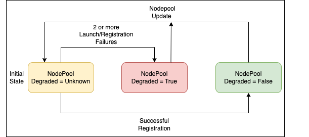
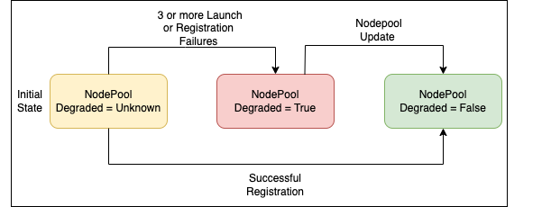

# RFC: Degraded NodePool Status Condition

## Motivation

Karpenter may initiate the creation of nodes based on a NodePool configuration, but these nodes might fail to join the cluster due to unforeseen registration issues that Karpenter cannot anticipate or prevent. An example illustrating this issue is when network connectivity is impeded by incorrect cluster security group configuration, such as missing outbound rule that allows outbound access to any IPv4 address. In such cases, Karpenter will continue its attempts to provision compute resources, but these resources will fail to join the cluster until the outbound rule for the security group is updated. The critical concern here is that users will incur charges for these compute resources despite their inability to be utilized within the cluster. 

This RFC proposes enhancing the visibility of these failure modes by introducing a `Degraded` status condition on the NodePool. We can then create new metric/metric-labels around this status condition which will improve the observability by alerting cluster administrators to potential issues within a NodePool that require investigation and resolution.

The `Degraded` status would specifically highlight instance launch/registration failures that Karpenter cannot fully diagnose or predict. However, this status should not be a mechanism to catch all types of launch/registration failures. Karpenter should not mark resources as `Degraded` if it can definitively determine, based on the NodePool/NodeClass configurations or through dry-run, that launch or registration will fail. For instance, if a NodePool is restricted to a specific zone using the `topology.kubernetes.io/zone` label, but the specified zone is not accessible through the provided subnet configurations, this inconsistency shouldn't trigger a `Degraded` status.

Currently, while launch and registration processes have defined timeouts, the initialization phase does not. As a result, there's no concept of initialization failures today. However, the proposed design can be extended to potentially incorporate initialization failure detection in future iterations.

## 🔑 Introduce a Degraded Status Condition on the NodePool Status

```
// 'Degraded' condition indicates that a misconfiguration exists that prevents the normal, successful use of a Karpenter resource
Status:
  Conditions:
    Last Transition Time:  2025-01-13T18:57:20Z
    Message:               
    Observed Generation:   1
    Reason:                Degraded
    Status:                True
    Type:                  Degraded
```
`Degraded` status condition is introduced in the NodePool status which can be set to - 
1. Unknown - When the NodePool is first created, `Degraded` is set to Unknown. This means that we don't have enough data to tell if the NodePool is degraded or not. 
2. True - NodePool has configuration issues that require customer investigation and resolution. Since Karpenter cannot automatically detect these specific launch or registration failures, we will document common failure scenarios and possible fixes in our troubleshooting guide to assist customers.
3. False - There has been successful node registration using this NodePool.

The state transition is not unidirectional meaning it can go from True to False and back to True or Unknown. A NodePool marked as Degraded can still be used for provisioning workloads, as this status isn't a precondition for readiness. However, when multiple NodePools have the same weight, a degraded NodePool will receive lower priority during the provisioning process compared to non-degraded ones. 

The approach that we go forward with should -
1. Tolerate transient errors.
2. Respond to corrections in external configuration (i.e. can remove the degraded status condition from a NodePool if an external fix allows Nodes to register).

### Option 1: In-memory Buffer to store history - Recommended

This option will have an in-memory FIFO buffer, which will grow to a max size of 10 (this can be changed later). This buffer will store data about the success or failure during launch/registration and is evaluated by a controller to determine the relative health of the NodePool. This will be an int buffer and a positive means `Degraded: False`, negative means `Degraded: True` and 0 means `Degraded: Unknown`.



Evaluation conditions -

1. We start with an empty buffer with `Degraded: Unknown`.
2. There have to be 2 minimum failures in the buffer for `Degraded` to transition to `True`. 
3. If the buffer starts with a success then `Degraded: False`. 
4. If Karpenter restarts then we flush the buffer but don't change the existing state of `Degraded` status condition.
5. If there is an update to a Nodepool/Nodeclass, flush the buffer and set `Degraded: Unknown`.
6. Since the buffer is FIFO, we remove the oldest launch result when the max buffer size is reached.

See below for example evaluations:

```
Successful Launch: 1
Default: 0
Unsuccessful Launch: -1

[] = 'Degraded: Unknown'
[+1] = 'Degraded: False'
[-1, +1] = 'Degraded: False'
[-1, -1] = 'Degraded: True'
[-1, +1, -1] = 'Degraded: True'
[-1, +1, +1, +1, +1, +1, +1, +1, +1, +1] = 'Degraded: False'
```

#### Considerations

1. 👍 Tolerates transient failures such as those that happen due to underlying hardware failure because we keep track of recent launch history and set `Degraded: True` only when there are 2 or more launch/registration failures.
2. 👍 Can be easily expanded if we want to update the buffer size depending on the cluster size.

### Option 2: In-memory counter

This approach uses an in-memory counter that keeps track of how many times node launch or registration attempts have failed by incrementing the counter with each failure.



Evaluation conditions -

1. If 3 or more NodeClaims fail to launch with a NodePool then the NodePool will be marked as degraded. The retries are included to account for transient errors.
2. Once a NodePool is `Degraded`, it recovers with `Degraded: False` after an update to the NodePool. 
3. A successful provisioning would also set `Degraded: False`.

#### Considerations

1. 👎 Three retries can still be a long time to wait on compute that never provisions correctly.
2. 👎 Setting `Degraded: False` on an update to NodePool implies Karpenter can vet with certainty that NodePool is correctly configured which is misleading.

### How Does this Affect Metrics and Improve Observability?
To improve observability, a new label can be added to metrics that tracks if the pod was expected to succeed for the NodePool configuration. Taking pod `provisioning_unbound_time_seconds` as an example, if there has been no successful launch/registration using a NodePool because a NACL blocks the network connectivity of the only zone for which it is configured, then this metric would be artificially higher than expected. Since Karpenter adds a label for if the NodePool has successfully launched a node before, users can view both the raw and filtered version of the pod unbound metric. From Karpenter's point-of-view, the pod should have bound successfully if the NodePool/NodeClass configuration had previously been used to launch a node.

Furthering the pod `provisioning_unbound_time_seconds` example:

```
PodProvisioningUnboundTimeSeconds = opmetrics.NewPrometheusGauge(
	crmetrics.Registry,
	prometheus.GaugeOpts{
		Namespace: metrics.Namespace,
		Subsystem: metrics.PodSubsystem,
		Name:      "provisioning_unbound_time_seconds",
		Help:      "The time from when Karpenter first thinks the pod can schedule until it binds. Note: this calculated from a point in memory, not by the pod creation timestamp.",
	},
	[]string{podName, podNamespace, nodePoolDegraded},
)
```

`nodePoolDegraded` can then be used as an additional label filter. There is still usefulness in the unfiltered metric and users should be able to compare the two metrics.