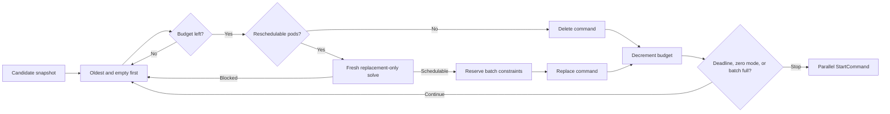

# Drift Replacement Throughput

We propose to batch dynamic drift replacements so large rollouts finish at the rate allowed by disruption budgets instead of one node at a time.

## Motivation

Dynamic drift currently has a command-generation bottleneck:

1. The disruption controller is a singleton.
2. `Drift.ComputeCommands` returns after its first successful candidate.
3. Each candidate uses the full disruption simulation: remaining nodes, pending pods, pods on deleting nodes, and the candidate's pods.
4. Drift has no deadline. A pass can test many unschedulable candidates before returning.

The queue can already run many commands concurrently. Static drift also emits multiple one-node commands in one pass. Dynamic drift is the missing case.

Seven-day fleet measurements show the effect. On a cluster with about 5,000 nodes:

- About 1,000 drifted nodes remained eligible.
- Drift produced about 17 decisions per hour.
- About 4.5 nodes consumed drift budgets while about 2,100 disruptions were allowed.
- Average drift evaluation was 26.8 seconds; the maximum was 604 seconds.
- Average disruption simulation was 14.8 seconds; the maximum was 150 seconds.
- Consolidation had about 2,000 eligible nodes but produced only 25 decisions in seven days because successful drift requeues before consolidation.

These numbers show that drift needs both batching and a deadline. A deadline alone would still spend most of its time rebuilding a cluster-wide simulation.

`GetCandidatesWithTotals` has not been measured separately. Measure it before rollout; it may become the next bottleneck. The simulation measurements above come from fleet instrumentation rather than an in-repository metric.

### Non-Goals

- Fair scheduling across disruption methods. [#2927](https://github.com/kubernetes-sigs/karpenter/pull/2927) is complementary.
- Parallel or sharded disruption reconcilers.
- CRD, budget-formula, PDB, or `terminationGracePeriod` changes.
- Optimizing candidate discovery or `DeepCopyNodes`.
- Defining replacement back-off. That remains in [`drift-per-nodepool-backoff.md`](drift-per-nodepool-backoff.md).

## Proposal

During one dynamic Drift pass, walk candidates for up to one minute and emit safe single-node commands allowed by the budget snapshot, up to a fixed batch size.

Each non-empty candidate is simulated with:

- only that candidate's reschedulable pods;
- new NodeClaims as the only packing targets; and
- no cluster-wide pending pods nor pods from other terminating nodes.

This removes two conflicts between commands: they cannot claim the same spare slot on a live node, and they cannot each provision capacity for the same pending pod. Shared constraints such as NodePool limits, reserved offerings, DRA devices, and topology still need batch-wide accounting as described below.

The semantic change is intentional. Even if a candidate's pods can fit on other nodes, Drift creates replacement capacity instead of shrinking the cluster. During a rollout, this avoids moving pods onto nodes that may also be drifted. Consolidation can remove extra capacity later.

There are no CRD changes. Package constants set `DriftTimeoutDuration` to one minute and `DriftMaxBatchSize` to 100. The `DriftReplacementBatching` feature gate is enabled by default. Disabling it selects a zero timeout, which restores the current at-most-one-command behavior without requiring a custom build.

### Algorithm

### Budgets and Back-off

The CRD budget formula is unchanged. `ComputeCommands` decrements its local NodePool budget when it accepts a command so one pass cannot exceed the initial mapping. Percentage-budget rounding remains unchanged.

`StartCommand` runs commands in parallel and may fail some before they enter the queue. The pass does not reclaim that local budget. The next pass rebuilds the mapping from NotReady and `MarkedForDeletion` nodes.

Per-NodePool back-off is designed but is not implemented in the current tree. If it lands, Drift skips backed-off pools before simulation. This RFC supersedes that RFC's “at most one command per pass” invariant, but keeps its one-candidate and one-NodePool-per-command invariants.

### Existing Behavior That Remains

- Drift remains an eventual disruption method and respects PDBs.
- Empty candidates are still ordered first. “Empty” here means no reschedulable pods, not `Candidate.IsEmpty()`.
- Replacements must become `Initialized=True` before candidates are deleted.
- In-flight candidates remain excluded through `queue.HasAny`.
- Static NodePools keep using `StaticDrift`, which already batches one-for-one replacements without simulation.
- CapacityBuffer virtual pods are not included in these per-candidate simulations. This matches the CapacityBuffer rollout rule: drift is allowed and the buffer refills after replacement.
- Drift can still starve consolidation by requeueing first. The deadline bounds command generation after candidate discovery; [#2927](https://github.com/kubernetes-sigs/karpenter/pull/2927) addresses fairness between methods.

### Observability

Use the existing lowercase `reason="drifted"` metrics:

- `karpenter_voluntary_disruption_decisions_total` measures throughput.
- `karpenter_nodepools_nodes_consuming_budgets` shows whether rollouts approach their configured budget.
- `karpenter_voluntary_disruption_decision_evaluation_duration_seconds` includes candidate discovery as well as `ComputeCommands`, so it is not a strict measurement of the one-minute compute deadline.

## Alternatives Considered

- **Call `disrupt()` repeatedly until a deadline.** Rejected because every iteration repeats cluster-wide candidate discovery. Method-level time slicing from #2927 should call the batched Drift method once.
- **Copy `StaticDrift` and skip simulation.** Rejected because dynamic NodePools may offer instance types that are too small for the candidate's pods.
- **Keep packing onto existing nodes.** Rejected because separate commands can claim the same spare capacity.
- **Carry a full simulated cluster forward between candidates.** Correct, but it keeps the cluster-sized work that causes the bottleneck. The proposed batch ledger tracks shared constraints without using existing nodes as destinations.
- **Only improve candidate order or parallelize simulation.** Helpful follow-ups, but neither removes the one-command ceiling or bounds a pass.

## Backward Compatibility

- Existing NodePools and budgets require no migration.
- More drift commands can run concurrently. Operators that need the old operational ceiling can set a drift budget of one node.
- Operators can restore at-most-one accepted command per pass by setting `--feature-gates DriftReplacementBatching=false` or `FEATURE_GATES=DriftReplacementBatching=false`. This selects zero-timeout mode at runtime and does not require rebuilding the controller.
- `DriftMaxBatchSize` bounds each initial replacement burst even when the disruption budget is much larger.
- Dynamic drift replaces instead of shrinking when pods fit on live nodes, so rollouts may use more temporary capacity.
- The disruption controller remains a singleton; no state is shared across replicas.

## Testing and Rollout

- Prove the deadline cancels a long scheduler solve and returns earlier accepted commands.
- Prove disabling `DriftReplacementBatching` selects zero-timeout mode and emits at most one command after any number of skipped candidates.
- Prove the batch never exceeds `DriftMaxBatchSize` across multiple NodePools.
- Emit empty delete commands without constructing a scheduler.
- Prove two candidates cannot claim the same live-node capacity or duplicate pending-pod capacity.
- Prove fresh solves do not leak NodeClaims, reservations, DRA allocations, or topology state.
- Prove the batch ledger prevents aggregate NodePool-limit, reserved-capacity, DRA, and topology conflicts.
- Verify budget decrementing, PDB filtering, candidate-deletion races, and non-deadline error propagation.
- Start and complete multiple replacement commands concurrently in the existing Drift suite.

## References

- [Drift reconciliation bottleneck (#3197)](https://github.com/kubernetes-sigs/karpenter/issues/3197)
- [Disruption time slicing (#2927)](https://github.com/kubernetes-sigs/karpenter/pull/2927)
- [Per-NodePool drift back-off](drift-per-nodepool-backoff.md)
- [Static capacity](static-capacity.md)
- [Capacity buffers](capacity-buffers.md)
- [Disruption controls by reason](disruption-controls-by-reason.md)
