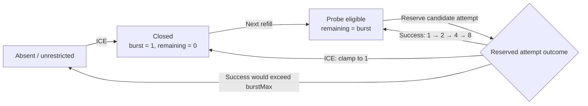
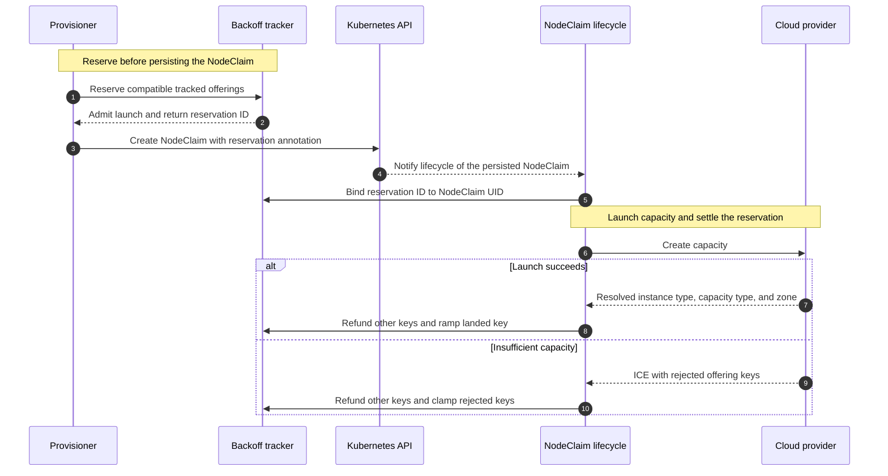
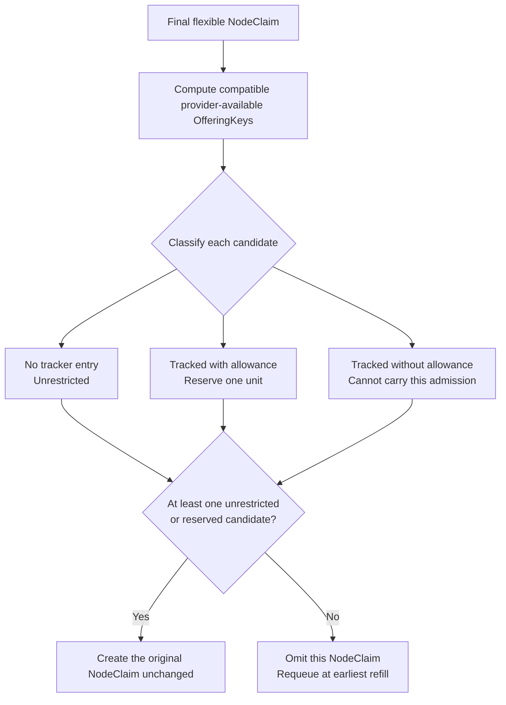
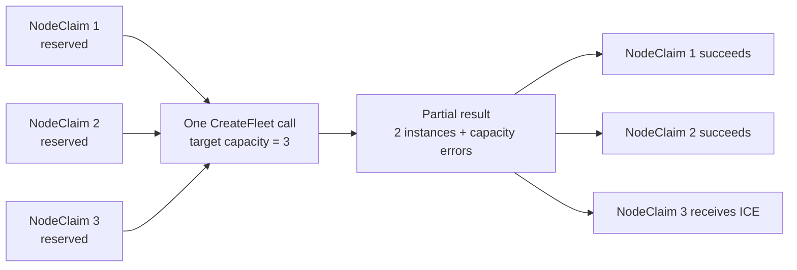

# Launch Backoff for Insufficient Capacity

After repeated `InsufficientCapacityError` (ICE), Karpenter limits retries against each
affected offering independently. Healthy offerings in the same NodePool continue at full
speed, and a cluster that never fails a launch is unchanged.

## Motivation

When a workload requests capacity the cloud provider cannot satisfy, Karpenter creates and
destroys NodeClaims in a tight loop for as long as the pods stay pending
([#3198](https://github.com/kubernetes-sigs/karpenter/issues/3198)). The launch path for
ICE deletes the NodeClaim immediately (`Launch.launchNodeClaim`) and relies entirely on
the cloud provider's unavailable-offerings cache for suppression. There is no backoff on
the create path, so the loop's rate is bounded only by controller throughput, and each
iteration drives work through the provisioner, `nodeclaim.lifecycle`, and disruption
controllers. One unsatisfiable workload therefore degrades provisioning and disruption
for the rest of the cluster.

This is not a rare edge case. Two production clusters over a 17-day window:

| Cluster     | NodeClaims created | Deleted by ICE | ICE share | Peak create rate |
| ----------- | ------------------ | -------------- | --------- | ---------------- |
| `cluster-a` | 366,724            | 341,522        | 93.1%     | 2.5/s over 2h    |
| `cluster-b` | 404,060            | 308,280        | 76.3%     | 5.4/s over 2h    |

In `cluster-a`, **more than nine out of ten NodeClaims ever created were destroyed by ICE
before launching.** The worst two-hour bucket in `cluster-b` created 39,137 NodeClaims and
destroyed 38,226 of them (97.7%) — roughly 5.4 NodeClaim create/delete cycles per second,
sustained, for two hours. Provisioner scheduling latency in that cluster runs 15–300s against
2–10s in an otherwise comparable cluster.

**Why the provider's ICE cache does not fix this.** The cache is a scheduling filter, not a
provisioning throttle:

- It adds no retry rate. It filters the offering set the scheduler considers; as long as a
  NodePool has any offering not currently cached, the scheduler produces another launch
  decision immediately.
- A broad NodePool has dozens to hundreds of offerings, so Karpenter can walk them one
  create → ICE → delete cycle at a time.
- Entries are learned by failing. The cost of learning that an offering is bad is itself a
  full NodeClaim churn cycle.
- The AWS provider TTL is three minutes, far shorter than the lifetime of pending demand.
  Entries continually expire and become eligible again while demand persists.

That last property produces the burst that prompted this RFC: with a few thousand pods queued
against an ICE'd offering, the moment the cache entry expires Karpenter can create a large
batch of NodeClaims that all fail. The existing boolean cannot express "retry this offering
slowly."

### Alpha rollout evidence

The first implementation combined per-offering time windows with a per-NodePool launch
budget. That stopped the create/delete storm, but instrumentation added during the rollout
showed that NodePool was the wrong scope for the budget:

| Cluster     | Window | Distinct failed keys | Peak simultaneous entries | Spot share of distinct keys | NodeClaims throttled |
| ----------- | ------ | -------------------- | ------------------------- | --------------------------- | -------------------- |
| `cluster-c` | 3.9d   | 197                  | 79                        | 86%                         | 5,187                |
| `cluster-d` | 6h     | 144                  | 50                        | 94%                         | 7,713                |
| `cluster-e` | 6h     | 10                   | 9                         | 0%                          | 4                    |

The important cardinality is the simultaneous working set, not every key observed over the
whole window. It stayed below 100 in all three clusters. This makes per-offering state
affordable while exposing material collateral throttling at NodePool scope:

- In `cluster-d`, 135 of 144 distinct failed keys were spot, but the aggregate NodePool budget
  withheld 3,455 on-demand-bound NodeClaims as well as 3,701 spot-bound and 459 mixed
  NodeClaims.
- In `cluster-c`, 1,844 of 5,187 throttled NodeClaims had only on-demand left when admission
  declined them. Some coincided with genuine on-demand scarcity, but the NodePool metric
  cannot identify which offering would have consumed the launch, so it cannot isolate the
  healthy portion.
- An ICE'd NodeClaim in `cluster-c` attributed 2.6 offering keys on average. This is evidence
  that provider failure attribution is not returning the whole catalog, but it is not the
  size of the compatible candidate set reserved before launch. That size needs its own
  metric; unused debits are refunded at outcome or automatically at the next refill.

The first design optimized for a hypothetical broad, account-level shortage where hundreds
of offerings needed one shared bound. The rollout instead showed small active offering sets,
high-quality provider attribution, and spot-dominated failures inside mixed-capacity
NodePools. A per-NodePool budget suppresses healthy capacity in exactly that observed shape.
This RFC therefore moves the rate limit to `cloudprovider.OfferingKey`.

### Use Cases

1. **Large partially-unsatisfiable scale-out.** A ~600-node GPU scale-out with thousands of
   pending pods, where some requested offerings are ICE'd.
   - Today: sustained NodeClaim churn at controller throughput, saturated workqueues, and
     degraded provisioning for unrelated workloads.
   - Desired: each failed offering is retried at a bounded rate while healthy offerings,
     including another capacity type in the same NodePool, launch at full speed.
2. **Burst at cache expiry.** Thousands of pods queued against one or more ICE'd offerings.
   - Today: a write storm whenever the provider's cache entries expire.
   - Desired: the first attempts after expiry consume per-offering probe allowance rather
     than admitting the full batch.
3. **Zone-scoped shortage in a multi-AZ NodePool.** One AZ is out of an instance type; the
   other AZs are healthy.
   - Desired: launches into healthy AZs are not charged to the dead AZ. Pods with a soft
     zonal spread give up the instance type before the spread; see
     [Topology spread](#topology-spread).
4. **Mixed spot and on-demand NodePool.** Spot is short while on-demand remains healthy.
   - Desired: spot attempts back off without constraining on-demand launches from the same
     NodePool.

### Non-Goals

- **Predicting capacity before the first failure.** Core learns only from observed outcomes.
  The first ICE for a previously healthy offering is unavoidable, as is the first batch after
  a process restart.
- **Modeling remaining cloud capacity.** `remaining` below is retry allowance, not an estimate
  of how many instances the cloud can supply.
- **Replacing `ReservationCapacity`.** Reservation capacity is keyed by reservation ID and
  shared across instance types. ICE retry allowance is keyed by
  `instanceType:capacityType:zone`. They are different quantities.
- **Replacing provider-side ICE caches.** They remain a fast, provider-local filter. An
  offering is usable only when the provider reports it available and core has retry
  allowance.
- **Querying cloud capacity APIs**, persisting backoff, or sharing signals across clusters.
- **Changing the failed NodeClaim lifecycle.** The NodeClaim is still deleted on ICE.
- **Making unsatisfiable pods schedulable.** They stay pending; this RFC stops paying for them
  in cluster-wide controller throughput.

## Proposal

Maintain one launch budget per failed `cloudprovider.OfferingKey`
(`InstanceType`, `CapacityType`, `Zone`). A budget starts at one launch per
`probeInterval`, doubles when that offering succeeds, and returns to one when it ICEs.
Once repeated successes would raise it above `burstMax`, its entry is deleted and the
offering returns to unrestricted operation.

This promotes the previous draft's "per-offering launch budgets with pessimistic debit"
alternative to the primary design.

A NodeClaim names a set of acceptable offerings rather than the offering the provider will
choose. Before creating it, Karpenter therefore reserves one unit from every tracked offering
the NodeClaim could consume that currently has allowance. The reservation is pessimistic but
short-lived:

- the offering the provider actually uses keeps the debit and receives the success signal;
- offerings the provider did not use are refunded;
- attributed ICE keys receive the failure signal and all other candidates are refunded;
- a missed or late refund cannot strand capacity because every budget refills from its
  ceiling at the next `probeInterval`.

There is no normal per-NodePool launch budget. A short spot offering cannot consume
on-demand allowance, one AZ cannot constrain another, and two NodePools that select the same
offering correctly share its budget because they compete for the same cloud capacity.



### The story in four steps

The design is easier to follow as one NodeClaim moving through the system:

1. **Learn.** A launch fails and the provider identifies the offering keys that returned
   insufficient capacity. Each key gets its own retry budget.
2. **Plan.** Scheduling still produces the same flexible NodeClaim. Karpenter expands its
   final requirements into the provider offerings it could use.
3. **Reserve.** Immediately before creation, Karpenter debits every tracked key the final
   NodeClaim could use and that currently has allowance. The NodeClaim proceeds when at least
   one candidate is unrestricted or reserved.
4. **Settle.** Success ramps only the offering that launched. ICE clamps only the offerings
   the provider rejected. Every other pessimistic debit is refunded.



### Why the budget is keyed by offering

The budget answers "how many launches may test this capacity pool now?" The answer belongs to
the capacity pool:

- **Failure attribution is offering-scoped.** Providers can return every
  `(instance type, capacity type, zone)` rejected by the fleet call. Those are the resources
  that should lose allowance.
- **Success attribution is offering-scoped.** The created NodeClaim's resolved labels identify
  the one offering that recovered. Success on on-demand must not release spot, and success in
  one AZ must not release another.
- **NodePool is configuration, not capacity.** A NodePool may contain unrelated capacity
  types, zones, and instance families. Conversely, two NodePools may select the same cloud
  offering. Pool-scoped state both couples unrelated capacity and separates consumers of the
  same capacity.
- **Observed cardinality is small.** The rollout saw at most 79 simultaneous failed keys in
  one cluster and at most 50 in another. That is the state and metric cardinality that matters
  operationally.

The cost is that a NodeClaim does not identify one offering before launch. Pessimistic
reservation is the same conservative choice `ReservationManager` makes for reserved
capacity: reserve compatible candidates before knowing which one the provider will consume,
then release the candidates not used. An exhausted candidate does not veto a NodeClaim with
another launchable option. Unlike cloud capacity accounting, exact refund delivery is not a
liveness dependency because retry allowance resets every window.

## How It Works

### Canonical offering key and ICE attribution

Canonical key and ICE attribution live on `cloudprovider`, next to `Offering`. The existing
`pkg/state/cost.OfferingKey` becomes an alias.

```go
// pkg/cloudprovider/types.go
type OfferingKey struct {
	InstanceType, CapacityType, Zone string
}

type InsufficientCapacityError struct {
	error
	Keys []OfferingKey
}
```

`NewInsufficientCapacityError` accepts variadic keys so existing provider call sites continue
to compile. AWS fills `Keys` from the failed overrides reported by CreateFleet. Identical
per-NodeClaim requests may share one batched CreateFleet call, so a failed NodeClaim receives
the failed keys from that shared call rather than from an exclusive cloud request. The
candidate requirements are identical across the batch, and one error may contain multiple
keys.

### Budget and reservation state

New package `pkg/state/launchbackoff` owns one shared tracker:

```go
type offeringEntry struct {
	incarnation uint64    // unique for this lifetime; prevents ABA after delete/recreate
	burst      int       // allowance ceiling for each refill window
	remaining  int       // allowance left in the current window
	nextRefill time.Time
	generation uint64    // prevents a late refund crediting a newer window
	epoch      uint64    // incremented by failure; stale successes cannot ramp it
	lastRamp   *uint64   // generation last increased by a success; nil before first ramp
	lastFailure *uint64  // generation that most recently observed failure
	lastActive time.Time
}

type reservationStamp struct {
	incarnation uint64
	generation uint64
	epoch      uint64
	debited    bool
}

type reservation struct {
	keys      map[cloudprovider.OfferingKey]reservationStamp
	expiresAt time.Time
	nodeClaim types.UID // empty until lifecycle observes the persisted object
}

type ReservationResult struct {
	Admitted     bool
	NextEligible time.Time
}

func (t *Tracker) Reserve(
	id string,
	candidates []cloudprovider.OfferingKey,
) ReservationResult
func (t *Tracker) ReserveBatch(
	candidates map[string][]cloudprovider.OfferingKey,
) (map[string]ReservationResult, bool)
func (t *Tracker) Bind(id string, nodeClaim types.UID)
func (t *Tracker) Release(id string)
func (t *Tracker) Fail(id string, keys ...cloudprovider.OfferingKey)
func (t *Tracker) Succeed(id string, landed cloudprovider.OfferingKey)
func (t *Tracker) IsAvailable(cloudprovider.OfferingKey) bool
func (t *Tracker) NextEligible(cloudprovider.OfferingKey) time.Time
```

An absent entry is unrestricted. It has no finite allowance and is not debited, but its
epoch is recorded in the reservation once the tracker contains any failed offering, so an
unattributed ICE during recovery can conservatively arm the compatible candidates. An entirely
empty tracker is a fast path: it computes no candidates and records no reservation. The
first ICE must therefore carry provider `Keys`; attribution is a prerequisite for the feature
rather than a reason to tax every healthy launch.

#### Refill

Refill is a lazy clock comparison performed under the tracker lock:

```go
if now >= entry.nextRefill {
	entry.remaining = entry.burst
	entry.nextRefill = now + probeInterval
	entry.generation++
}
```

There is no continuously refilling token float and no background goroutine. Reads may compute
whether a refill is due, but only `Reserve`, `Fail`, `Succeed`, and cleanup mutate state.

#### Failure

For each failed key:

```go
if entry.lastFailure == nil || *entry.lastFailure != entry.generation {
	entry.epoch++
	entry.lastFailure = ptr.To(entry.generation)
}
if entry.burst != 1 || entry.remaining != 0 || now >= entry.nextRefill {
	entry.burst = 1
	entry.remaining = 0
	entry.nextRefill = now + probeInterval
}
```

If the entry is already clamped at one with no allowance and its refill has not arrived,
another failure is a no-op. This makes a first in-flight batch one failure signal rather than
an arbitrarily long postponement.

#### Success

Success applies only to the landed key and only when the reservation's epoch equals the
entry's current epoch. A failure therefore dominates successes from the same or any older
batch regardless of completion order. At most one success per clean generation may ramp an
entry. If doubling its current `burst` would exceed `burstMax`, delete the entry; otherwise
double `burst`, taking effect on the next refill. This produces
`1 → 2 → 4 → 8 → unrestricted`. Other candidate keys receive only their refund; success on
one offering does not change their recovery state.

| Parameter        | Default           | Rationale |
| ---------------- | ----------------- | --------- |
| `probeInterval`  | `30s`             | Bounds each failed offering to two attempts per minute before provider-side suppression. Short enough to discover recovery promptly. |
| `burstMax`       | `8`               | Requires repeated successful probes before returning an offering to unrestricted launch, while reaching full speed in a few windows. |
| `unboundReservationTTL` | `2 * LaunchTimeout` | Bounds bookkeeping for API calls whose success is ambiguous and whose NodeClaim is never observed. Passed into the tracker at wiring time to avoid a package dependency on lifecycle. |
| `entryTTL`       | `10m` after idle  | Removes stale recovered or withdrawn keys and their metric series. A later failure starts again at burst one. |

### Computing candidate offerings

Compute candidates after `TruncateInstanceTypes`, using the final instance-type names and
requirements that `ToNodeClaim` will emit. Expand those values against the provider's
unmodified instance types, then intersect with provider availability and offering
compatibility. Do not derive candidates from the scheduling copies after
`FilterUnavailable`: those copies intentionally hide exhausted core entries that the broad
NodeClaim requirements may still represent. This approximates the override set the provider
will use without changing the NodeClaim's requirements.

The key observation is that an exhausted candidate does not veto a flexible NodeClaim.
Cloud providers may try the compatible alternatives, and a provider `Create` succeeds for a
NodeClaim when that request receives an instance. A healthy candidate can therefore carry
the launch even when another candidate is short:



`Reserve` performs that classification and debit atomically:

1. refill due budgets and expire stale unbound reservations;
2. treat candidates with no tracker entry as unrestricted;
3. debit every tracked candidate that currently has allowance;
4. admit when at least one candidate is unrestricted or was successfully debited;
5. otherwise return the earliest candidate refill.

Tracked candidates already at zero are not debited and do not block a NodeClaim that has
another way to succeed. The reservation records every candidate for outcome reconciliation,
including unrestricted and exhausted keys.

For example, an on-demand NodeClaim may allow zones A and B while zone A is short and zone B
is healthy. Karpenter leaves both zones in the NodeClaim. AWS may include both overrides in
CreateFleet. A zone B instance assigned to that NodeClaim makes it succeed; failed zone A
overrides are still added to the provider's unavailable-offerings cache.

#### AWS CreateFleet batching and partial fulfillment

The AWS provider calls `launchInstance` once per NodeClaim, initially requesting one
instance. `CreateFleetBatcher` coalesces identical requests and changes the shared
CreateFleet target to the number of waiting NodeClaims. CreateFleet may return fewer
instances than requested together with capacity errors.



The batcher splits one returned instance to each successful requestor. Remaining requestors
receive an output with the shared errors and no instance; `launchInstance` returns
`InsufficientCapacityError` for those NodeClaims when every error is classified as ICE.
Successful requestors retain the shared errors long enough for the provider to update its
unavailable-offerings cache before returning success.

The distinction is important: the underlying CreateFleet call can be partially successful,
while each NodeClaim still has one outcome. Reservations and recovery are settled per
NodeClaim—success for those assigned an instance, ICE for the unfulfilled remainder.
Each NodeClaim reserves independently before provider `Create`, so finite tracked allowance
bounds how many requests can enter a matching batch unless an unrestricted alternative
keeps them admissible. In a partial result, failure clamps the attributed keys and dominates
success ramps from the same epoch; the first partial batch discovers any previously
untracked shortage, and subsequent batches are bounded.

The per-offering budget therefore bounds failed NodeClaim create/delete cycles, not every
internal override the provider may evaluate during a successful launch. Preserving provider
flexibility is what lets a healthy zone or capacity type escape a shortage without being
collaterally throttled.

### Reservation identity and lifecycle

Generate an opaque reservation ID before Kubernetes API creation and persist it on the
NodeClaim as the internal `karpenter.sh/launch-backoff-reservation` annotation. Lifecycle
uses that ID to settle the reservation. The annotation handles an ambiguous API timeout
where the object persisted but `client.Create` did not return its generated name or UID.

- An omitted NodeClaim or a known pre-API validation failure calls `Release`.
- An ambiguous Kubernetes create error leaves the reservation to lifecycle or TTL cleanup;
  releasing immediately could admit a second launch while the first object already exists.
- On its first reconcile, lifecycle calls `Bind(id, nodeClaim.UID)`. Bound reservations do
  not expire by age while their NodeClaim exists.
- Lifecycle calls `Fail` or `Succeed` with the annotation value.
- A retryable generic `CreateError` retains the reservation because lifecycle will retry
  cloud-provider `Create` on the same NodeClaim.
- A NodeClaim deleted before launch releases its reservation.
- Cleanup drops an unbound reservation after `unboundReservationTTL`; a bound reservation is
  removed only by outcome, deletion, or a check that its NodeClaim UID no longer exists.
- Tracker state is in-memory; restart discards both budgets and reservations together, so
  there is no orphaned persistent debit to reconcile.

Refund requires the entry incarnation, generation, and epoch to match the reservation stamp.
A non-landed key is never incremented above `burst`. Incarnation prevents an old bound
reservation from mutating a key that recovered, was deleted, and later failed again with
generation and epoch counters reset. A late outcome from an older window removes bookkeeping
but cannot add allowance to the new window. A success from before the latest failure cannot
ramp recovery. Duplicate outcomes are no-ops after the reservation is removed.

### Applying the budget filter

`GetInstanceTypes` often returns cached pointers and `Offerings` is
`[]*Offering`, so a shallow copy still aliases `Available`. A helper DeepCopies only
instance types whose offerings need to be changed:

```go
// FilterUnavailable returns its unchanged when the tracker has no exhausted matching
// entries. Otherwise it DeepCopy()s only affected instance types and sets
// Available=false on offerings with no allowance in the current window.
func FilterUnavailable(
	its []*cloudprovider.InstanceType,
	t *Tracker,
) []*cloudprovider.InstanceType
```

The combined predicate is:

```
usable(offering) = provider.Available && budget.IsAvailable(key(offering))
```

Call it immediately after `GetInstanceTypes` and before anything triggers
`AllocatableOfferingsList()` / `Allocatable()`:

1. `Provisioner.NewScheduler`, before `NewTopology` and `scheduler.NewScheduler`;
2. `disruption.BuildNodePoolMap`, before the name-to-instance-type map.

`Reserve` recomputes candidate budget state under its write lock immediately before create.
The filter shapes scheduling; the reservation closes races between overlapping NodeClaims.

### Dynamic provisioning

After `Solve`, the provisioner walks NodeClaims in their existing order:

1. run the existing `TruncateInstanceTypes`;
2. if the tracker is empty, use the existing create path unchanged;
3. otherwise derive candidate keys from the final instance types and requirements;
4. call `Reserve`;
5. omit the NodeClaim if no candidate can carry the launch;
6. otherwise create the original NodeClaim unchanged with its reservation annotation.

There is no risky/non-risky partition and no NodePool-level `Admit`. A NodeClaim that can use
one healthy offering is immediately admissible. A NodeClaim backed only by failed offerings
is admitted when at least one of those offerings has allowance, and pessimistic debit
prevents another overlapping NodeClaim from spending the same allowance.

### Disruption

Disruption simulation remains read-only: `NewScheduler` and `BuildNodePoolMap` see the
budget filter but do not reserve allowance. Before `Queue` calls `markDisrupted`, it reserves
the candidate set for every replacement through one `ReserveBatch` call.

`ReserveBatch` applies the same rules against a temporary allowance snapshot, considering
the replacements with the fewest launchable candidates first. It commits only when every
replacement can be admitted; otherwise it rolls back the whole batch. This is deliberately
conservative because disruption replacements must be created together.

- A command with no replacements is never gated.
- If any replacement has no allowed offering, release the entire batch and do not cordon any
  candidate.
- If `markDisrupted` or another pre-create step fails, release the entire batch.
- Candidate NodePools are irrelevant; only replacement offerings consume allowance.
- Once the command starts, each replacement reservation is bound to the NodeClaim created for
  it and settles through lifecycle like a provisioning launch.

This preserves `len(names) == len(replacements)` without letting disruption simulation
consume real probe allowance.

### Static capacity

Static provisioning does not build a scheduler, but its controller already has the
NodePool and cloud provider. Before creating replicas it calls `GetInstanceTypes`, computes
provider-available offerings compatible with the final NodeClaim, and reserves them per
proposed replica.

Static NodeClaims remain broad and let the provider choose. If any compatible offering is
unrestricted or has allowance, static capacity proceeds; if all compatible offerings are
exhausted, it waits for the earliest refill. A failed static launch settles from provider
`Keys`, or from its saved candidate set when `Keys` is empty.

Withheld replicas release the corresponding `NodePoolState` reservation immediately, as the
current NodePool admission implementation does.

### Recording outcomes

`Launch.launchNodeClaim` is the single place a cloud launch's fate is known:

- **ICE with keys.** `errors.As` to `*cloudprovider.InsufficientCapacityError`.
  `Fail(reservationID, ice.Keys...)` clamps every attributed key and refunds reserved
  candidates not in `Keys`.
- **ICE without keys.** `Fail(reservationID)` clamps every candidate saved in the
  reservation. This is deliberately conservative but still narrower than NodePool scope.
  If the tracker was empty and the launch took the no-reservation fast path, core records
  the event but cannot arm a budget.
- **Success.** Derive the landed key from the created NodeClaim's resolved instance type,
  capacity type, and zone labels. `Succeed(reservationID, key)` refunds every other candidate
  and ramps only the landed key.
- **Retryable `CreateError`.** Keep the reservation. Lifecycle retains the NodeClaim and
  retries provider `Create`; releasing here would let the retry bypass its budget.
- **Terminal non-capacity failure or deletion.** Release the reservation.
  `NodeClassNotReadyError`, registration timeout, and initialization timeout do not change
  offering budgets.

The NodeClaim is still deleted and
`NodeClaimsDisruptedTotal{reason=insufficient_capacity}` still increments on ICE.

### Attributing unschedulability to unavailable offerings

The provisioner must distinguish "these pods have nowhere to go until allowance refills" from
"these pods are unschedulable for a reason no delay will fix." The scheduler reports the
first case with a typed error:

```go
type OfferingsUnavailableError struct {
	error
}

func NewOfferingsUnavailableError(err error) OfferingsUnavailableError
func IsOfferingsUnavailableError(err error) bool
func (e OfferingsUnavailableError) Unwrap() error
func (r Results) OfferingsUnavailableErrors() map[*corev1.Pod]error
```

`filterInstanceTypesByRequirements` computes a second hypothetical set with provider and
core availability ignored, while still applying requirements, resource fit, and
`minValues`. It produces `OfferingsUnavailableError` only when:

```go
len(remaining) == 0 && len(remainingIgnoringAvailability) > 0
```

Availability must be the sole reason the real set is empty. Merely checking
`requirementsMet && !hasOffering` is insufficient: an oversized pod can match labels while
still failing resources after allowance refills. The hypothetical pass needs an
availability-independent equivalent of `fits`, including offering-specific allocatable
overlays, so affinity, resources, and strict `minValues` failures retain their real errors.

The classification is deliberately layer-agnostic: provider unavailability and an exhausted
core budget have the same retry behavior. The error does not carry a deadline because the
filtered copies lose that provenance and core does not know provider cache TTLs. The
provisioner retries these errors after `probeInterval`; a NodeClaim rejected directly by
`Reserve` still carries its exact earliest refill.

`OfferingsUnavailableError` must not join the `ReservedOfferingError` short-circuit in
`trySchedule`. A reservation may be released inside the same `Solve`, while a budget cannot
refill there. Soft affinity and `ScheduleAnyway` topology spread must still relax.

### Topology spread

Use case 3 says pods with a zonal spread should give up the instance type before the spread.
That remains the existing ordering:

1. `nextDomainTopologySpread` selects the least-loaded eligible domain.
2. `filterInstanceTypesByRequirements` drops instance types with no usable offering there,
   so a different instance type in that zone is considered first.
3. `Preferences.Relax` drops required node-affinity terms and preferred affinity terms.
4. `removeTopologySpreadScheduleAnyway` relaxes the spread last.

A `DoNotSchedule` spread never relaxes, so its pods wait for that zone's next offering-budget
refill.

A fully unavailable zone remains a registered topology domain because
`buildDomainGroups` reads `InstanceType.Requirements`, not `Offerings.Available()`. This is
pre-existing provider-cache behavior. Pruning the zone from requirements is out of scope
because those requirements also feed label resolution on the resulting NodeClaim.

### Provisioner requeue

Zero new NodeClaims requeues immediately today. The feature instead sleeps only when every
pending pod is accounted for by transient offering unavailability:

```go
created, omitted := ... // after Reserve + CreateNodeClaims

if len(created) > 0 {
	return RequeueImmediately
}

for pod := range pendingPods {
	if IsOfferingsUnavailableError(results.PodErrors[pod]) || omitted.Has(pod) {
		continue
	}
	return RequeueImmediately
}

wake := min(omitted.NextEligible, now+probeInterval)
return RequeueAfter: min(wake-now, probeInterval)
```

The cap ensures a newly created NodePool or a provider availability change is noticed within
one interval.

### NodePool weight fallback

A pod whose offerings are exhausted in its preferred NodePool falls through to the next
NodePool by weight in the same scheduling pass. A high-weight spot NodePool can therefore
shed to a lower-weight on-demand NodePool while spot is short, and consolidation can return
the workload to spot after recovery.

Unlike the previous design, one failed offering does not constrain every launch from its
NodePool. Pods stay pending only when every compatible offering across every compatible
NodePool is unavailable.

### Worked example

A NodePool contains 200 GPU offerings across four AZs and two capacity types, with 3,000
pending pods. Defaults are `probeInterval=30s` and `burstMax=8`.

1. **Initial batch.** No entries exist, so scheduling and launch match today's behavior. The
   first NodeClaims may fail in parallel; this unavoidable first batch establishes the keys.
2. **Failure.** Each attributed key is clamped to `burst=1`, `remaining=0`. Healthy siblings
   remain absent from the tracker and continue at full speed.
3. **Provider cache expiry.** When provider and core both allow a key, the first overlapping
   NodeClaim reserves its unit. Pessimistic debit consumes allowance from every tracked key
   it could land on that currently has allowance. Another NodeClaim whose only candidates
   are now exhausted waits; one with a healthy alternative still proceeds.
4. **Persistent shortage.** Each failed key gets at most one core probe per 30-second window,
   further reduced by the provider's longer cache. If workloads target disjoint failed keys,
   they may probe independently; this is intentional isolation, not a NodePool-wide herd.
5. **Partial recovery.** A successful launch in one AZ refunds unused candidates and doubles
   only the landed key's burst. Healthy AZs and on-demand offerings never wait for a dead
   spot key's recovery.
6. **Full recovery.** Repeated successes move the landed key through `1 → 2 → 4 → 8`; the
   next success removes the entry and launches become unrestricted.

The worst-case aggregate probe rate is linear in the number of simultaneously failed,
disjoint keys. The rollout observed fewer than 100 such keys per cluster, and overlapping
NodeClaim candidate sets make pessimistic debit reduce the number of actual NodeClaims below
that ceiling. A cluster-wide ceiling remains an open question.

### Invariants

- **Only real creates reserve allowance.** Provisioning, static capacity, and disruption
  reserve immediately before creating. Scheduling simulation only reads.
- **NodeClaim flexibility is preserved.** Backoff does not rewrite zone, capacity-type, or
  instance-type requirements. An exhausted candidate does not veto a NodeClaim with another
  unrestricted or reserved candidate.
- **Candidates match the final request.** Compute them after instance-type truncation from
  the same provider offerings and requirements represented by the emitted NodeClaim.
- **The budget bounds failed NodeClaims.** It does not promise to suppress every internal
  provider override attempted during a successful flexible launch.
- **Reservation is atomic across candidates.** No partial debit survives a rejected
  NodeClaim. Batch disruption reservations are all-or-nothing.
- **Pessimistic accounting self-heals.** Refunds are idempotent, generation-aware, and
  epoch-aware, but a missed refund costs at most one `probeInterval` because refill replaces
  `remaining` from `burst`.
- **Failure is idempotent inside a closed window.** An in-flight failure burst cannot keep
  moving `nextRefill`.
- **Failure dominates stale success.** Failure increments the key's epoch. Success from that
  or any older epoch cannot ramp it, and only one success per clean generation can ramp.
- **Recovery is local.** Only current-epoch success on a key raises that key's burst. No
  NodePool or sibling offering is released as a side effect.
- **No create path bypasses an active budget.** When the tracker is non-empty, a new path
  that creates NodeClaims must reserve candidate offerings or explicitly prove it has no
  cloud launch. The empty-tracker fast path is intentionally unrestricted.
- **State is in-memory.** Restart may cause one fresh launch batch, but it also discards every
  reservation and budget together; no persistent debit can be orphaned.
- **State decays.** Idle entries and expired reservations are removed, including metric
  series.

## Interaction with Existing Features

- **Drift and consolidation.** Simulations see budget-exhausted offerings through
  `NewScheduler` and `BuildNodePoolMap`. Commands reserve replacement offerings before
  cordoning, preserving all-or-nothing replacement creation.
- **Disruption budgets.** Independent; they still limit how many nodes may be disrupted.
- **Capacity buffers.** Use dynamic provisioning and therefore the same reservation and
  requeue behavior.
- **NodePool weight.** Exhausted offerings fall through to lower-weight pools without a
  failed sibling constraining the whole source pool.
- **Static capacity.** Computes candidates directly from `GetInstanceTypes` and reserves
  before creating replica NodeClaims.
- **Topology spread.** Unchanged in mechanism; a fully unavailable zone remains a topology
  domain.
- **`minValues`.** If filtering exhausted offerings violates `minValues`, scheduling follows
  the existing Strict or BestEffort policy.
- **Reserved offerings.** `ReservationManager` applies its capacity reservation before the
  launch-budget reservation. A candidate must pass both. The two ledgers remain separate
  because they use different keys and represent different quantities.

## Observability

Emit gauges only for keys with tracker entries. The alpha rollout measured fewer than 100
simultaneous entries per cluster, keeping series cardinality proportional to active shortage
rather than the full offering catalog.

| Signal | Type | Purpose |
| ------ | ---- | ------- |
| `karpenter_offerings_launch_failures_total` | counter by `instance_type`, `capacity_type`, `zone` | Number of ICE attributions. Increment once per provider key, or once with empty labels when the provider returns no keys. |
| `karpenter_offerings_launch_budget` | gauge by `instance_type`, `capacity_type`, `zone` | Current `burst` ceiling (`1`, `2`, `4`, `8`) for a tracked offering. Deleted when the entry returns to unrestricted operation or expires. |
| `karpenter_offerings_unavailable` | gauge 0/1 by `instance_type`, `capacity_type`, `zone` | `1` while a tracked offering has no remaining allowance in the current window. |
| `karpenter_launch_backoff_active_offerings` | gauge | Number of offering entries currently held by the tracker. Low-cardinality guardrail for state growth. |
| `karpenter_nodepools_launch_probes_total` | counter by `nodepool`, `capacity_type` | NodeClaims whose reservation debited at least one tracked offering. Its rate is the aggregate probe-rate guardrail. |
| `karpenter_nodepools_launch_probe_offerings` | histogram by `capacity_type` | Number of tracked keys pessimistically debited by each probe reservation. Measures the over-debit assumption directly. |
| `karpenter_nodepools_launch_throttled_total` | counter by `nodepool`, `capacity_type`, `reason=offering_budget` | NodeClaims not created because all candidate offering budgets were exhausted. NodePool labels impact, not budget scope. |

Remove `karpenter_nodepools_launch_constrained` and
`karpenter_nodepools_launch_burst`; there is no NodePool budget to expose.

The primary success metric remains the ratio of
`karpenter_nodeclaims_disrupted_total{reason=insufficient_capacity}` to
`karpenter_nodeclaims_created_total`. Guardrails are launch latency for successful
NodeClaims, aggregate probes per minute, active offering-entry count, and the share of
throttles by capacity type.

## Edge Cases

- **Provider returns no `Keys`.** If a reservation exists, the tracker clamps its saved
  candidate keys. This may back off healthy candidates, but only those the failed NodeClaim
  could have consumed, never every offering in its NodePool. If no reservation exists —
  including the first failure against an empty tracker or an in-flight NodeClaim surviving
  process restart — core records an unattributed failure and cannot safely arm state.
- **Provider attribution is wrong.** Misattributed keys receive one probe per interval. A
  success ramps and eventually removes them; idle expiry also removes stale state. Healthy
  keys outside the reported or candidate set are unaffected.
- **First batch and restart.** Untracked offerings are unrestricted. The first launch batch
  after process start can fail at today's rate before outcomes arm budgets.
- **Offering set churn.** New keys are absent and unrestricted. Entries for withdrawn or
  unused keys idle-expire.
- **Spot and on-demand are independent.** Capacity type is part of the key. A spot failure
  cannot consume on-demand allowance for the same instance type and zone.
- **Shared offerings across NodePools.** Shared state is correct because the NodePools contend
  for the same cloud capacity. Fairness is first-come, first-served within a refill window;
  per-NodePool shares are an open question.
- **Broad account-level shortage.** Many keys may ICE independently, so aggregate probe rate
  scales with active keys. Provider caching, overlapping pessimistic reservations, and
  observed active cardinality bound the deployed case. A cluster-wide safety ceiling can be
  layered on without returning to NodePool coupling.
- **Late outcome after refill.** Generation-aware settlement never refunds into a newer
  window. A late failure still clamps its attributed keys because it is new capacity
  evidence.
- **Unbound reservation expires.** If an ambiguous Kubernetes create actually persisted a
  NodeClaim but lifecycle did not observe it before `unboundReservationTTL`, cleanup may
  permit one extra probe. A reservation bound to an observed NodeClaim never age-expires.
- **Mixed success and failure results.** Providers report a launch as either success or
  error. A successful landed key is the only key credited; an ICE may clamp multiple keys.
- **Reserved offering exhaustion.** Existing `ReservationCapacity` filtering runs first.
  ICE on a reserved offering additionally arms its launch budget.

## Alternatives Considered

### Alternative 1: Replace `Available` with learned remaining capacity

Model each ICE as a scalar inventory count and binpack against it. Rejected for this RFC:
providers do not report the remaining count on ICE, and retry allowance is enough to stop
churn. This remains a possible later capacity-modeling RFC.

### Alternative 2: Availability as a probability

Track success rate and feed expected capacity into scheduling. Rejected because it changes
the scheduling objective, is harder to reason about than a rate limit, and still needs a
hard bound during persistent failure.

### Alternative 3: Back off per NodePool only

Simple and effective at stopping churn, but too coarse. The rollout showed spot-dominated
failure sets withholding thousands of on-demand-bound NodeClaims in the same mixed pools.
NodePool is also the wrong sharing domain: unrelated offerings within one pool are coupled,
while the same offering selected by two pools gets independent allowance.

### Alternative 4: Keep the ICE'd NodeClaim in a backed-off state

Rejected because doomed NodeClaims remain user-visible, consume NodePool limits and cluster
state, and still cost scheduling work. Delete-and-recreate is acceptable once retries are
bounded.

### What we already tried:

#### Per-offering windows plus a per-NodePool launch budget

This was the first alpha implementation. Per-offering windows isolated scheduling, while an
aggregate and risky NodePool budget bounded creates and ramped recovery.

It is rejected as the final design because the aggregate budget still penalizes healthy
offerings. Admission cannot tell whether an on-demand-bound NodeClaim would have used the
same scarce capacity as the spot launch that constrained the pool, so it withholds both.
The added risky budget also complicates admission ordering, requeue, disruption peeks,
metrics, and state cleanup. Moving the budget to offerings collapses those mechanisms into
one source of truth and credits only the capacity that actually recovers.

The original objection to per-offering budgets was that pessimistic debit required exact
accounting and a missed refund could pin an offering at zero forever. A refill-window budget
removes that failure mode: refunds improve utilization within the current window, but the
next refill restores allowance independently. Exact accounting is therefore an optimization,
not a liveness dependency.

#### cluster-state sync

We first suspected `Cluster.Synced` was the bottleneck. A patch removed the provider-ID sync
delay and drove `karpenter_cluster_state_unsynced_time_seconds` to zero, but ICE churn stayed
between 63% and 93% and later produced the largest event in the window. Sync latency was a
symptom, not the cause.

## Backward Compatibility

- No CRD field is added. Budgeted NodeClaims receive the internal
  `karpenter.sh/launch-backoff-reservation` annotation so lifecycle can settle reservations
  across an ambiguous API response; user-authored NodePool and NodeClaim YAML is unchanged.
- `NewInsufficientCapacityError` gains variadic `OfferingKey` values and
  `InsufficientCapacityError` gains `Keys`; existing call sites compile unchanged.
- With `LaunchBackoff=false`, core records metrics but does not filter, reserve, or rate-limit.
- With the gate enabled and an unmodified provider, an unattributed ICE can reuse a
  reservation only after some attributed failure has armed the tracker. Provider-populated
  `Keys` are required to bootstrap backoff and are therefore required for graduation.
- Tracker restart is fail-open and may repeat one initial batch, matching existing in-memory
  health and drift state.
- The NodePool constrained and burst gauges introduced by the first alpha implementation are
  removed before beta; they were feature-gated alpha metrics, not stable API.

## Graduation Criteria

### Alpha (`LaunchBackoff=false`)

Ships with:

- `cloudprovider.OfferingKey` and `InsufficientCapacityError.Keys`;
- per-offering refill-window budgets with generation and failure epochs;
- candidate-key derivation after instance-type truncation from the final NodeClaim shape;
- reservation in dynamic provisioning, static provisioning, and disruption replacement
  creation;
- lifecycle settlement for success, attributed ICE, unattributed ICE, and other errors;
- `FilterUnavailable` in `NewScheduler` and `BuildNodePoolMap`;
- `OfferingsUnavailableError` and bounded provisioner requeue;
- active-entry, probe, budget, and throttle metrics.

### Beta (default on)

Requires provider `Keys` in the implementation under test and evidence that:

- ICE share of created NodeClaims falls substantially;
- successful NodeClaim launch latency does not regress materially;
- active offering-entry cardinality and aggregate probes per minute remain bounded;
- on-demand-bound throttling falls relative to the NodePool-budget alpha baseline in mixed
  pools;
- no create path bypasses reservation while any offering budget is active.

### GA

Remove the feature gate. Decide whether providers should retain their own ICE caches or defer
to core's budget. Capacity-count modeling remains a separate proposal.

## Open Questions

1. **Is `OfferingKey` granular enough?** Subnet, placement group, capacity reservation, or
   NodeClass may be narrower than instance type, capacity type, and zone. Adding dimensions
   improves isolation but fragments evidence and increases probe rate. Start with the tuple
   providers already use for ICE caches.
2. **Does per-offering retry need a cluster-wide ceiling?** Worst-case probes scale with
   simultaneously failed disjoint keys. Alpha observed fewer than 100 active entries, but a
   broad regional or account-level shortage could exceed that. A global token bucket would
   cap total churn without coupling healthy offerings during normal shortages.
3. **Should shared offering allowance be fair across NodePools?** First-come, first-served is
   capacity-correct but one busy NodePool can consume every probe. Weighted or round-robin
   shares add state and may delay recovery discovery; measure starvation before adding them.
4. **Are `probeInterval=30s` and `burstMax=8` correct?** The provider cache currently makes
   the effective probe interval longer on AWS. Other providers may expose the full core rate.
5. **Should failed overrides on a successful split result feed core backoff?** A partially
   fulfilled AWS batch already gives each unfulfilled NodeClaim attributed ICE, so those
   failures reach core. The same shared CreateFleet errors also accompany successful
   NodeClaim results; AWS records them in its local cache, while core sees only each landed
   offering. If every requestor receives an instance, there is no NodeClaim churn to bound.
   Exposing those additional failures to core would require a new success result contract
   and could double-count evidence already reported by failed siblings. Keep them
   provider-local for v1.
6. **Should non-ICE launch failures feed budgets?** NodeClass misconfiguration and
   registration failures produce churn but are not capacity evidence. Keep them out for v1.
7. **Should a fully unavailable zone stop being a topology domain?** Pruning it could unblock
   hard spread but changes label-domain reasoning. Keep existing behavior for v1.

## References

- [Karpenter NodeClaim churn for Insufficient Capacity
  (#3198)](https://github.com/kubernetes-sigs/karpenter/issues/3198)
- [Per-NodePool exponential backoff for drift disruption](./drift-per-nodepool-backoff.md)
  and [#3080](https://github.com/kubernetes-sigs/karpenter/issues/3080)
- [NodeRegistrationHealthy status condition](./noderegistrationhealthy-status-condition.md)
- [Capacity reservations](./capacity-reservations.md) and
  `pkg/controllers/provisioning/scheduling/reservationmanager.go`
