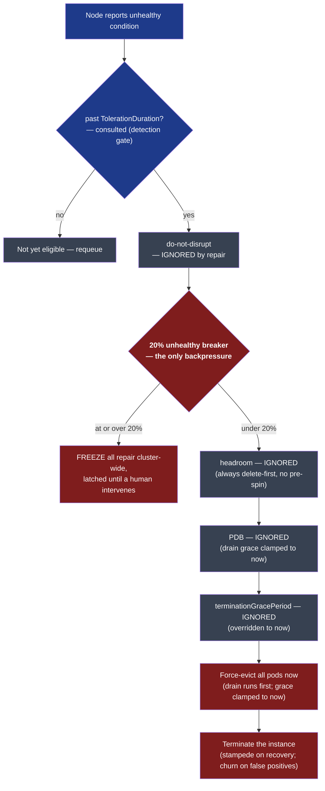
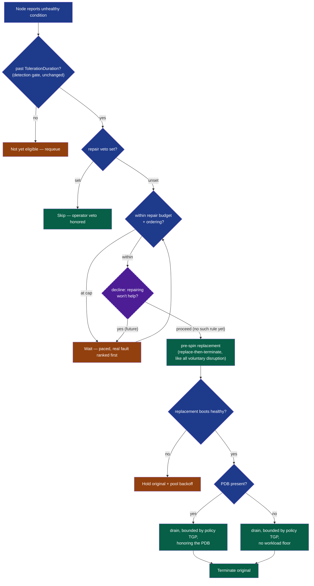

# RFC: Making Node Repair Voluntary

## Summary

Node auto repair ([#1768](https://github.com/kubernetes-sigs/karpenter/pull/1768)) shipped as an alpha, opt-in mechanism that **forcefully terminates** nodes a cloud provider has declared unhealthy. It runs as a standalone controller (`node.health`) that deletes NodeClaims directly, gated only by a single hardcoded `allowedUnhealthyPercent = "20%"` circuit breaker. It does not pre-spin a replacement, does not respect disruption budgets, does not honor `terminationGracePeriod`, and gives an operator no way to stop it mid-incident.

This RFC proposes that **repair become a voluntary disruption** — the same class as consolidation and drift — rather than an involuntary, forceful one. Concretely:

1. **Budget** — repair rides the existing disruption-budget machinery as a new `DisruptionReason`, replacing the hardcoded 20% breaker with a paced, self-clearing, per-NodePool cap.
2. **Ordering** — because a budget forces a choice of *which* eligible node to repair first, repair gets a deterministic, prioritizable, starvation-free ordering.
3. **Policy** — the existing `RepairPolicy` gains a per-condition drain bound (forceful vs. graceful) and an ordering priority.
4. **Veto** — repair needs a dedicated veto (the escape hatch the breaker never gave), distinct from `do-not-disrupt`. This RFC establishes that it must exist; the exact shape is a separate RFC.

These changes are additive and default to behavior *more* conservative than today's. They realize two "future considerations" the original RFC explicitly deferred for lack of data — disruption budgets and a graceful/forceful split — which the community has since asked for repeatedly ([#2811](https://github.com/kubernetes-sigs/karpenter/issues/2811), [#2134](https://github.com/kubernetes-sigs/karpenter/issues/2134), [#2321](https://github.com/kubernetes-sigs/karpenter/issues/2321), [#2042](https://github.com/kubernetes-sigs/karpenter/issues/2042)).

---

## Motivation

### The circuit breaker is the wrong shape, and it fails in both directions

Today repair's only backpressure is a package-level constant: `allowedUnhealthyPercent = "20%"`, evaluated per-NodePool for pool-owned nodes and cluster-wide for standalone NodeClaims. It is AZ-blind, topology-blind, not per-condition, and it **latches** — once tripped it stays open until a human drives the unhealthy fraction back under the line.

A single binary threshold cannot be right, because it has two failure modes and no correct one. Consider a large accelerator fleet where a detector false-positive marks most of a NodePool unhealthy at once, while one node in that pool has a *genuine* uncorrectable fault:

- **Freeze (false negative).** The false-positive wave pushes the unhealthy fraction over 20%, the breaker trips, and **all repair freezes cluster-wide — including the one genuinely-broken node**, which sits un-repaired until an operator intervenes. The safety mechanism blocks the repair the customer actually needed.
- **Stampede (false positive).** As the falsely-flagged nodes recover and the fraction drops back under 20%, the breaker re-opens and Karpenter **terminates all still-flagged nodes at once**, taking out healthy workloads in a burst. Operators who *knew* the signal was bad had no lever to stop it.

Repair only ever observes one symptom — *nodes reporting unhealthy* — but that symptom has many underlying causes, each wanting a different response:

| It's actually… | Repair should… | Under the 20% breaker |
|---|---|---|
| a **bad rollout** (a component version degrades or falsely flags the cohort; replacements re-inherit it) | stop — replacing won't help | churns replacements below the line; freezes everything above it |
| a **flaky detector** (noisy, not wrong) | wait for it to settle | fires if a flap outlasts toleration; else freezes |
| a **zonal outage / partition** | defer; don't add load to an impaired zone | mass-replaces below the line; freezes above it |
| a **genuine hardware failure** | repair it | repaired — unless a concurrent false-positive wave freezes it out |

We can, and should, build specific catches for several of these causes (rollout-health detection, deferral to zonal-shift responders, detector debouncing). But each catch is specific to one cause and each has a blind spot. When a catch misses, repair acts on a symptom it has misjudged — and the whole safety story reduces to: *when repair is wrong, how much can it break?* The answer must be a **capped, self-clearing blast radius** that holds regardless of which cause it's in, not a latched all-or-nothing freeze.

### The community has been asking for exactly this

The graduation tracking issue ([#2398](https://github.com/kubernetes-sigs/karpenter/issues/2398)) already accumulates the relevant blockers, and the underlying asks converge on "the breaker is the wrong tool":

- **[#2811](https://github.com/kubernetes-sigs/karpenter/issues/2811)** — an over-termination incident; wants disruption-budget-style controls ("1 at a time, once per 5m") and a graceful-drain-first attempt before ungraceful delete.
- **[#2134](https://github.com/kubernetes-sigs/karpenter/issues/2134)** / **[#2321](https://github.com/kubernetes-sigs/karpenter/issues/2321)** — in small NodePools a single unhealthy node exceeds 20%, so either it never repairs or the breaker is meaningless (round-up makes a lone node always pass). No single threshold works across pool sizes.
- **[#2042](https://github.com/kubernetes-sigs/karpenter/issues/2042)** — repair doesn't honor PDBs / `terminationGracePeriodSeconds`; a graduation blocker.

The common thread: users reach for a *configurable* breaker, but their rationale keeps describing a *paced budget* — bounded rate, self-clearing, per-scope. That is not a better threshold; it is a different mechanism.

### The disruption controls the operator already set are inert

Repair consults exactly two controls today: the per-condition `TolerationDuration` (how long a condition must persist before the node is eligible) and the 20% breaker (the sole backpressure). Both of these are hard coded and cannot be controlled by the operator. Everything else the operator configured to govern *disruption* is bypassed, because repair deletes the NodeClaim directly instead of going through the disruption path: the node's `PodDisruptionBudget`, its `terminationGracePeriod`, and any `do-not-disrupt` intent are all ignored, and forceful termination evicts the pods before it even attempts to terminate the instance. Drawn as a decision flow — the two live controls in colour, every bypassed one grey:



---

## Background: two axes of disruption

Every way Karpenter takes a node out of service lands on two orthogonal axes.

**Axis 1 — who decided the node should go** (governs budgets and replacement ordering):

- **Voluntary** — Karpenter *chose* to act (consolidation, drift). Discretionary, so it's paced by disruption budgets, honors `do-not-disrupt`, and **pre-spins a replacement before removing the node** — there's no rush, so don't open a capacity gap.
- **Involuntary** — the node is leaving regardless (spot interruption, expiration). Budgets can't hold it back, and there's nothing to pre-spin for.

**Axis 2 — how the node is terminated**, really a spectrum of *how long Karpenter attempts to drain before proceeding anyway*, bounded by the node's `terminationGracePeriod` (TGP):

- **Graceful** — attempt to drain first (honoring PDBs and pod grace), bounded by TGP if set, unbounded otherwise.
- **Forceful** — the zero-bound endpoint: `TGP = 0`, drain skipped, instance terminated immediately. Not a separate mechanism — just graceful with the drain window closed. Repair reaches it today by stamping `nodeclaim-termination-timestamp = now`.

The two axes are independent, so every disruption source lands in one cell:

| | **Graceful (drains, bounded by TGP)** | **Forceful (TGP = 0, no drain)** |
|---|---|---|
| **Voluntary** (budgeted, vetoable) | Consolidation, Drift | — |
| **Involuntary** (bypasses budgets) | Spot interruption, scheduled maintenance, `DescribeInstanceStatus`, Expiration | **Repair (today)** |

Repair is the only thing in the forceful/involuntary cell — and this RFC argues it doesn't belong there.

---

## Repair is voluntary, not involuntary

Involuntary means *a commitment to remove the node*: the cloud provider is reclaiming it, or an operator's expiration policy says it must go. There is nothing to budget — the node is going.

Repair is the opposite. It acts on a fault *diagnosis*, and a diagnosis can be wrong (see [Motivation](#motivation)). A fallible signal must never exempt itself from the budget — that is precisely the bug where one bad signal drove unbounded termination. So **every repair signal is voluntary**: budgeted and vetoable. This holds even for higher-trust cloud-provider-sourced diagnoses (e.g. an instance-status health check, [prov#9064](https://github.com/aws/karpenter-provider-aws/pull/9064)) — "more trustworthy" is a reason to repair that node *before* others, not to skip the budget.

Similarly, **forceful vs. graceful should depend on the condition**, not be forceful-always. The question is: *can the kubelet still carry out an eviction?* If maybe, drain (graceful, bounded); if not, a drain would only hang, so skip it (forceful). 

Both changes align with the original RFC ([#1768](https://github.com/kubernetes-sigs/karpenter/pull/1768)), which scoped out budgets and draining because there wasn't enough data to justify them. There now is.

---

## Proposal

Making repair a well-behaved voluntary disruption is four additive changes. Together they turn the inert controls above into live branches — the same decision flow, but now every control the operator set steers it:



### 1. Budget — repair as a `DisruptionReason`

Repair follows the same paced disruption-budget semantics consolidation and drift already use. It's one enum value:

```go
// +kubebuilder:validation:Enum={Underutilized,Empty,Drifted,Repair}
type DisruptionReason string

const ( /* … */ DisruptionReasonRepair DisruptionReason = "Repair" )
```

An operator writes `spec.disruption.budgets` with `reasons: ["Repair"]` to say "repair at most N at a time," per-NodePool and schedulable — building directly on the reason-keyed budget design already in-tree (`designs/disruption-controls-by-reason.md`). A false-positive flood is bounded to a trickle instead of a stampede, and it **self-clears** as nodes recover, with no latched breaker to manually unstick. This replaces the binary 20% breaker outright.

**Not a breaking change.** The default budget is 10% — *more* conservative than today's 20% — so an operator who does nothing gets tighter, not looser. Repair runs as a disruption *method* inside the shared disruption loop rather than as its own controller, and it must run **before drift and consolidation** (fixing a fault outranks a discretionary rebalance, as it effectively does today).

Two benefits fall out of riding the shared machinery:

- **Observability for free.** Budget metrics are already `reason`-labeled, so `reason="Repair"` gets its own `karpenter_nodepools_allowed_disruptions` and `nodes_consuming_budgets` series (equal ⇒ at cap), plus the NodePool-scoped `DisruptionBlocked` event. A false-positive flood becomes *visible* as repair pinned at its cap — exactly the legibility the breaker lacked, which today trips silently. (One counter worth adding: a `..._blocked_total`.)
- **A natural home for smarter restraint.** A cap forces a choice of *which* node, and that choice point is where repair can eventually get much smarter — declining a valid, in-budget target when repairing it won't help (see [Scope](#scope-and-follow-ups)). The budget is a **ceiling, not a mandate.**

> NodePool may not be the ideal budget scope (an arbitrary `nodeSelector` would be more flexible), but splitting repair's budget out alone fragments lifecycle management. [#2930](https://github.com/kubernetes-sigs/karpenter/pull/2930) proposes doing budget scoping properly for *all* disruption at once; this RFC rides the existing per-NodePool scope and stays compatible with that.

### 2. Ordering — deterministic, prioritizable, starvation-free

Once a budget caps the rate, something must choose which eligible node goes first. Today that choice is **arbitrary** — whichever reconcile fires under the breaker wins. The initial ordering just needs to be **deterministic** (same set → same order), **prioritizable** (a fatal ECC fault beats a flaky fabric error), **starvation-free** (a low-priority real fault can't wait forever), and **monotone in waiting** (waiting only raises a node's standing). Linear aging with a per-NodePool backoff satisfies all four:

```
E = rank + age/τ − backoff(nodePool)     sort descending; tie-break on disruptionCost, then nodeName
```

- **`rank`** — a dense ordering of fault types from per-policy `Priority` (below). Using rank, not raw priority values, keeps arbitrary magnitudes from changing what `τ` means.
- **`age/τ`** — time *past toleration*, the wait that buys one rank tier (`τ` sets the starvation bound). Age starts at *eligibility*, not fault onset, so a flakier signal's longer toleration can't bank extra age and rank higher.
- **`backoff(nodePool)`** — a down payment on smarter restraint: applied to every node in a pool whose replacements keep failing, pacing the bad-component loop across fresh nodes. Keyed to the **NodePool, not the node**, because a failed launch is almost never node-specific. (This is the same head-of-line / launch-failure problem drift hits in [#3072](https://github.com/kubernetes-sigs/karpenter/issues/3072) / [#3080](https://github.com/kubernetes-sigs/karpenter/issues/3080).)

This ordering is the concrete answer to the freeze: a genuine fault out-*ranks* a false-positive flood, so it's served first, not starved behind it — and aging guarantees even a low-priority real fault wins within `Δrank·τ`. This direction generalizes to [#3141](https://github.com/kubernetes-sigs/karpenter/issues/3141) (unify disruption methods into a single priority-scored candidate list), where repair is simply one more scored candidate.

### 3. Policy — expand the existing `RepairPolicy`

```go
type RepairPolicy struct {
    // existing
    ConditionType      corev1.NodeConditionType
    ConditionStatus    corev1.ConditionStatus
    TolerationDuration time.Duration      // how long the condition must persist before repair acts

    // new — the Axis-2 drain bound.
    //   0        = forceful (skip drain)
    //   nil      = inherit nodepool.TGP
    //   non-zero = min(value, nodepool.TGP)
    TerminationGracePeriod *time.Duration

    // new — ordering weight, 0–100. Collisions expected and unresolved;
    // compressed to a dense rank, so only ordering matters, not the value.
    Priority int
}
```

- **`TerminationGracePeriod`** encodes Axis 2 per condition, and composes with any NodePool-level TGP as a **minimum** — the policy's bound can only tighten the drain window, never extend it past what the operator already set:
  - `0` = **forceful** — skip the drain outright, for conditions the kubelet can't drain through (e.g. `Ready=Unknown`, `KernelReady=False`). This overrides a longer NodePool TGP, since a drain there would only hang.
  - `nil` = **inherit** the NodePool's TGP unchanged (the pool's configured drain window, or unbounded if it set none).
  - non-zero = **`min(policy.TGP, nodepool.TGP)`** — the tighter of the two applies, so the policy can shorten a generous pool window for a condition that shouldn't wait, but a strict pool TGP is never loosened by the policy.

  Because a policy TGP applies even when the NodePool set none, repair also gets its *own* default drain bound — so an unconfigured NodePool still bounds the drain and repair is never the unbounded hang that [#2042](https://github.com/kubernetes-sigs/karpenter/issues/2042) describes. This is the shape that resolves the forceful-vs-graceful split ([prov#9173](https://github.com/aws/karpenter-provider-aws/issues/9173) / [prov#9198](https://github.com/aws/karpenter-provider-aws/pull/9198) land the forceful path today by annotation; this migrates it onto policy at graduation).
- **`Priority`** feeds the ordering tie-break. It is *not* redundant with `TolerationDuration`: toleration is a confidence delay before eligibility; priority orders what's already eligible.

Nothing is budget-exempt in this RFC: every repair condition is a fallible diagnosis, so all of them are voluntary. One exception is conceivable — a signal trusted enough to repair *involuntarily* even when no replacement can be spun (e.g. "this instance is physically gone," where leaving the node only wastes money). Rather than bake a budget-exempt field into the policy now, this RFC keeps everything voluntary and leaves that exception to an explicit follow-up if a concrete case for it emerges.

### 4. Veto — repair needs a dedicated one

The budget paces repair; it doesn't give an operator a "stop, you're wrong" lever mid-incident. A veto does — the ability to say "don't remediate this node, even if it looks broken" is a longstanding, direct ask ([#2424](https://github.com/kubernetes-sigs/karpenter/issues/2424)). Making repair voluntary means it **needs a veto of its own**, distinct from the existing `karpenter.sh/do-not-disrupt`.

It has to be dedicated because the two carry different intents. `do-not-disrupt` means "don't do *discretionary* things to this node" — consolidation, drift. A user who set it to protect a long-running job did not necessarily mean "and never fix this node if it breaks"; conversely, a user might want repair suppressed on a node they're happy to consolidate. Repair-suppression and disruption-suppression are separable intents, so repair gets its own annotation rather than overloading `do-not-disrupt`.

**What this RFC does *not* settle:** whether `do-not-disrupt` should *also* imply "don't repair" **by default**. Repair ignores `do-not-disrupt` today, so any coupling would be a behavior change with real trade-offs in both directions, and the right shape (default coupling? node vs. NodePool scope? interaction with the dedicated veto?) deserves its own discussion. This RFC commits only to the principle that **a repair-specific veto must exist**; the precise annotation shape and its relationship to `do-not-disrupt` are worked out in a dedicated follow-up, tracked in [#2424](https://github.com/kubernetes-sigs/karpenter/issues/2424). The node-level pause direction in [#2497](https://github.com/kubernetes-sigs/karpenter/issues/2497) / [#2901](https://github.com/kubernetes-sigs/karpenter/pull/2901) is related prior art for that conversation.

---

## How this handles the failure cases

The mechanisms compose against the causes from [Motivation](#motivation): the **budget** caps the rate, **ordering** decides who goes first, **pool backoff** slows a pool whose replacements keep failing.

| Situation | What this design does | Case-specific fix (elsewhere) |
|---|---|---|
| **Bad rollout** | budget caps churn; pool backoff paces the loop; ordering keeps the flood from starving a real fault | rollout-health detection *stops* a bad version |
| **Flaky detector** | budget backstops if a flap outlasts toleration | detector debouncing / toleration |
| **Zonal outage / partition** | budget paces replacement in the impaired zone; pre-spin (companion RFC) naturally defers to zonal-shift responders — a replacement can't come up healthy in the impaired zone, so the original is never terminated | zonal-shift integration ([#2171](https://github.com/kubernetes-sigs/karpenter/issues/2171)) |
| **Genuine hardware failure** | ordering puts the real fault first; budget paces the batches | none — repair working as intended |

The residual is a *bounded delay*, not a hole: a higher-priority flood can delay a lower-priority real fault by at most `Δrank·τ`, and aging guarantees it eventually wins. Closing that further is a matter of smarter *ordering* (the decline/deprioritize follow-up in [Scope](#scope-and-follow-ups)), not of subdividing the budget.

---

## Scope and follow-ups

This RFC is deliberately the minimal change. Everything below builds additively; none of these choices preclude them.

**Beta-blocking follow-ups (separate RFCs):**

- **No-headroom delete-first fallback ([#2906](https://github.com/kubernetes-sigs/karpenter/pull/2906)).** Pre-spinning a replacement before terminating comes with making repair voluntary — it's the same replace-then-terminate every voluntary disruption already does, and it's strictly better across the cases (a false positive becomes a wasted launch, not an outage; a genuine failure is a zero-downtime swap; a bad-component loop never terminates the original because the replacement comes up unhealthy). What this RFC does *not* need to solve is the fleet that has no headroom to pre-spin (reserved/ODCR, static at `limits`) and so needs a delete-first path instead. That fallback is a cross-disruption primitive shared with drift, not a repair-only bolt-on — covered in a companion RFC ([#2905](https://github.com/kubernetes-sigs/karpenter/issues/2905), [#2955](https://github.com/kubernetes-sigs/karpenter/pull/2955)).
- **Repair veto shape ([#2424](https://github.com/kubernetes-sigs/karpenter/issues/2424)).** This RFC establishes that a repair-specific veto must exist (§4) but deliberately doesn't settle its shape. The follow-up decides the dedicated suppression signal (annotation? NodePool field? both?), its scope (node vs. NodePool), and — the open question — whether `karpenter.sh/do-not-disrupt` should imply "don't repair" by default, or whether suppression should instead be reason-scoped. Related pool-level pause prior art: [#2497](https://github.com/kubernetes-sigs/karpenter/issues/2497) / [#2901](https://github.com/kubernetes-sigs/karpenter/pull/2901).
- **Termination contract ([#3029](https://github.com/kubernetes-sigs/karpenter/issues/3029)).** Repair coordinates with the termination controller through the `nodeclaim-termination-timestamp` annotation hack (with explicit optimistic-lock code to avoid a race). Formalizing a first-class termination contract resolves that and the related grace-period correctness bugs ([#3032](https://github.com/kubernetes-sigs/karpenter/issues/3032) (fixed), [#3111](https://github.com/kubernetes-sigs/karpenter/issues/3111)). Sequenced early to keep the refactor cheap; not itself a hard gate.

**Beyond graduation (extensibility, not gates):**

- **Declining / deprioritizing repairs that won't help.** The budget is a ceiling, not a mandate — a target can be valid and in-budget yet not worth repairing (a whole zone down). Pool backoff is the first narrow instance; the general form is a decline step in the budget→order→act pipeline. This is why we don't reach for per-condition budgets: ordering already puts the real fault ahead of a flood, and declining removes the futile flood outright. The narrow launch-failure case is tracked by [#3072](https://github.com/kubernetes-sigs/karpenter/issues/3072) / [#3080](https://github.com/kubernetes-sigs/karpenter/issues/3080), and zonal deferral by [#2171](https://github.com/kubernetes-sigs/karpenter/issues/2171); the general decline framework has no dedicated issue yet.
- **Unified disruption object ([#3141](https://github.com/kubernetes-sigs/karpenter/issues/3141)).** If disruption config consolidates into one priority-scored candidate list, these inline fields relocate into it — a move, not a redesign.

---

## Alternatives considered

**Just fix the breaker.** Each targeted fix is still a binary threshold that *stops* (not paces) and *latches* (not self-clears):
- *AZ-aware breaker* — fixes the zonal row only; still latched, still blind to bad-rollout / bad-detector causes.
- *Configurable threshold* ([#2134](https://github.com/kubernetes-sigs/karpenter/issues/2134), [#2321](https://github.com/kubernetes-sigs/karpenter/issues/2321)) — moving the number doesn't change that *some* threshold trips and freezes everything above it. No number is right.
- *Per-condition breaker* — a per-condition *stopping* threshold is just per-reason budgets built badly; the paced version is the budget.

**Repair-native budget (a second, separate budget system).** Rejected: fragments lifecycle management and duplicates observability. Riding the existing reason-keyed budget gets metrics, events, and scheduling for free.

---

## References

- [#1768](https://github.com/kubernetes-sigs/karpenter/pull/1768) — RFC: Node Auto Repair (the alpha design being revised)
- [#2398](https://github.com/kubernetes-sigs/karpenter/issues/2398) — Node repair graduation (tracking issue)
- [#2811](https://github.com/kubernetes-sigs/karpenter/issues/2811) — per-NodePool repair config; budgets + graceful-first
- [#2134](https://github.com/kubernetes-sigs/karpenter/issues/2134) · [#2321](https://github.com/kubernetes-sigs/karpenter/issues/2321) — small-NodePool starvation under the threshold
- [#3031](https://github.com/kubernetes-sigs/karpenter/issues/3031) — dynamic / AZ-aware circuit breaking (accepted, needs-design)
- [#2042](https://github.com/kubernetes-sigs/karpenter/issues/2042) — repair respects PDBs/TGP (graduation blocker)
- [#3029](https://github.com/kubernetes-sigs/karpenter/issues/3029) — formalize the node termination contract
- [#2906](https://github.com/kubernetes-sigs/karpenter/pull/2906) · [#2905](https://github.com/kubernetes-sigs/karpenter/issues/2905) · [#2955](https://github.com/kubernetes-sigs/karpenter/pull/2955) — replacement strategies / no-headroom fallback
- [#2930](https://github.com/kubernetes-sigs/karpenter/pull/2930) — standalone/hierarchical disruption budgets
- [#3141](https://github.com/kubernetes-sigs/karpenter/issues/3141) — unify disruption methods into a single priority-scored list
- [#2497](https://github.com/kubernetes-sigs/karpenter/issues/2497) · [#2901](https://github.com/kubernetes-sigs/karpenter/pull/2901) — NodePool-level disruption pause
- [#2310](https://github.com/kubernetes-sigs/karpenter/pull/2310) — NodePool repair policies with toleration durations
- [#3072](https://github.com/kubernetes-sigs/karpenter/issues/3072) · [#3080](https://github.com/kubernetes-sigs/karpenter/issues/3080) — halt/starvation under repeated launch failures
- [prov#9173](https://github.com/aws/karpenter-provider-aws/issues/9173) · [prov#9198](https://github.com/aws/karpenter-provider-aws/pull/9198) — forceful vs. graceful termination split
- [prov#9064](https://github.com/aws/karpenter-provider-aws/pull/9064) — `DescribeInstanceStatus` health signal
- [prov#8685](https://github.com/aws/karpenter-provider-aws/issues/8685) · [prov#7491](https://github.com/aws/karpenter-provider-aws/issues/7491) — configurable repair policy
