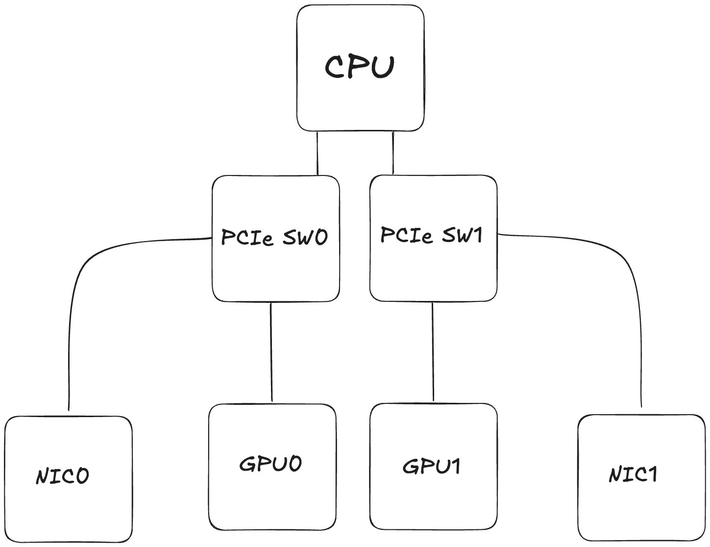

# NodeOverlay Integration for Dynamic Resource Allocation

## Overview

When Karpenter constructs a NodeClaim for a given set of pods, it uses information from the cloudprovider to determine
the resources that will exist on a Node if one is created for a given instance type. That is then used to determine
which instance types will satisfy a given set of requests. Cloudprovider implementations can get this information from
any number of sources, for example AWS EC2's `DescribeInstanceTypes` API, and they use their knowledge of well-known
device plugins to determine the resulting nodes' allocatable resources. The drawback of this approach is that each
cloudprovider needs to build integrations for specific drivers, and users are limited by those integrations.
`NodeOverlays` were introduced to close that gap by allowing end users to explicitly inform Karpenter of the resources
that will be made available for a given instance type. For example, the following `NodeOverlay` will add the
`smarter-device/fuse` device to `c5.large` instances from the NodePool `fuse-np`.

```yaml
kind: NodeOverlay
apiVersion: karpenter.sh/v1alpha1
spec:
  requirements:
    - key: karpenter.sh/nodepool
      operator: In
      values: ["fuse-np"]
    - key: node.kubernetes.io/instance-type
      operator: In
      values: ["c5.large"]
  capacity:
    smarter-device/fuse: 1
```

We face the same challenge with DRA: CloudProviders will need to be made aware of the `ResourceSlices` that will be
published when a given instance type registers with the cluster as a node. This RFC proposes extending the existing
`NodeOverlay` API to support specifying `ResourceSlices` in addition to conventional extended resources.

**Note:** `NodeOverlays` are an advanced Karpenter feature and are not intended to be the primary way for users to use
DRA. The expecation is that cloudproviders will build integrations for common use-cases and that the `NodeOverlay`
extension will serve advanced users with specific requirements. `NodeOverlays` are being used for initial implementation
since they are cloudprovider agnostic and enable the development / use of DRA while awaiting native cloudprovider
integrations.

### Goals

- Enable end users to use DRA drivers with Karpenter without cloudprovider specific integrations
- Enable the description of complex topological relationships between nodes and `ResourceSlices`
- Define how `ResourceSlices` integrate with the rest of the `NodeOverlay` API (e.g. conflict resolution)
- Decouple the development of Karpenter's DRA featureset from cloudprovider integrations

### Non-goals

- Support for describing non-node-local devices
- Defining the scheduling integration and internal Karpenter interfaces. This will be defined in a follow-up RFC.

## API Design

Although we know we need to embed `ResourceSlices` into the `NodeOverlay` object, there are sevaral options available
with regards to typing. The following three options are considered in this proposal:

- A slice of unstructured objects
- A slice of unmutated, upstream `ResourceSlice` objects
- A slice of custom `ResourceSlice` objects (referred to as `ResourceSliceTemplates` going forward)

A list of unstructured objects has the advantage of not coupling the `NodeOverlay` CRD to a particular version of the
`ResourceSlice` schema. We have considered changing other fields in Karpenter to accept an unstructured object
(`spec.kubelet` and `spec.userData` (Bottlerocket) on the `EC2NodeClass`) for this reason. This would provide an
advantage in those cases because Karpenter passes those fields unmutated to other processes, e.g. Kubelet. Since
Karpenter's version is not coupled to those processess' versions, coupling the configuration schema can cause
unnecessary compatiblity issues. On the other hand Karpenter won't be passing the `ResourceSlices` embedded in
`NodeOverlays` to any other process. Additionally, Karpenter is coupled to the version of the schema supported by its
scheduler. Including a concrete schema in the `NodeOverlay` CRD definition self-documents the supported subset of DRA's
functionality.

Using the upstream schema is the next obvious solution. Users are already familiar with this schema, and it simplifies
the onboarding process by allowing existing manifests to be copied into the `NodeOverlay` directly. However, this also
comes with some notable drawbacks:

- Karpenter won't support all of the fields that are present in the upstream schema, for example those backed by alpha
  features.
- Some of the fields are redundant, e.g. `spec.nodeName`, since it will be implicitly associated with the instance
  that's launched. Additionally, in this case it's impossible to know the concrete value ahead of launch.
- Some of the required fields don't provide useful information for Karpenter, e.g. `spec.pool`. Requiring users to
  configure these values would be confusing.

For these reasons, this proposal recommends the third option, `ResourceSliceTemplates`. The following principles would
be used to determine if fields should be included in Karpenter's `ResourceSliceTemplate` schema:

- Fields which don't influence scheduling should be excluded
- Fields backing feature gates unsupported by Karpenter should be excluded

Based on these principles, the following fields from the `v1` API in Kubernetes 1.34 would be **excluded**:

| Field                                     | Rationale                                                                                                                                                                                |
| ----------------------------------------- | ---------------------------------------------------------------------------------------------------------------------------------------------------------------------------------------- |
| `spec.nodeName`                           | The concrete value for this field can't be known when creating the template. If no other selector is specified in the template, we should assume the `ResourceSlice` will be node local. |
| `spec.perDeviceNodeSelection`             | Alpha (Partitionable Devices)                                                                                                                                                            |
| `spec.pool`                               | Irrelevant to Karpenter's scheduling simulation                                                                                                                                          |
| `spec.sharedCounters`                     | Alpha (Partitionable Devices)                                                                                                                                                            |
| `spec.devices[].allNodes`                 | Alpha (Partitionable Devices)                                                                                                                                                            |
| `spec.devices[].allowMultipleAllocations` | Alpha (Consumable Capacity)                                                                                                                                                              |
| `spec.devices[].bindingConditions`        | Alpha (Device Binding Conditions). Shouldn't be required even when the feature goes beta / GA since it's not relevant to instance type selection.                                        |
| `spec.devices[].bindingFailureConditions` | Alpha (Device Binding Conditions). Shouldn't be required even when the feature goes beta / GA since it's not relevant to instance type selection.                                        |
| `spec.devices[].bindsToNode`              | Alpha (Device Binding Conditions). Shouldn't be required even when the feature goes beta / GA since it's not relevant to instance type selection.                                        |
| `spec.devices[].consumesCounters`         | Alpha (Consumable Capacity)                                                                                                                                                              |
| `spec.devices[].nodeName`                 | Alpha (Partitionable Devices). Wouldn't be supported regardless due to it being an unresolvable value.                                                                                   |
| `spec.devices[].nodeSelector`             | Alpha (Partitionable Devices)                                                                                                                                                            |
| `spec.devices[].taints`                   | Alpha (Device Taints)                                                                                                                                                                    |

New fields would be evaluated on a case-by-case basis as they are added to the upstream schema. Additionally, new fields
may be introduced to support functionality specific to Karpenter. An example of this can be found in the section on
[supporting relative topology requirements](#supporting-relative-topology-requirements). A complete description of the
proposed `ResourceSliceTemplate` schema can be found in the appendix.

### Supporting Relative Topology Requirements

One of the main additional capabilities that DRA enables is non-node local device consumption. Drivers can define the
set of nodes a device can be consumed from using `spec.nodeSelector` on the `ResourceSlice`. Generally speaking, this
topology requirement is going to be **relative** to the device's "host node." Going forward, we'll consider an example
of a device which is only available within the same zone as the host node.

When a DRA driver creates `ResourceSlices` for such a device, it already knows the zone the node has been provisioned in
and can inject that zonal requirement into the `ResourceSlice's` selector. On the other hand, the user does not
necessarily know the zone that Karpenter will provision the node into. They could create a `NodeOverlay` per topology
domain, but this becomes untennable with a large number of domains. This problem statement can be generalized: how does
a user express a topology constraint when the domain is unresolved?

There is prior art in Kubernetes for expressing topological constraints based on unresolved domains:
[`matchLabelKeys` for pod affinity and topology spread constraints](https://kubernetes.io/blog/2024/08/16/matchlabelkeys-podaffinity/).
The motivating example for this feature was very similar: users need a way to express constraints based on a pod's
template hash, but that hash won't be resolved until the pod is created. Therefore, the user can't express this directly
in the pod template. This is the same issue we face with DRA: we know the topology we want to express the constraint on
(zone) but won't know the domain until the node is provisioned. This RFC proposes adding `matchLabelKeys` to
`spec.nodeSelector` on the `ResourceClaimTemplate` where it will serve the same purpose as it does in the pod spec.

An example of configuring a zonal selector using `matchLabelKeys`:

```yaml
kind: NodeOverlay
apiVersion: karpenter.sh/v1alpha1
spec:
  resourceSliceTemplates:
    - spec:
        nodeSelector:
          nodeSelectorTerms:
            - matchLabelKeys:
                - "topology.kubernetes.io/zone"
```

**Note:** This RFC does **not** propose extending the upstream `ResourceSlice` schema with `matchLabelKeys`. Although we
have the concept of a "host node" in Karpenter, this is not necessarily the case for all `ResourceSlices` in which case
`matchLabelKeys` would not make sense semantically. Additionally, the drivers creating `ResourceSlices` will have been
able to resolve these topology domains already. For this reason it only proposes extending `ResourceClaimTemplate`.

An alternative approach can be found in the appendix.

### Supporting Inter-Device Topology Alignment

One of the core capabilities that DRA provides is enabling users to specify a set of attributes that must match or be
distinct across a set of devices. One of the motivating examples of this feature is to guaranteed topological alignment
between accelerators and NICs to ensure certain performance characteristics. The problem this poses for Karpenter is
that it isn't necessarily possible to know the concrete values of these attributes before launching an instance.

Consider the following example. A user wants to allocate a GPU and NIC for an application, and wants to ensure that
they're colocated using the standardized `resource.k8s.io/pcieRoot` attribute. They use the following `ResourceClaim` to
make this request:

```yaml
kind: ResourceClaim
apiVersion: resource.k8s.io/v1
spec:
  devices:
    requests:
      - name: gpu
        exactly:
          deviceClassName: gpu.nvidia.com
      - name: nic
        exactly:
          deviceClassName: rdma.nvidia.com
  constraints:
    - requestNames: ["gpu", "nic"]
      matchAttribute: resource.k8s.io/pcieRoot
```

The user will also need to create NodeOverlays for instance types which support this type of request. For this example,
we'll consider an instance with the following topology:



To encode this topology in a `NodeOverlay` we need to indicate that the attributes on the two `ResourceSlices` will have
a shared value. The naive approach would be to just use a shared static value:

```yaml
kind: NodeOverlay
apiVersion: karpenter.sh/v1alpha1
spec:
  resourceSlicesTemplates:
    - spec:
        driver: rdma.nvidia.com
        devices:
          - attributes:
              resource.k8s.io/pcieRoot:
                string: "pcie-root-1"
              # ...
          - attributes:
              resource.k8s.io/pcieRoot:
                string: "pcie-root-2"
              # ...
    - spec:
        driver: gpu.nvidia.com
        devices:
          - attributes:
              resource.k8s.io/pcieRoot:
                string: "pcie-root-1"
              # ...
          - attributes:
              resource.k8s.io/pcieRoot:
                string: "pcie-root-2"
              # ...
```

This approach doesn't require any additional changes to the `ResourceSlice` schema and is easy for an end user to reason
about. However, since it doesn't distinguish between known values and placeholder values it has notable downsides:

- The "placeholder" value can't overlap with resolved values on existing `ResourceSlices`.
- There is additional complexity when validating that the `ResourceSlices` produced for an instance match Karpenter's
  expectations during the initialization stage of the NodeClaim's lifecycle.

To resolve these issues, a dedicated placeholder value could be used. This RFC proposes nesting the
`ResourceSliceTemplates` in a new top-level field, `dynamicResources`, and adding an `attributeBindings` field. This
field can be thought of as the corollary to `spec.devices.constraints` on `ResourceClaim`. Each binding consists of a
set of devices and a set of attributes. Karpenter assumes that each device specified will have the specified attributes
and those attributes will have a shared value. These bindings would have the following properties:

- Bindings are scoped to a single `NodeOverlay` resource. A user couldn't specify a binding that selects against devices
  in separate `NodeOverlays`.
- Bindings are scoped to a single in-flight `NodeClaim`. If a `NodeOverlay` selects against multiple `NodeClaims` within
  a single scheduling simulation, the `ResourceSlices` for each `NodeClaim` will have a unique values for their
  attributes.

The following example demonstrates how a `NodeOverlay` would be configured with `attributeBindings`:

```yaml
kind: NodeOverlay
apiVersion: karpenter.sh/v1alpha1
spec:
  dynamicResources:
    attributeBindings:
      - deviceSelectors:
          - resourceSliceTemplate: rdma-slice
            device: rdma-device-0
          - resourceSliceTemplate: gpu-slice
            device: gpu-device-0
        attributes:
          - resource.k8s.io/pcieRoot
    resourceSliceTemplates:
      - metadata:
          name: rdma-slice
        spec:
          driver: rdma.nvidia.com
          devices:
            - name: rdma-device-0
      - metadata:
          name: gpu-slice
        spec:
          driver: gpu.nvidia.com
          devices:
            - name: gpu-device-0
```

While this approach does satisfy today's requirements, driven by the `matchAttribute` constraint, it may not offer the
flexibility required long-term. Specifically,
[KEP-5254: Constraints with CEL](https://github.com/kubernetes/enhancements/pull/5391) proposes the addition of a CEL
expression to `constraints`, enabling users to use arbitrarily complex CEL expressions when constraining devices. That
being said, the proposed mechanism still supports the use-cases proposed in that KEP and others from existing drivers.
This isn't a one-way door decision and we can increase the flexibility of this API as new use-cases present themselves.
For this reason, `attributeBindings` is the recommended approach for initial DRA support in Karpenter.

For alternative approaches, refer to the appendix.

## Conflict Resolution

Today `NodeOverlays` support two types of overrides, both of which have their own semantic for conflict resolution.
Conflict resolution for price is handled based on the weight of the `NodeOverlays`. If two `NodeOverlays` apply to the
same instance type and have different weights, the higher weighted overlay is used. If their weights are the same,
they're marked as conflicting. The semantic for capacity is similar, but it isn't treated as an atomic unit. Instead,
conflicts are handled separately per-resource.

There are two approaches we could take to handling conflicts with `ResourceSlices`. The first is to treat the
`ResourceSlices` in a NodeOverlay as an atomic unit. The `ResourceSlices` in the highest weight `NodeOverlay` for an
instance type will be applied. If there are any `NodeOverlays` of equal weight that apply to the same instance type and
have `ResourceSlices` specified, this will result in a conflict. The downside of this approach is that you can only
specify a single `NodeOverlay` per instance type with `ResourceSlices`. This wouldn't prevent the use of the feature,
but it reduces the APIs flexibility. This could be particularly burdensome in clusters with a large number of DRA
drivers - separating the `ResourceSlices` for different drivers into separate `NodeOverlays` is useful from an
organization standpoint.

Alternatively, we could associate a key with each `ResourceSlice` that would be used for conflict resolution. This would
be comparable to the use of the resource name as a key for extended resources. This would improve the flexibility of the
API while ensuring it's easy to reason about conflict resolution. We could introduce a new field to serve as this key,
but there are already two appropriate candidates.

- `metadata.name`
- `spec.driver`

Out of the two, `spec.driver` is recommended. This field is already required to be set as part of the `ResourceSlice`
definition and we don't currently anticipate use-cases for multiple `NodeOverlays` per instance type and driver. This
may change as DRA adoption grows and the driver ecosystem evolves. This isn't a one-way door decision and we can
evaluate mechanisms to introduce more granular conflict resolution when a use-case presents itself.

## Appendix

### Proposed Schema

```go
type NodeOverlaySpec struct {
	// ...
	//
	// +optional
	DynamicResources *DynamicResources `json:"dynamicResources,omitempty"`
}

type DynamicResources struct {
	// +optional
	AttributeBindings []AttributeBinding `json:"attributeBindings,omitempty"`

	// ResourceSliceTemplates lists the ResourceSliceTemplates that will be generated by DRA drivers when nodes selected
	// by this NodeOverlay are provisioned.
	//
	// +required
	ResourceSliceTemplates []ResourceSliceTemplate `json:"resourceSliceTemplates"`
}

type AttributeBinding struct {
	// +required
	Attributes []resourcev1.QualifiedName `json:"attributes"`

	// +required
	DeviceSelectors []DeviceSelectors `json:"deviceSelectors"`
}

type DeviceSelector struct {
	// +required
	Template string `json:"template"`

	// +required
	Device string `json:"device"`
}

type ResourceSliceTemplate struct {
	// Contains the information published by the driver.
	Spec ResourceSliceTemplateSpec `json:"spec"`
}

type ResourceSliceTemplateSpec struct {
	// Driver identifies the DRA driver providing the capacity information.
	// A field selector can be used to list only ResourceSlice
	// objects with a certain driver name.
	//
	// Must be a DNS subdomain and should end with a DNS domain owned by the
	// vendor of the driver. This field is immutable.
	//
	// +required
	Driver string `json:"driver"`

	// NodeSelector defines which nodes have access to the resources in the pool,
	// when that pool is not limited to a single node.
	//
	// Must use exactly one term.
	//
	// Exactly one of NodeName, NodeSelector, AllNodes, and PerDeviceNodeSelection must be set.
	//
	// +optional
	// +oneOf=NodeSelection
	NodeSelector *v1.NodeSelector `json:"nodeSelector,omitempty"`

	// AllNodes indicates that all nodes have access to the resources in the pool.
	//
	// Exactly one of NodeName, NodeSelector, AllNodes, and PerDeviceNodeSelection must be set.
	//
	// +optional
	// +oneOf=NodeSelection
	AllNodes *bool `json:"allNodes,omitempty"`

	// Devices lists some or all of the devices in this pool.
	//
	// Must not have more than 128 entries.
	//
	// +optional
	// +listType=atomic
	Devices []Device `json:"devices"`
}

type NodeSelector struct {
	// Required. A list of node selector terms. The terms are ORed.
	// +listType=atomic
	NodeSelectorTerms []NodeSelectorTerm `json:"nodeSelectorTerms"`
}

type NodeSelectorTerm struct {
	// A list of label keys which must match the provisioned node's.
	// +listType=atomic
	// +optional
	MatchLabelKeys []string `json:"matchLabelKeys,omitempty"`
	// A list of node selector requirements by node's labels.
	// +optional
	// +listType=atomic
	MatchExpressions []NodeSelectorRequirement `json:"matchExpressions,omitempty"`
	// A list of node selector requirements by node's fields.
	// +optional
	// +listType=atomic
	MatchFields []NodeSelectorRequirement `json:"matchFields,omitempty"`
}

type Device struct {
	// Name is unique identifier among all devices managed by
	// the driver in the pool. It must be a DNS label.
	//
	// +optional
  Name *string `json:"name"`

	// Attributes defines the set of attributes for this device.
	// The name of each attribute must be unique in that set.
	//
	// The maximum number of attributes and capacities combined is 32.
	//
	// +optional
	Attributes map[resourcev1.QualifiedName]resourcev1.DeviceAttribute `json:"attributes,omitempty"`

	// Capacity defines the set of capacities for this device.
	// The name of each capacity must be unique in that set.
	//
	// The maximum number of attributes and capacities combined is 32.
	//
	// +optional
	Capacity map[resourcev1.QualifiedName]resourcev1.DeviceCapacity `json:"capacity,omitempty"`
}
```

### Alternative: In-place Bound Attributes

Rather than encoding bound attribute's in a separate field, we could specify the bound attribute "in-place" within the
`ResourceSliceTemplate`. A unique key would be used to indicate two attributes on different devices are bound. This key
would be added to the `DeviceAttribute` struct under the name `bindingKey`. This field would have the following
properties:

- It's mutually exclusive with the existing fields in `DeviceAttribute`. In other words, a user can't specify a
  `bindingKey` with a concrete value.
- Scope is limited to a single NodeOverlay. In other words, the same binding key can be used across multiple
  `NodeOverlays` without creating inter-overlay bindings.
- Scope is limited to a single `NodeClaim` during provisioning. If multiple `NodeClaims` are created which both have the
  same `NodeOverlay` applied, the `ResourceClaims` associated with each `NodeClaim` will have unique attribute values.

The following example demonstrates how a `NodeOverlay` could be configured using `bindingKeys`:

```yaml
kind: NodeOverlay
apiVersion: karpenter.sh/v1alpha1
spec:
  resourceSliceTemplates:
    - spec:
        driver: rdma.nvidia.com
        devices:
          - attributes:
              resource.k8s.io/pcieRoot:
                bindingKey: pcie-root-1
              # ...
    - spec:
        driver: gpu.nvidia.com
        devices:
          - attributes:
              resource.k8s.io/pcieRoot:
                bindingKey: pcie-root-1
              # ...
```

**Pros:**

- The syntax is more concise than the proposed `attributeBindings` field

**Neutral:**

- This approach is equivalent in terms of "expressiveness"

**Cons:**

- Requires an additional change to the `ResourceSlice` schema. While changes are acceptable, they should be minimized.
- Configuration is now spread across multiple devices rather than a single source. This makes configuration changes more
  error prone.

Since this approach is just as expressive as the `attributeBindings` approach but is easier to misconfigure, this
approach is not recommended.

### Alternative: CEL Based Requirement Resolution

Another alternative explored was the use of inline CEL expressions in the `ResourceSliceTemplate`. The following
examples demonstrate what this could look like for expressing relative topology requirements and inter-device topology
constraints:

**Relative Topology Example:**

```yaml
kind: NodeOverlay
apiVersion: karpenter.sh/v1alpha1
spec:
  resourceSliceTemplates:
    - spec:
        nodeSelector:
          nodeSelectorTerms:
            - matchExpressions:
                - key: topology.kubernetes.io/zone
                  operator: In
                  values: "${resolvedLabel('topology.kubernetes.io/zone')}"
```

**Inter-device Topology Example:**

```yaml
kind: NodeOverlay
apiVersion: karpenter.sh/v1alpha1
spec:
  resourceSliceTemplates:
    - spec:
        driver: rdma.nvidia.com
        devices:
          - attributes:
              resource.k8s.io/pcieRoot:
                string: '${boundAttribute("pcie-root-1")}'
              # ...
    - spec:
        driver: gpu.nvidia.com
        devices:
          - attributes:
              resource.k8s.io/pcieRoot:
                string: '${boundAttribute("pcie-root-1")}'
              # ...
```

**Pros:**

- Requires no additive changes to the `ResourceSlice` schema
- An easy path to expand the API with more expressive CEL functions in the future

**Cons:**

- The API is not "self-documenting". A user couldn't reason about configuration based on the fields alone.
- We wouldn't necessarily want to support the full set of CEL functionality.

This approach isn't recommended primarily because it's significantly more expressive than our current requirements.
While this could be valuable in the future, without a current use-case for the increased expressability it just makes
the API easier to misconfigure. Additionally, this isn't a one way door and we can introduce this functionaliy at a
later date if a strong use-case presents itself.

### User Experience

A brief summary of the user experience with this feature:

- Determine `ResourceSlice` shape
  - May be able to just "guess" all of the relavent details, otherwise can provision instances out-of-band (e.g. using
    static capacity) to discover it that way.
- Encode `ResourceSlice` information into one or more `NodeOverlay` resources
  - Simplest workflow would be to create one `NodeOverlay` per-instance, this could be collapsed further though (e.g.
    overlay for all instance types with 2 GPUs)
  - We might want to introduce a mechanism to allow users to specify a "scaling" parameter. Cloudproviders could surface
    additional metadata about an instance type (e.g. it has this many of this "key") that we could scale off of. I don't
    think this is necessary for this first revision.
- When creating new `NodeClaims` as part of its scheduling simulation, Karpenter will use the `ResourceSlices` embedded
  into the `NodeOverlay` objects for the instance types compatible with the `NodeClaim`.
