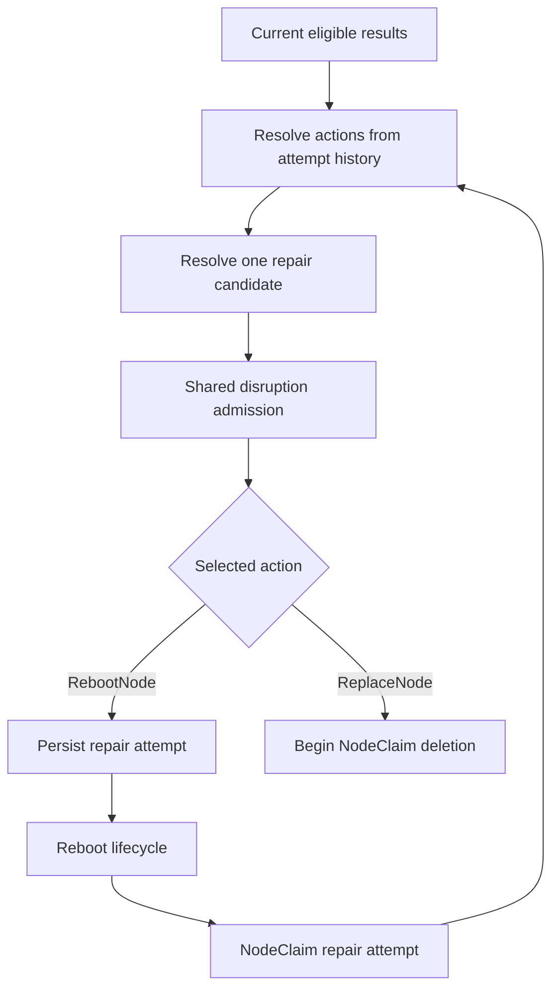

# Node Repair: Candidate Resolution, Admission, and Escalation

## Motivation

[Reason-aware matching](https://github.com/kubernetes-sigs/karpenter/pull/3263)
can produce several eligible repair results for one Node. Each result represents
a current unhealthy condition and may request a different action or drain
bound. Karpenter must reduce those results to one response before repair enters
the shared disruption pipeline. Otherwise, informer iteration could decide
which response wins, or competing actions could begin against the same
NodeClaim.

Repair may also wait after becoming eligible. Under the
[voluntary repair proposal](https://github.com/kubernetes-sigs/karpenter/pull/3192),
disruption budgets, operator vetoes, and workload controls can delay repair
while health and policy continue to change. A recommendation that is safe to
reconstruct does not need durable state, while an action that may affect the
instance must survive controller restart.

[Reboot](https://github.com/kubernetes-sigs/karpenter/pull/3259) makes that
boundary more important. It leaves the NodeClaim and instance in place, and a
provider request may still take effect after Karpenter loses leadership. Once
the attempt finishes, the same or a different condition may still request
reboot. Treating every later result as new work could reboot one instance
indefinitely. Acting only from attempt history could repair a Node whose current
fault has already cleared.

This RFC defines the decision lifecycle between matching and action execution:
how current eligible results and prior attempt history produce one candidate,
how shared disruption admits it, when the action becomes durable, and how a
completed reboot affects later repair decisions.

### Terminology

- **Eligible result:** The output produced for one current `NodeCondition` by
  reason-aware policy matching after at least one matching policy becomes
  eligible.
- **Repair candidate:** The single repair recommendation selected for one Node
  and NodeClaim.
- **Repair attempt:** One committed logical in-place repair action against a
  NodeClaim.
- **Unresolved attempt:** A committed attempt whose `ResolvedAt` is unset.
- **Commitment:** The point after which Karpenter can no longer reliably cancel
  the selected action.
- **Action resolution:** The step that applies durable attempt history to the
  action requested by current eligible results.

### Use Cases

1. A Node has eligible reboot and replacement results at the same time.
   Karpenter must choose one action and explain which current condition drove
   it.
2. A repair waits behind a budget, veto, or workload control. A restart must
   neither lose committed work nor turn a waiting recommendation into durable
   state.
3. Karpenter loses leadership while a reboot request is in flight. Another
   disruption must not race a provider operation that can still take effect.
4. A reboot completes and the fault either persists, clears, or returns later.
   Any subsequent repair must use current health and policy without creating an
   autonomous reboot loop.

### Non-Goals

- Defining reason matching, fallback behavior, eligibility timing, or health
  reconciliation.
- Defining cross-Node ordering or repair-policy priority.
- Defining the configuration or general implementation of budgets, vetoes,
  Pod Disruption Budgets, or other shared disruption controls.
- Defining reboot execution, provider retries, recovery observation, or
  replacement execution.
- Defining reset rules, multiple reboot attempts, or additional in-place repair
  actions.
- Adding customer-facing repair policy.

## What This Review Needs Consensus On

1. Current eligible results and durable attempt history jointly determine which
   actions remain available, with one logical reboot attempt allowed per
   NodeClaim in the initial strategy.
2. All current eligible results for one Node resolve deterministically into one
   candidate by combining action and drain urgency independently.
3. Shared disruption admits and reserves a reconstructible candidate, while
   durable state begins only at the selected action's commitment boundary.

## Proposal

This RFC consumes the eligible results produced by the
[reason-aware matching RFC](https://github.com/kubernetes-sigs/karpenter/pull/3263).
Each disruption loop reads those results with the current NodeClaim and its
durable repair attempt. Action resolution first constrains the actions available
after a prior reboot. Candidate resolution then combines the remaining results
into at most one recommendation. Shared disruption applies its existing safety
controls before committing reboot or replacement.



For example, consider a Node whose current `AcceleratorReady=False` condition
has reason `NvidiaXID48Error`:

1. Matching emits an eligible `RebootNode` result. Candidate resolution selects
   it if no eligible replacement result takes precedence.
2. If a budget or veto blocks admission, Karpenter stores nothing. A later
   disruption loop reconstructs the recommendation from current state.
3. Once admitted, shared disruption writes `repairAttempt` before the reboot
   lifecycle can call the provider. That record survives restart.
4. While the attempt is unresolved, no other voluntary disruption begins for
   that NodeClaim.
5. After the attempt resolves, cleared health produces no repair. If current
   matching still emits an eligible reboot result, action resolution converts
   it to replacement, which passes through candidate resolution and admission
   again.

This boundary keeps matching and candidate selection reconstructible. Reboot
commitment is durable because current health cannot reconstruct a provider side
effect. Replacement continues to use NodeClaim deletion as its durable
boundary.

### Proposed Spec

Reboot can outlive the disruption loop that admitted it while health and policy
continue to change. Shared disruption therefore records its handoff on the
NodeClaim before reboot can invoke the provider:

```go
type NodeClaimStatus struct {
	// Existing fields omitted.
	RepairAttempt *RepairAttemptStatus `json:"repairAttempt,omitempty"`
}

type RepairAttemptStatus struct {
	Action                 RepairAction             `json:"action"`
	OperationID            string                   `json:"operationID"`
	NodeUID                types.UID                `json:"nodeUID"`
	CommittedAt            metav1.Time              `json:"committedAt"`
	ResolvedAt             *metav1.Time             `json:"resolvedAt,omitempty"`
	DrivingConditionType   corev1.NodeConditionType `json:"drivingConditionType"`
	DrivingConditionStatus corev1.ConditionStatus   `json:"drivingConditionStatus"`
	DrivingReason          string                   `json:"drivingReason"`
	TerminationGracePeriod *metav1.Duration         `json:"terminationGracePeriod,omitempty"`
	Execution              *RepairExecutionStatus   `json:"execution,omitempty"`
}
```

Embedding the record binds it to the NodeClaim identity and lifetime. `NodeUID`
records which Node supplied the admitted health evidence, so status and logs do
not attribute the attempt to a later Node with the same name. After commitment,
it serves this identity purpose. The executor continues work even if the Node
object is replaced. The action, driving condition, and termination grace period
freeze the admitted decision. The operation ID and execution state let the
reboot lifecycle resume. Timestamps identify commitment and resolution. The
executor does not reconstruct committed work from mutable health or policy.

This RFC owns the attempt envelope, its lifetime, and the fields copied across
the commitment boundary. The structured attempt is the authoritative
commitment and lifecycle record. Conditions and events may summarize it for
operators but do not drive action resolution.

The [reboot RFC](https://github.com/kubernetes-sigs/karpenter/pull/3259) owns
`RepairExecutionStatus`, provider invocation, retries, recovery observation,
and the transition to a terminal success or failure. The reboot lifecycle
writes that terminal outcome and `ResolvedAt` in one status patch.

Replacement does not create an attempt record. Its successful deletion request
already places the NodeClaim in a durable, monotonic lifecycle.

`operationID` identifies one logical provider operation. Shared disruption
generates it at commitment, and the reboot lifecycle reuses it across retries
and controller restarts. Providers with native request idempotency map this
value to their deduplication mechanism.

### Action Resolution

Matching answers whether current evidence qualifies for repair. Attempt history
must constrain the available response without creating repair work after that
evidence clears. Karpenter therefore applies **action resolution** to every
current eligible result before combining results into a candidate:

| Attempt state | Current eligible action | Resolved action |
|---|---|---|
| Absent | `RebootNode` or `ReplaceNode` | Keep the current action |
| Unresolved | Any action | Produce no repair result |
| Resolved | `RebootNode` | `ReplaceNode` |
| Resolved | `ReplaceNode` | `ReplaceNode` |
| Any state | No eligible result | No repair |

#### Resolved Reboot Attempts

In the `NvidiaXID48Error` example, the resolved attempt
does not authorize replacement by itself. Matching must still emit a current
eligible result. If it does, action resolution changes only `RebootNode` to
`ReplaceNode` and retains the condition, `eligibleAt`, and
`terminationGracePeriod`. Restarting toleration would add a delay the current
policy did not request because that result is already eligible. If the
condition clears, matching emits nothing and no replacement is considered.

A reboot is consumed at commitment for the lifetime of the
NodeClaim. A changed reason, a period of healthy operation, or a later
reboot-clearable fault does not restore it. Keying the allowance to a reason
would let last-writer-wins reason churn create repeated reboots. Resetting it
after recovery would require a recovery definition, stability interval, attempt
limit, and additional durable history.

The lifetime bound can replace a Node that another reboot might have recovered.
For example, a Node may remain healthy for several days after reboot and later
develop a different reboot-clearable fault. The initial strategy accepts that
cost to keep autonomous repair bounded. A future strategy can add reset rules
or additional attempts behind action resolution without changing the other
stages. A successor NodeClaim receives its own allowance.

#### Unresolved Reboot Attempts

An unresolved attempt produces no repair result, and
shared admission prevents another voluntary disruption from starting for that
NodeClaim. The reboot lifecycle resolves every committed request through the
terminal status update defined above. After setting `ResolvedAt`, it makes no
further provider calls for that `operationID`. Terminal provider rejection,
retry exhaustion, and recovery-window expiry resolve the attempt as failures.

A call accepted before retry exhaustion or expiry
may still complete after resolution. Current matching can admit replacement at
that point, so a late reboot may overlap replacement. The residual exposure is
limited to provider calls issued before resolution. Keeping the attempt
unresolved indefinitely would prevent voluntary disruption from recovering the
NodeClaim.

### Candidate Resolution

Matching evaluates current conditions independently, so one Node may produce
several eligible results for the same NodeClaim. Starting each result could
race repair actions. Selecting the first result would make informer iteration
part of repair policy. Karpenter instead combines all action-resolved results
into at most one **repair candidate**:

1. **Select the action.** Choose the more disruptive action using
   `RebootNode < ReplaceNode`. Replacement can satisfy evidence requiring the
   current instance to be removed, while reboot cannot. Several reboot results
   still select reboot because their count alone does not justify replacement.
2. **Select the driving result.** Among results requesting the selected action,
   choose the earliest `eligibleAt`, then break ties by condition type, status,
   and reason. This records the result that has waited longest after its own
   toleration and makes the choice independent of iteration order.
3. **Select the drain bound.** Use the shortest defined
   `terminationGracePeriod` among every eligible result. Action and drain
   urgency carry different evidence, so a strict bound remains relevant even
   when another condition selects the action. If every result is `nil`, the
   candidate remains unbounded.

For example, assume a NodeClaim with no prior reboot attempt has three eligible
results:

| Result | Current condition | `eligibleAt` | Action | Termination grace period |
|---|---|---|---|---|
| A | `AcceleratorReady=False` | `10:00` | `RebootNode` | `1m` |
| B | `StorageReady=False` | `10:05` | `ReplaceNode` | `10m` |
| C | `NetworkingReady=False` | `10:10` | `ReplaceNode` | `2m` |

Karpenter selects `ReplaceNode` because results B and C request the more
disruptive action. Result B drives the candidate because it is the earliest
replacement result. Result A supplies the `1m` termination grace period because
it is the shortest current drain bound.

A candidate carries:

| Field | Purpose |
|---|---|
| Node and NodeClaim references | Bind the recommendation to exact UIDs. |
| `action` | Select `RebootNode` or `ReplaceNode`. |
| `eligibleAt` | Preserve when the driving result completed toleration. |
| Condition type, status, and reason | Identify the current evidence that selected the action. |
| `terminationGracePeriod` | Carry the nullable resolved drain bound into admission and execution. |

The condition contributing the shortest drain bound can differ from the driving
condition. Candidate decision logs record that contributor, but
`repairAttempt` does not retain it because it does not change the selected
action or later action resolution.

### Admission and Reservation

Candidate resolution selects behavior for one Node. Shared disruption must
admit that candidate before Karpenter acts. Repair registers under
`DisruptionReasonUnhealthy`, runs before drift and consolidation, and uses the
same loop that admits only one disruption method for a Node.

#### Admission Controls

Shared disruption applies these controls before repair may begin:

| Control | Admission behavior |
|---|---|
| Repair budget, Node and NodeClaim eligibility, and nomination | Must allow the candidate. |
| Node-level repair veto | Blocks repair until removed. |
| Pod-level repair veto and blocking PDBs with `terminationGracePeriod=nil` | Block commitment until they clear. |
| Pod-level repair veto and blocking PDBs with a positive termination grace period | Execution honors them until the deadline. |
| `terminationGracePeriod=0` | Skips drain and Pod/PDB blockers. The budget and Node-level veto still apply. |

A control that blocks the current disruption loop
discards the recommendation. The next loop reconstructs it from current API
state, so waiting recommendations need no durable lifecycle.

#### Budget Reservation

Admission must consume the Repair budget before yielding control. The
reservation mechanism follows the selected action:

1. **Replacement.**
   [`StartCommand`](https://github.com/kubernetes-sigs/karpenter/blob/a897175c702279d77491bbf04e2e326eb590c769/pkg/controllers/disruption/queue.go#L321-L356)
   uses the existing in-memory disruption queue. It creates any replacement
   NodeClaims, calls `MarkForDeletion`, then queues the command.
   [Budget calculation](https://github.com/kubernetes-sigs/karpenter/blob/a897175c702279d77491bbf04e2e326eb590c769/pkg/controllers/disruption/helpers.go#L258-L302)
   counts marked candidates as disrupting. This ordering avoids double-launching
   capacity, and a failed command
   [clears the mark](https://github.com/kubernetes-sigs/karpenter/blob/a897175c702279d77491bbf04e2e326eb590c769/pkg/controllers/disruption/queue.go#L423-L433).
   The reservation spans the wait for replacement readiness. This can reduce
   repair throughput, but reserving later could admit more work than the budget
   allows.
2. **Reboot.** Reboot creates no replacement command. Final admission generates
   `operationID` and writes `repairAttempt`, which serves as commitment and the
   durable budget reservation. The current loop consumes the allowance, and
   later budget calculation counts the unresolved attempt until `ResolvedAt`.
   Without a deletion mark, provisioning continues to treat the capacity as
   returning.

Resolving the attempt releases its Repair slot. A later replacement must pass
current matching, candidate resolution, and ordinary admission again. Prior
reboot admission cannot bypass a changed budget or newly applied veto.

#### Disruption During an Unresolved Attempt

While an attempt is unresolved, admission blocks new
repair, drift, and consolidation for that NodeClaim because the reboot lifecycle
may still invoke the provider or be observing an active operation. Involuntary
lifecycle actions and deletion already in progress continue through their
existing paths. Resolution ends this exclusion under the late-operation
tradeoff above. Other NodeClaims are unaffected.

For queued replacement commands, this RFC adds no validation after admission.
The existing queue owns its command lifecycle.

### Commitment

Replacement admission may mark a Node or create replacement capacity without
taking the original NodeClaim out of service. Those operations can be abandoned
and reconstructed. Reboot admission proceeds directly to its durable attempt.
Commitment begins when the selected action crosses a boundary that cannot be
reliably canceled.

The resolved `terminationGracePeriod` starts at commitment. Time spent waiting
for a budget, veto, or replacement capacity does not consume the workload's
drain window. Execution receives the committed value and does not reread repair
policy.

The two actions cross that boundary differently:

1. **`RebootNode`.** Shared disruption creates `repairAttempt` with an
   optimistic status patch before any provider call. The reboot lifecycle owns
   `Execution` and writes its terminal outcome with `ResolvedAt` in one status
   patch, releasing the admission block.
2. **`ReplaceNode`.** Commitment occurs when a successful NodeClaim deletion
   request sets `deletionTimestamp`. Replacement may pre-spin capacity and mark
   the candidate before that point, but those steps do not commit removal. Once
   deletion begins, Karpenter does not select another repair action for that
   NodeClaim.

### Attempt Ownership and Lifetime

The attempt belongs to one NodeClaim and must survive restart for that
NodeClaim's lifetime.
[NodeClaim status](https://github.com/kubernetes-sigs/karpenter/blob/main/pkg/apis/v1/nodeclaim_status.go)
already carries Karpenter's instance and disruption state, so it preserves the
same ownership and garbage-collection boundary without another object.

Shared disruption creates `repairAttempt` only while the field is absent and
owns its immutable commitment fields. The reboot lifecycle updates only its
execution state and resolution time. Both writers reread and retry on status
conflict rather than replacing complete NodeClaim status.

The record remains after resolution so the consumed reboot allowance survives
for the NodeClaim lifetime.

### Interaction with Existing Features

This RFC depends on repair entering shared voluntary disruption as proposed in
[#3192](https://github.com/kubernetes-sigs/karpenter/pull/3192). That design
continues to own cross-Node ordering, disruption budgets, replacement capacity,
and the general disruption method lifecycle.

Policy matching and eligibility remain owned by
[#3263](https://github.com/kubernetes-sigs/karpenter/pull/3263). This RFC
neither changes its current-evidence contract nor persists its output.
Action resolution inherits the `NodeCondition` timing and freshness limitations
accepted by that RFC.

The reboot RFC continues to own action execution from the committed attempt and
must eventually produce a terminal success or failure.

Repair vetoes and PDBs remain shared admission inputs. Their configuration and
general evaluation are outside this RFC.

### Observability

Operators need to identify the evidence that selected an action, why repair is
waiting, and whether an unresolved attempt is holding voluntary disruption for
a NodeClaim. Observability follows the component that owns each decision.

Candidate decision logs identify the Node, selected action, driving condition,
eligibility time, resolved termination grace period, and the condition that
contributed that bound when it differs. Reasons and Node identities remain in
logs rather than metric labels.

Existing shared-disruption metrics and events explain budget and veto blocks.
`karpenter_node_repair_blocked_nodeclaims{cause}` reports NodeClaims that cannot
start another voluntary disruption, with `unresolved_repair_attempt` as the
initial bounded cause. Karpenter emits a deduplicated NodeClaim event when an
attempt begins blocking voluntary disruption. Logs include attempt age and
execution state.

Action resolution is recomputed during every disruption loop, so converting
`RebootNode` to `ReplaceNode` is not a durable event and adds no counter. The
attempt and decision logs explain the result. A future durable escalation
transition can own a counter without changing this boundary.

### Edge Cases

| Case | Behavior |
|---|---|
| An unresolved reboot attempt exists | No repair result is produced, and new voluntary disruption waits for resolution. |
| A reboot resolves and its fault remains eligible | The current result becomes `ReplaceNode` and passes ordinary admission. |
| A reboot resolves and its fault clears | Matching produces no result, so attempt history creates no replacement. |
| A different reboot-clearable fault becomes eligible later | The consumed reboot converts that current result to replacement. |
| Replacement is already eligible after reboot | Replacement remains replacement and participates in candidate resolution normally. |
| Reboot reaches a terminal failure or timeout | The attempt resolves, the budget slot is released, and current matching determines whether replacement is eligible. |
| An accepted provider operation completes after resolution | Karpenter issues no further calls for the operation. The late reboot is an accepted residual risk of bounded execution. |
| The controller restarts before commitment | The candidate is reconstructed from current API state. |
| The controller restarts after reboot commitment | The durable attempt resumes through the reboot lifecycle. |

## Alternatives Considered

### Narrower Candidate Resolution

Karpenter could select the first eligible result, or it could select the
shortest termination grace period only from results requesting the chosen
action.

**Why It Falls Short.** First-result selection makes informer iteration part of
repair policy and can choose reboot while replacement evidence is eligible.
Restricting the drain bound to the selected action discards another current
diagnosis's stricter urgency merely because it did not select the response.

### Persist Recommendations Before Admission

Karpenter could write every candidate before it enters shared disruption, or
store attempt state in a separate object, condition, or annotation.

**Why It Falls Short.** A waiting candidate is reconstructible from current
health, policy, NodeClaim, and attempt state. Persisting it would create stale
state without authorizing work. A separate object introduces another lifecycle
and deletion boundary. Conditions are observations rather than structured
state machines under the
[Kubernetes API conventions](https://github.com/kubernetes/community/blob/master/contributors/devel/sig-architecture/api-conventions.md#typical-status-properties),
and annotations provide no schema for a commitment record. NodeClaim status
gives the attempt the identity and lifetime it already owns.

### Reset Reboot by Reason or Recovery

Karpenter could allow one reboot for each reason or restore reboot after the
Node appears healthy for a period.

**Why It Falls Short.** Reasons are last-writer-wins and may churn without a
condition transition, so per-reason allowance can create repeated reboots.
Recovery reset needs a recovery definition, stability interval, attempt limit,
and more durable history. Those policies can be added behind action resolution
after operational evidence supports their thresholds.

### Replace Directly from Attempt History

Karpenter could authorize replacement as soon as a reboot resolves without
requiring another current eligible result.

**Why It Falls Short.** The previous diagnosis may have cleared or provider
policy may have changed. Acting directly from history could replace a Node that
no longer qualifies and would bypass current matching and voluntary admission.

## Backward Compatibility

`repairAttempt` is an optional, additive NodeClaim status field. Its absence
means no reboot has committed. Existing NodePool and NodeClaim manifests do not
change.

Disabling reboot prevents new attempts but does not discard existing records.
The reboot lifecycle must continue resolving committed attempts, and admission
must continue honoring unresolved records.

A controller version that does not honor `repairAttempt` can race an unresolved
provider operation or forget that the NodeClaim has consumed its reboot
allowance. Such a version is incompatible after an attempt commits. This RFC
does not define mixed-version rollout or rollback procedures.

## Graduation Criteria

This behavior ships behind the existing `NodeRepair` feature gate and graduates
with Node Repair.

Before Node Repair reaches beta:

- Voluntary repair in
  [#3192](https://github.com/kubernetes-sigs/karpenter/pull/3192), reason-aware
  matching in [#3263](https://github.com/kubernetes-sigs/karpenter/pull/3263),
  and the reboot lifecycle in
  [#3259](https://github.com/kubernetes-sigs/karpenter/pull/3259) are available.
- Tests cover action resolution for absent, unresolved, and resolved attempts,
  deterministic candidate merging, nullable termination grace periods, budget
  reservation and release, commitment boundaries, restart recovery, and
  status-patch conflicts.
- Tests verify that terminal execution and `ResolvedAt` are written together
  and that the reboot lifecycle makes no provider calls after resolution.
- Failure injection covers restart before and after reboot commitment, provider
  ambiguity, late provider completion, and a reboot lifecycle that reaches each
  terminal outcome.
- Logs, events, and metrics explain candidate selection, admission blocks,
  unresolved attempts, and the action ultimately committed.
