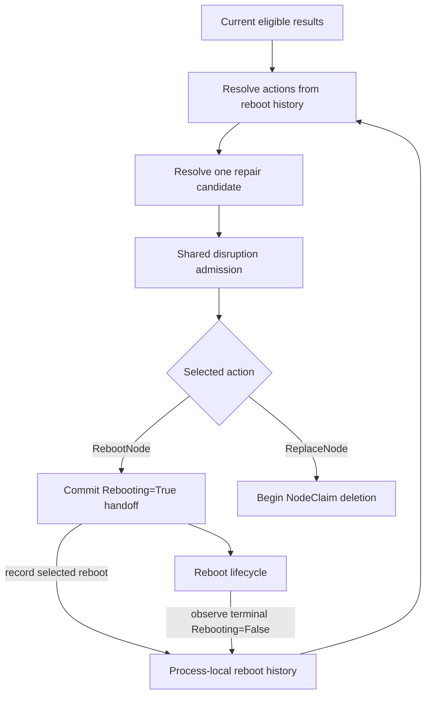

# Node Repair: Candidate Resolution, Admission, and Escalation

## Motivation

[Reason-aware matching](https://github.com/kubernetes-sigs/karpenter/pull/3263)
can produce several eligible repair results for one Node. Each result represents
a current unhealthy condition and may request a different action or drain
bound. Karpenter must reduce those results to one response before repair enters
the shared disruption pipeline. Otherwise, informer iteration could decide
which response wins, or competing actions could begin against the same
NodeClaim.

Repair may also wait after becoming eligible. Under the
[voluntary repair proposal](https://github.com/kubernetes-sigs/karpenter/pull/3192),
disruption budgets, operator vetoes, and workload controls can delay repair
while health and policy continue to change. Waiting recommendations remain
reconstructible from current state and need no stored lifecycle.

[Reboot](https://github.com/kubernetes-sigs/karpenter/pull/3259) makes that
boundary important. Its lifecycle owns committed execution, operation identity,
restart recovery, and exclusion from competing disruption. Once the lifecycle
finishes, the same or a different condition may still request reboot. Treating
every later result as new work could repeatedly reboot one instance. Acting
only from reboot history could repair a Node whose current fault has already
cleared.

This RFC defines the decision lifecycle between matching and action execution:
how current eligible results and process-local reboot history produce one
candidate, how shared disruption admits it, when the selected action commits,
and how a completed reboot affects later repair decisions.

### Terminology

- **Eligible result:** The output produced for one current `NodeCondition` by
  reason-aware policy matching after at least one matching policy becomes
  eligible.
- **Repair candidate:** The single repair recommendation selected for one Node
  and NodeClaim.
- **Reboot history:** Process-local state recording that a reboot was selected
  for a NodeClaim and whether its lifecycle has resolved.
- **Commitment:** The point after which Karpenter can no longer reliably cancel
  the selected action.
- **Action resolution:** The step that applies process-local reboot history to
  the action requested by current eligible results.

### Use Cases

1. A Node has eligible reboot and replacement results at the same time.
   Karpenter must choose one action and explain which current condition drove
   it.
2. A repair waits behind a budget, veto, or workload control. Karpenter must
   reevaluate current health and policy rather than retain a stale waiting
   recommendation.
3. A reboot request is in flight. Candidate resolution must not start another
   repair action while the reboot lifecycle owns the NodeClaim.
4. A reboot completes and the fault either persists, clears, or returns later.
   Any subsequent repair must use current health and policy without creating an
   autonomous reboot loop while process-local history remains available.

### Non-Goals

- Defining reason matching, fallback behavior, eligibility timing, or health
  reconciliation.
- Defining cross-Node ordering or repair-policy priority.
- Defining the configuration or general implementation of budgets, vetoes,
  Pod Disruption Budgets, or other shared disruption controls.
- Defining reboot execution, provider retries, recovery observation, or
  replacement execution.
- Reconstructing completed reboot history after controller restart or
  leadership transfer. The reboot RFC separately owns restart recovery for an
  active reboot lifecycle.
- Defining reset rules, multiple reboot attempts, or additional in-place repair
  actions.
- Adding customer-facing repair policy.

## What This Review Needs Consensus On

1. Current eligible results and process-local reboot history jointly determine
   which actions remain available, with one logical reboot attempt allowed per
   NodeClaim while that history remains available.
2. All current eligible results for one Node resolve deterministically into one
   candidate by combining action and drain urgency independently.
3. Shared disruption admits a reconstructible candidate, while the selected
   action's lifecycle owns commitment, execution, and active budget reservation.

## Proposal

This RFC consumes the eligible results produced by the
[reason-aware matching RFC](https://github.com/kubernetes-sigs/karpenter/pull/3263).
Each disruption loop reads those results with the current NodeClaim and any
process-local reboot history. Action resolution first constrains the actions
available after a prior reboot. Candidate resolution then combines the
remaining results into at most one recommendation. Shared disruption applies
its existing safety controls before committing reboot or replacement.

For example, consider a Node whose current `AcceleratorReady=False` condition
has reason `NvidiaXID48Error`:

1. Matching emits an eligible `RebootNode` result. Candidate resolution selects
   it if no eligible replacement result takes precedence.
2. If a budget or veto blocks admission, Karpenter stores nothing. A later
   disruption loop reconstructs the recommendation from current state.
3. Once admitted, shared disruption commits the selected candidate to the reboot
   lifecycle and records process-local reboot history.
4. While the reboot lifecycle is active, no other voluntary disruption begins
   for that NodeClaim.
5. After the lifecycle resolves, cleared health produces no repair. If current
   matching still emits an eligible reboot result, action resolution converts
   it to replacement, which passes through candidate resolution and admission
   again.

This boundary keeps matching, candidate selection, and post-reboot escalation
separate from action execution. The reboot RFC owns its durable handoff,
operation identity, restart recovery, and terminal outcome. This RFC stores no
additional API state. Process loss can forget that a completed reboot consumed
the NodeClaim's reboot allowance. Reconstructing that history is outside scope.

### Process-Local Reboot History

Node Repair keeps process-local reboot history keyed by NodeClaim UID. Action
resolution uses this history to distinguish a NodeClaim with no prior reboot
from one whose reboot lifecycle has resolved.

An **active reboot lifecycle** has `Rebooting=True` with reason
`RebootRequested` or `RebootIssued`. A **terminal reboot lifecycle** has
`Rebooting=False` with reason `RebootSucceeded` or `RebootFailed`.

Shared disruption records the entry after the reboot handoff commits. The
repair method marks it resolved after observing a terminal `Rebooting`
condition. Creation and resolution must be atomic with repair admission in the
same process. Resolved history remains until the NodeClaim no longer exists or
the controller loses the process-local entry.

The reboot lifecycle remains authoritative for active reboot recovery. This RFC
does not require completed reboot history to be reconstructed after restart or
leadership transfer.

### Action Resolution

Matching answers whether current evidence qualifies for repair. Process-local
reboot history constrains the available response without creating repair work
after that evidence clears. Karpenter therefore applies **action resolution**
to every current eligible result before combining results into a candidate:

| Reboot state | Current eligible action | Resolved action |
|---|---|---|
| No process-local history | `RebootNode` or `ReplaceNode` | Keep the current action |
| Active process-local history or active reboot lifecycle | Any action | Produce no repair result |
| Resolved process-local history | `RebootNode` | `ReplaceNode` |
| Resolved process-local history | `ReplaceNode` | `ReplaceNode` |
| Any state | No eligible result | No repair |

Active process-local history or an active reboot lifecycle takes precedence over
resolved-history escalation. This suppresses another admission before the
informer observes the committed `Rebooting=True` handoff.

#### Resolved Reboot Attempts

In the `NvidiaXID48Error` example, the resolved attempt
does not authorize replacement by itself. Matching must still emit a current
eligible result. If it does, action resolution changes only `RebootNode` to
`ReplaceNode` and retains the condition, `eligibleAt`, and
`terminationGracePeriod`. Restarting toleration would add a delay the current
policy did not request because that result is already eligible. If the
condition clears, matching emits nothing and no replacement is considered.

A reboot is consumed at commitment for the NodeClaim's lifetime while
process-local history remains available. A changed reason, a period of healthy
operation, or a later reboot-clearable fault does not restore it. Keying the
allowance to a reason would let last-writer-wins reason churn create repeated
reboots. Resetting it after recovery would require a recovery definition,
stability interval, and attempt limit.

The lifetime bound can replace a Node that another reboot might have recovered.
For example, a Node may remain healthy for several days after reboot and later
develop a different reboot-clearable fault. The initial strategy accepts that
cost to keep autonomous repair bounded while the history remains available. A
future strategy can add reset rules, durable history, or additional attempts
behind action resolution without changing the other stages. A successor
NodeClaim receives its own allowance. Restarting the controller can clear the
allowance, as described in the non-goals.

#### Active Reboot Lifecycles

An active reboot lifecycle produces no repair result, and shared disruption
prevents another voluntary disruption from starting for that NodeClaim. The
reboot RFC defines provider invocation, retry, recovery observation, terminal
outcomes, and restart behavior. When the lifecycle reaches a terminal outcome,
the repair method marks its process-local history resolved and current matching
determines whether any later repair remains eligible.

### Candidate Resolution

Matching evaluates current conditions independently, so one Node may produce
several eligible results for the same NodeClaim. Starting each result could
race repair actions. Selecting the first result would make informer iteration
part of repair policy. Karpenter instead combines all action-resolved results
into at most one **repair candidate**:

1. **Select the action.** Choose the more disruptive action using
   `RebootNode < ReplaceNode`. Replacement can satisfy evidence requiring the
   current instance to be removed, while reboot cannot. Several reboot results
   still select reboot because their count alone does not justify replacement.
2. **Select the driving result.** Among results requesting the selected action,
   choose the earliest `eligibleAt`, then break ties by condition type, status,
   and reason. This records the result that has waited longest after its own
   toleration and makes the choice independent of iteration order.
3. **Select the drain bound.** Use the shortest defined
   `terminationGracePeriod` among every eligible result. Action and drain
   urgency carry different evidence, so a strict bound remains relevant even
   when another condition selects the action. If every result is `nil`, the
   candidate remains unbounded.

For example, assume a NodeClaim with no prior reboot attempt has three eligible
results:

| Result | Current condition | `eligibleAt` | Action | Termination grace period |
|---|---|---|---|---|
| A | `AcceleratorReady=False` | `10:00` | `RebootNode` | `1m` |
| B | `StorageReady=False` | `10:05` | `ReplaceNode` | `10m` |
| C | `NetworkingReady=False` | `10:10` | `ReplaceNode` | `2m` |

Karpenter selects `ReplaceNode` because results B and C request the more
disruptive action. Result B drives the candidate because it is the earliest
replacement result. Result A supplies the `1m` termination grace period because
it is the shortest current drain bound.

A candidate carries:

| Field | Purpose |
|---|---|
| Node and NodeClaim references | Bind the recommendation to exact UIDs. |
| `action` | Select `RebootNode` or `ReplaceNode`. |
| `eligibleAt` | Preserve when the driving result completed toleration. |
| Condition type, status, and reason | Identify the current evidence that selected the action. |
| `terminationGracePeriod` | Carry the nullable resolved drain bound into admission and execution. |

The condition contributing the shortest drain bound can differ from the driving
condition. Candidate decision logs record that contributor, but process-local
reboot history does not retain it because it does not change the selected
action or later action resolution.

### Admission and Reservation

Candidate resolution selects behavior for one Node. Shared disruption must
admit that candidate before Karpenter acts. Repair registers under
`DisruptionReasonUnhealthy`, runs before drift and consolidation, and uses the
same loop that admits only one disruption method for a Node.

#### Admission Controls

Shared disruption applies these controls before repair may begin:

| Control | Admission behavior |
|---|---|
| Repair budget, Node and NodeClaim eligibility, and nomination | Must allow the candidate. |
| Node-level repair veto | Blocks repair until removed. |
| Pod-level repair veto and blocking PDBs with `terminationGracePeriod=nil` | Block commitment until they clear. |
| Pod-level repair veto and blocking PDBs with a positive termination grace period | Execution honors them until the deadline. |
| `terminationGracePeriod=0` | Skips drain and Pod/PDB blockers. The budget and Node-level veto still apply. |

A control that blocks the current disruption loop
discards the recommendation. The next loop reconstructs it from current API
state, so waiting recommendations need no durable lifecycle.

#### Budget Reservation

Admission must consume the Repair budget before yielding control. The
reservation mechanism follows the selected action:

1. **Replacement.**
   [`StartCommand`](https://github.com/kubernetes-sigs/karpenter/blob/a897175c702279d77491bbf04e2e326eb590c769/pkg/controllers/disruption/queue.go#L321-L356)
   uses the existing in-memory disruption queue. It creates any replacement
   NodeClaims, calls `MarkForDeletion`, then queues the command.
   [Budget calculation](https://github.com/kubernetes-sigs/karpenter/blob/a897175c702279d77491bbf04e2e326eb590c769/pkg/controllers/disruption/helpers.go#L258-L302)
   counts marked candidates as disrupting. This ordering avoids double-launching
   capacity, and a failed command
   [clears the mark](https://github.com/kubernetes-sigs/karpenter/blob/a897175c702279d77491bbf04e2e326eb590c769/pkg/controllers/disruption/queue.go#L423-L433).
   The reservation spans the wait for replacement readiness. This can reduce
   repair throughput, but reserving later could admit more work than the budget
   allows.
2. **Reboot.** Reboot creates no replacement command. Final admission generates
   the reboot handoff defined by the reboot RFC. Its active lifecycle serves as
   commitment and the budget reservation. Later budget calculation counts the
   NodeClaim while `Rebooting=True`. A terminal `Rebooting=False` condition
   releases the reservation. Without a deletion mark, provisioning continues to
   treat the capacity as returning.

Resolving the reboot lifecycle releases its Repair slot. A later replacement
must pass current matching, candidate resolution, and ordinary admission again.
Prior reboot admission cannot bypass a changed budget or newly applied veto.

#### Disruption During an Active Reboot

While the NodeClaim has `Rebooting=True`, admission blocks new repair, drift,
and consolidation because the lifecycle may still invoke the provider or be
observing an active operation. Involuntary lifecycle actions and deletion
already in progress continue through their existing paths. The reboot RFC owns
the durable condition and its restart behavior. A terminal `Rebooting=False`
condition ends the exclusion. Other NodeClaims are unaffected.

For queued replacement commands, this RFC adds no validation after admission.
The existing queue owns its command lifecycle.

### Commitment

Replacement admission may mark a Node or create replacement capacity without
taking the original NodeClaim out of service. Those operations can be abandoned
and reconstructed. Commitment begins when the selected action crosses a
boundary that cannot be reliably canceled.

The resolved `terminationGracePeriod` starts at commitment. Time spent waiting
for a budget, veto, or replacement capacity does not consume the workload's
drain window. Execution receives the committed value and does not reread repair
policy.

The two actions cross that boundary differently:

1. **`RebootNode`.** Commitment occurs when shared disruption successfully
   creates the durable reboot handoff defined by the reboot RFC. The handoff
   freezes the selected action and resolved termination grace period before any
   provider call. Shared disruption then records process-local reboot history.
2. **`ReplaceNode`.** Commitment occurs when a successful NodeClaim deletion
   request sets `deletionTimestamp`. Replacement may pre-spin capacity and mark
   the candidate before that point, but those steps do not commit removal. Once
   deletion begins, Karpenter does not select another repair action for that
   NodeClaim.

### Interaction with Existing Features

This RFC depends on repair entering shared voluntary disruption as proposed in
[#3192](https://github.com/kubernetes-sigs/karpenter/pull/3192). That design
continues to own cross-Node ordering, disruption budgets, replacement capacity,
and the general disruption method lifecycle.

Policy matching and eligibility remain owned by
[#3263](https://github.com/kubernetes-sigs/karpenter/pull/3263). This RFC
neither changes its current-evidence contract nor persists its output.
Action resolution inherits the `NodeCondition` timing and freshness limitations
accepted by that RFC. That RFC delegates committed-action state to the
downstream lifecycle.

The reboot RFC owns the durable handoff, operation identity, action execution,
restart recovery, active-disruption exclusion, and terminal outcome. This RFC
consumes that outcome only to update process-local reboot history.

Repair vetoes and PDBs remain shared admission inputs. Their configuration and
general evaluation are outside this RFC.

### Observability

Operators need to identify the evidence that selected an action, why repair is
waiting, and whether an active reboot is holding voluntary disruption for a
NodeClaim. Observability follows the component that owns each decision.

Candidate decision logs identify the Node, selected action, driving condition,
eligibility time, resolved termination grace period, and the condition that
contributed that bound when it differs. Reasons and Node identities remain in
logs rather than metric labels.

Existing shared-disruption metrics and events explain budget and veto blocks.
The reboot lifecycle's conditions, events, and metrics explain active execution
and terminal outcomes. Candidate logs include whether process-local history
converted a requested reboot to replacement.

Action resolution is recomputed during every disruption loop, so converting
`RebootNode` to `ReplaceNode` is not an API event and adds no counter. The
process-local history and decision logs explain the result. A future durable
escalation transition can own a counter without changing this boundary.

### Edge Cases

| Case | Behavior |
|---|---|
| An active reboot lifecycle exists | No repair result is produced, and new voluntary disruption waits for the lifecycle to resolve. |
| A reboot resolves and its fault remains eligible | The current result becomes `ReplaceNode` and passes ordinary admission. |
| A reboot resolves and its fault clears | Matching produces no result, so reboot history creates no replacement. |
| A different reboot-clearable fault becomes eligible later | The consumed reboot converts that current result to replacement. |
| Replacement is already eligible after reboot | Replacement remains replacement and participates in candidate resolution normally. |
| Reboot reaches a terminal failure or timeout | The lifecycle resolves, the budget slot is released, and current matching determines whether replacement is eligible. |
| The controller restarts while reboot is active | The reboot RFC owns lifecycle recovery and continued disruption exclusion. |
| The controller restarts after reboot resolves | Process-local consumed-reboot history may be lost, so a current reboot-eligible result may select reboot again. |

## Alternatives Considered

### Narrower Candidate Resolution

Karpenter could select the first eligible result, or it could select the
shortest termination grace period only from results requesting the chosen
action.

**Why It Falls Short.** First-result selection makes informer iteration part of
repair policy and can choose reboot while replacement evidence is eligible.
Restricting the drain bound to the selected action discards another current
diagnosis's stricter urgency merely because it did not select the response.

### Persist Reboot History

Karpenter could persist consumed-reboot history in NodeClaim status or a
separate object. That record could preserve escalation semantics across
controller restarts.

**Why It Falls Short.** Durable reboot history adds a public API lifecycle,
status ownership and conflict handling, and upgrade and rollback semantics for
state used only by post-reboot action resolution. The reboot lifecycle already
owns durable execution state, operation identity, and restart recovery. The
initial strategy keeps repeat suppression and escalation history process-local
and accepts that a restart may allow another reboot after the prior lifecycle
resolves. Waiting candidates remain reconstructible and are not persisted in
either strategy.

### Reset Reboot by Reason or Recovery

Karpenter could allow one reboot for each reason or restore reboot after the
Node appears healthy for a period.

**Why It Falls Short.** Reasons are last-writer-wins and may churn without a
condition transition, so per-reason allowance can create repeated reboots.
Recovery reset needs a recovery definition, stability interval, attempt limit,
and more history. Those policies can be added behind action resolution after
operational evidence supports their thresholds.

### Replace Directly from Reboot History

Karpenter could authorize replacement as soon as a reboot resolves without
requiring another current eligible result.

**Why It Falls Short.** The previous diagnosis may have cleared or provider
policy may have changed. Acting directly from history could replace a Node that
no longer qualifies and would bypass current matching and voluntary admission.

## Backward Compatibility

This design adds no Kubernetes API fields and does not change existing NodePool
or NodeClaim manifests. Upgrading, rolling back, restarting, or transferring
leadership can clear process-local reboot history. The reboot lifecycle's own
compatibility and restart behavior remain defined by the reboot RFC. After that
lifecycle resolves, the next repair decision reevaluates current health and
policy without assuming the current process knows a prior reboot was consumed.

Disabling reboot prevents new reboot candidates. An active committed reboot
continues according to the reboot lifecycle rather than being canceled by
discarding process-local history.

## Graduation Criteria

This behavior ships behind the existing `NodeRepair` feature gate and graduates
with Node Repair.

Before Node Repair reaches beta:

- Voluntary repair in
  [#3192](https://github.com/kubernetes-sigs/karpenter/pull/3192), reason-aware
  matching in [#3263](https://github.com/kubernetes-sigs/karpenter/pull/3263),
  and the reboot lifecycle in
  [#3259](https://github.com/kubernetes-sigs/karpenter/pull/3259) are available.
- Tests cover action resolution with no history, an active reboot lifecycle,
  and resolved history, deterministic candidate merging, nullable termination
  grace periods, budget reservation and release, commitment boundaries,
  process-local history creation and resolution, and cleanup after NodeClaim
  deletion.
- Tests verify that active process-local history suppresses another repair
  before the committed `Rebooting=True` handoff is observed, active reboot
  lifecycle state continues that suppression, and each terminal outcome updates
  process-local history when observed.
- Restart tests remain owned by the reboot lifecycle. Candidate-resolution
  tests accept that completed reboot history is not reconstructed after process
  loss.
- Logs, events, and metrics explain candidate selection, admission blocks,
  active reboot execution, and the action ultimately committed.
