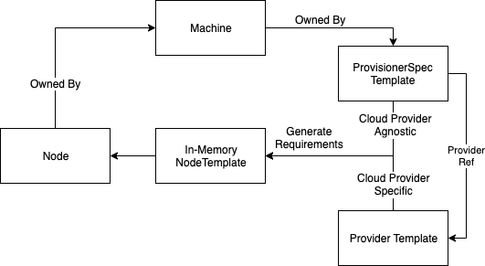

# Karpenter Deprovisioning - Node Template and Drift

Drift is implemented to assert that nodes are running with the AMIs as specified in their AWSNodeTemplate. Karpenter has many more configuration options that must be considered for Drift. These are segmented by Provisioner Drift and Provider Drift. This document is to validate that drift on each configuration option for the Provisioner and Provider make sense, and how to reason about future API fields.

## Provisioners and Deployments

Analogous to the [relationship of Deployment -> Pods](https://kubernetes.io/docs/concepts/workloads/controllers/deployment/#pod-template), nodes are owned by the Machine which is owned by the Provisioner, nodes have the provisioner-name label in the metadata, and nodes are heterogenous replicas of the Provisioner’s requirements. A node refers to only one Provisioner, and each Provisioner refers to only one AWSNodeTemplate. In this, we can create logical mapping as follows.



Drift is actually already implemented in the Kubernetes Deployment object for pods. Given the label selector of Pods in a [deployment](https://kubernetes.io/docs/concepts/workloads/controllers/deployment/#selector), Kubernetes “may terminate Pods whose labels match the selector if their template is different from `.spec.template`”. More specifically, Kubernetes maintains a hash of the pod template, annotates the pods with that hash, and then uses it as a checksum to ensure they remain the same. Finally, Kubernetes even allows [strategy](https://kubernetes.io/docs/concepts/workloads/controllers/deployment/#strategy) for how to roll out deployment changes when pods drift from its deployment.

## 🔑 ProvisionerSpec fields → ProvisionerSpec.template

```
spec:
  template:
    requirements: {...}
    labels: {...}
    taints: {...}
    annotations: {...}
    startupTaints: {...}
    providerRef: {...}
```

Following this semantic, the `ProviderRef`/`in-line Provider` struct will be included in the template. The `ProviderRef`/`Provider` is responsible for any Cloud Provider-specific Machine Template requirements and will also be nested within template.

## How does this relate to Drift?

A machine will be drifted if the machine’s in-memory template matches the by the `ProvisionerSpec.Template` and `Provider.Spec` fields.

### What about the other behavioral specs?

#### Limits

In terms of deprovisioning nodes once limits have been changed to now make the amount of running capacity invalid, Karpenter would need to deprovision some number of nodes to assert that limits are no longer breached. Since Karpenter has no way of figuring out which applications should be prioritized outside of [PodEvictionCost](https://github.com/aws/karpenter-core/blob/main/pkg/controllers/deprovisioning/helpers.go#L125), choosing which nodes to be deprovisioned is extremely tough to get right for all use-cases. Limits will only block provisioning and not affect when to initiate deprovisioning.

#### Weight

A Provisioner's weight is only considered at provisioning time when pod requirements can fit within the node requirements for two provisioners. If a user changes provisioner weights, Karpenter will not choose to deprovision nodes by switching the provisioner label on the node after creation, the node is inherently tied to one Provisioner. Any new nodes should be removed and re-provisioned if weights are modeled as preferential requirements.

## Drift Validation

This is a thought exercise that will validate each of the template fields for drift. Some of these may be able to be done in-place, but that is an optimization that will be considered later. For now, all methods will replace nodes.

### Node Requirements

If a user changes the (1) instance type requirements, (2) architecture, (3) zone, (4) capacity type, (5) OS, or (6) instance metadata requirements, the node should be rescheduled with those values.

1. If a user adds daemonsets or limits, not changing instance type requirements could prevent pods from scheduling.
2. If a user changes the machine image, the architecture could become incompatible.
3. If a user changes networking settings in the Provider, not changing the zone here can make this incompatible.
4. Not changing the capacity type could result in more cost or more disruptions than expected.
5. If a user changes the machine image, the OS could become incompatible.
6. If a user changes any instance metadata requirements, such as GPU count, memory, name, custom pods, hypervisor, family, category, or generation, any amount of issues with expectations could become incorrect.

### Labels

While labels may not provide incompatibility with workloads, labels are used for a variety of use-cases in the backend. Whether it’s cost discovery or inter-cluster communication, labels are important for users to navigate the cluster. Labels are [meant to represent node-identifying information](https://kubernetes.io/docs/concepts/overview/working-with-objects/labels/). If labels are only added to the Provisioner requirements, it may be simple to add labels in-place to each node, but if they are removed, this could break functionality for how users monitor nodes. Drift works here only if Karpenter replaces nodes.

### StartupTaints

StartupTaints may be used in combination with other daemons for initialization logic. If a new daemon is installed, these startupTaints may need to be validated. Since these daemons often run vital workloads for cost and monitoring, changes here should deprovision nodes.

### Taints

Taints are used to enforce scheduling constraints against pods. If users have strict requirements on their nodes, or lack thereof, any changes here should drift nodes so that pods are ensured to be running on the correct capacity.

### KubeletConfiguration

If the KubeletConfiguration is used, a user that changes these settings most likely has custom use-cases that need to be satisfied. Whether that’s the pod density, image cache eviction levels, or node overhead, these values may be fine-tuned to a user's requirements on bin-packing and node connectivity. This is essential for Drift to consider.

## AWS Specific Drift Validation

### SubnetSelector

If a user changes subnets, this indicates a need to migrate away from the old one, where capacity must run on the new subnets. If a subnet has been forcefully deleted, a zone is experiencing an outage, or users want to load balance their applications, Karpenter should drift nodes if the subnet selector no longer matches.

### Security GroupSelector

A very similar case to SubnetSelector. This is a vital part of discovering how nodes are allowed to communicate within the cluster. If this changes, the nodes should definitely be deprovisioned.

### InstanceProfile

InstanceProfile defines the permissions of the node. If this changes, permissions NEED to be updated so that node permissions are in-line with what’s defined, and no nodes are able to use old permissions.

### AMIFamily + AMISelector

If the AMIFamily or AMISelector changes, the AMI that’s used can change, and the bootstrapping logic that was used may need to be changed to work. If the old AMI has a security vulnerability, is deleted, is deprecated, or is no longer preferred, not changing the node AMIs can be a serious conflict in expectations. *This is already completed.*

### UserData

If the UserData changes, this is a very similar use-case, where the bootstrapping logic may now be out of date. This bootstrapping logic may have essential reorganizations of the instance filesystem or other needed changes. If this changes, users may also be changing their used AMIs as well. This should be drifted when it changes.

### Tags

Tags are very similar to Kubernetes labels in that they’re used for monitoring, discovery, and communication purposes. In contrast to labels, tags can run into issues both in addition and deletion. Since these tags are persisted to each of the AWS created resources, adding tags may fail by running into tag limits. Tag deletion can also break existing functionality on monitoring. For this, tags could be done in-place in the future, but would require more thought than labels to validate this.

### MetadataOptions

These are essential to control the exposure of the IMDS on EC2 instances. Users may want to change their HTTP protocol, or settings for the instances. Nodes that drift from this configuration need to change since users that have hard requirements on the exposure of IMDS need to be able to access it.

### BlockDeviceMappings

There are a lot of settings here that are important for the storage volumes that are used for nodes.  Any additional block device mappings may be essential to functionality for applications on the node. The KMS key may no longer be valid, the volume type, volume size, IOPS, encryption settings, throughput, or snapshotID may change. In all of these settings, not changing these can be disruptive.

### Detailed Monitoring

Detailed Monitoring is used for enabling EC2 Detailed Monitoring. This will display monitoring graphs for the instances that are launched. Since enabling this costs money per metric for nodes, users may want to disable this to save on cost. This could be potentially done in place in the future, as it’s purely for monitoring purposes.
