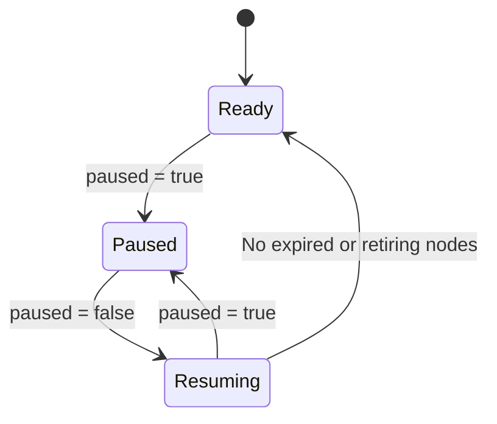

# NodePool Disruption Pausing

This RFC proposes a NodePool-wide pause followed by a controlled **Resuming** phase that retires expired nodes before the NodePool becomes **Ready**.

## Motivation

Cluster operators need to pause automated node removal during incidents or protected windows without rewriting disruption budgets or lifetime configuration. Releasing the pause must not allow accumulated expirations to remove many nodes together.

Today, zero-node disruption budgets can block consolidation and drift, but expiration does not consult those budgets. Expiration uses the lifetime captured in each NodeClaim's immutable spec. Changing the NodePool template to `expireAfter: Never` does not suspend expiration for existing NodeClaims and can cause drift. Automatic repair has its own control path.

Related work includes [Node Repair Veto (#3277)](https://github.com/kubernetes-sigs/karpenter/pull/3277), [Making Node Repair Voluntary (#3192)](https://github.com/kubernetes-sigs/karpenter/pull/3192), and [external disruption controls (#2497)](https://github.com/kubernetes-sigs/karpenter/issues/2497). [RFC #2901](https://github.com/kubernetes-sigs/karpenter/pull/2901) proposes external HTTP signals; this RFC puts the policy on the NodePool and explicitly covers expiration.

### Use Cases

- Preserve existing nodes during an incident while allowing provisioning for pending workloads.
- Hold every automated removal method while investigating an image rollout or health signal.
- Release a pause with many overdue nodes without flooding the NodePool as more nodes expire.

### Non-Goals

- Defining health probes, external signal delivery, or an incident-management service inside Karpenter.
- Freezing eligibility timers, resetting node ages, or mutating NodeClaim lifetime specifications.
- Preventing cloud-provider reclamation or reversing a deletion already in progress.
- Providing per-disruption, per-node, multi-owner, or strongly consistent locking.
- Changing normal expiration outside a pause/resume cycle or defining a general-purpose budget API for all disruption methods.

## Decision Points for Review

| Decision | Current Direction | Feedback Needed |
| --- | --- | --- |
| [Scheduling while Paused](#scheduling-on-expired-nodes) | Open: preserve scheduling, taint expired nodes, or let the operator choose. | Operational examples and the default if configurable. |
| [Expiration taints on release](#expiration-taints-on-release) | Taint every expired node on entering Resuming. | Is the immediate loss of schedulable headroom acceptable? |
| [Expiration retirement cohorts](#one-expiration-retirement-path-or-separate-cohorts) | Use one retirement path for every expiration while Resuming. | Is there a need for separate cohorts despite the shared NodePool risk? |
| [Resume policy](#resume-policy-pacing-and-replacement-readiness) | Bound admission and wait for replacement readiness; `resumePolicy.expiredNodes` is illustrative. | Naming, API shape, default, budget interactions, and readiness guarantee. |
| [Other disruptions while Resuming](#other-disruptions-while-resuming) | Admit expired nodes only. | Should repair or other methods share the recovery limit? |
| [Returning to Ready](#returning-to-ready) | Require zero waiting and active expiration work. | Is a nonzero threshold defensible, and how should blocked recovery be handled? |

## Proposal

Add `spec.disruption.paused`. Because it is outside the NodeClaim template, changing it applies to existing and future NodeClaims without causing drift.

The pause is best effort, not an atomic barrier. Controllers check it before deletion, but a racing deletion may begin before the controller observes the change and is then allowed to continue.

Clearing the pause starts Resuming. Expired nodes receive a dedicated `NoSchedule` taint and retire through one paced NodePool-wide path. New expirations join that path. Other automated removals remain held, subject to **Other Disruptions While Resuming**.

### Lifecycle

The NodePool moves through three controller-observed phases: **Ready**, **Paused**, and **Resuming**. `expireAfter` continues to describe node lifetime.



| Phase | Automated Removal Behavior |
| --- | --- |
| Ready | Existing disruption policies apply. |
| Paused | Hold new automated removals while continuing evaluation. |
| Resuming | Taint expired nodes and retire them through the controlled expiration path before becoming Ready. |

Operators set pause intent; the controller derives Resuming and Ready. A NodePool with `paused: false` may therefore still be Resuming. With no expired or retiring nodes, it becomes Ready immediately. Setting `paused: true` during Resuming stops new admission; deletions already in progress continue. Provisioning continues in every phase.

### Proposed Spec

```yaml
spec:
  disruption:
    paused: true
```

`paused` defaults to `false`. Clearing it after a pause starts Resuming. A NodePool that has never been paused retains existing behavior. There is no per-reason override.

The pause covers empty-node removal, underutilization, drift, expiration, automatic node repair, and static NodePool replica reduction. Resume-policy configuration is a decision point below; this proposal does not add a new expiration reason to existing disruption budgets.

### How It Works

Controllers continue evaluating health, drift, utilization, and expiration. While Paused they may report candidates, but do not launch replacements, evict pods, or delete nodes for covered methods. Demand-driven provisioning continues. Scheduling on expired nodes remains open.

Controllers need not repeatedly run expensive replacement simulations while Paused. They recompute or revalidate plans before execution rather than replay stale decisions after release.

Every automated removal path must honor the policy, including expiration and repair. Policy changes enqueue affected work; restarts reconstruct phase and pending retirements from persisted state.

### Deletions Already in Progress

Once Karpenter observes Paused, it starts no covered deletion. A deletion is already in progress when its Node or NodeClaim has a deletion timestamp; draining, instance termination, finalization, and cleanup continue.

A command without a deletion timestamp must not delete its candidate while Paused. Existing cancellation handles its temporary state and replacement capacity. Explicit deletion and externally imposed shutdown remain outside the pause.

Controllers recheck before deletion, but the best-effort pause neither synchronizes controllers nor reverses a racing deletion.

### Observation and Restart

Expose the observed phase and generation as informational status, not proof that every controller stopped simultaneously. A successful patch also does not prove that no deletion raced with it.

Persist enough lifecycle state to distinguish Resuming from Ready. On restart, reconstruct pending work from NodeClaims and durable in-flight state so recovery cannot be skipped.

### Cleanup That Continues

Failed launch and registration cleanup continues while Paused or Resuming, as does cleanup when the underlying instance is gone. These paths reclaim no usable capacity and could otherwise consume NodePool limits.

Cleanup does not make an unhealthy but still existing node exempt from the pause. Automatic repair remains governed by the phase behavior described below.

## Discussion

The remaining decisions follow the NodePool lifecycle so that each choice is considered at the point where its consequences appear.

### While Paused

#### Scheduling on Expired Nodes

**Motivation:** Expired nodes are usable capacity, but new workloads placed on them increase disruption after release. Blocking placement instead removes capacity operators may need during an incident.

Expiration continues tracking deadlines, but does not evict, delete, start termination grace periods, or launch replacements. Whether it changes scheduling eligibility remains open.

| Option | Behavior while Paused | Benefit | Tradeoff |
| --- | --- | --- | --- |
| A. Keep scheduling eligibility unchanged | Expiration adds no taint or cordon. | Preserves scheduling headroom when provisioning may be unhealthy. | New workloads can accumulate on overdue nodes. |
| B. Apply a `NoSchedule` taint | Taint at the deadline while retaining existing pods. | Discourages new placement and may reduce workloads through natural turnover. | Reduces capacity during an incident; tolerating pods can still schedule. |
| C. Let the operator choose | Add a NodePool policy selecting A or B. | Supports both incident and planned holds. | Adds API surface, a default, and taint lifecycle rules. |

All options converge on tainting expired nodes once Resuming begins.

**Discussion:** Which behavior should be the default, and are both needed enough to justify configuration?

### Releasing into Resuming

#### Expiration Taints on Release

**Motivation:** Pacing limits deletion, but waiting nodes can still receive workloads. Tainting separates stopping placement from retiring existing workloads.

On entering Resuming, apply a dedicated expiration `NoSchedule` taint to all expired nodes, including those waiting for admission. Taint new expirations as they occur.

Existing pods remain, and tolerating pods can still schedule. The taint does not initiate termination or arrange replacement capacity.

Tainting and retirement admission are separate. With 100 overdue nodes and a one-node limit, all 100 are tainted while one enters retirement. Waiting nodes do not consume slots or count as deleting.

Use a dedicated, controller-owned taint because the existing disruption taint is removed outside the disruption queue. Preserve unrelated taints, restore owned taints after restart, and retain them through retirement.

This immediately reduces schedulable headroom. NodePool limits, placement constraints, or cloud availability may prevent replacement provisioning.

**Discussion:** Is stopping placement on the entire overdue set worth the immediate loss of schedulable headroom?

### While Resuming

#### One Expiration Retirement Path or Separate Cohorts

**Motivation:** Nodes continue expiring during recovery. Independent paths for old and new expirations could exceed the recovery limit.

**Proposed direction:** Use one retirement path per NodePool while Resuming. The initial backlog and new expirations share admission and pacing; normal expiration cannot bypass it.

Reevaluate eligibility at admission. Prefer earlier expiration deadlines, with a stable tie-breaker, so new arrivals do not continually overtake older nodes.

**Alternative:** Separate the initial backlog from new expirations. Independent limits could add together; a shared limit still needs common arbitration.

**Discussion:** Is there a concrete need for separate cohorts that outweighs the simpler safety guarantee of one shared path?

#### Resume Policy, Pacing, and Replacement Readiness

**Motivation:** Tainting stops placement but does not limit disruption to existing workloads. Resumption needs bounded retirement and a replacement-readiness rule.

**Proposed direction:** Express a bounded resumption policy separately from `expireAfter` and general disruption budgets. The leading name is `resumePolicy.expiredNodes`.

```yaml
spec:
  disruption:
    paused: false
    resumePolicy:
      expiredNodes:
        maxConcurrentDisruptions: 1
```

Resuming always bounds retirement, even without explicit tuning. Admit the permitted nodes, prepare required replacement capacity, wait for readiness, then terminate. A slot is held through replacement and termination; tainting alone uses no slot.

Admission accounts for removals already in progress. External losses cannot be bounded, but Karpenter should not add its full allowance on top of known removals.

**Alternatives:** Reuse budget syntax, use a fixed limit, or limit starts without waiting for replacements. Applying existing reasonless budgets to normal expiration would affect users who never paused.

**Discussion:** What should this policy be named and default to, should it reuse budget syntax, and must it guarantee replacement readiness?

#### Other Disruptions While Resuming

**Motivation:** Consolidation, drift, repair, or static scale-down can exceed the recovery limit if they run independently. Holding them can delay useful repair or cost reduction.

**Proposed direction:** Admit only expired nodes while Resuming. Continue evaluating other methods, but hold their removals until Ready. Provisioning, static scale-up, external shutdown handling, and explicit deletion continue.

A node that is both expired and drifted uses the expiration path; drift does not provide another admission route.

**Discussion:** Should other automated removals share the recovery limit? Should repair be an exception?

#### Returning to Ready

**Motivation:** Ready restores ordinary disruption. Entering it too early exposes overdue nodes to unpaced deletion; requiring no backlog can leave the pool Resuming indefinitely.

**Proposed direction:** Become Ready only when there are no expired NodeClaims awaiting retirement and no expiration retirements in flight.

```text
resumptionComplete =
    waitingExpired == 0
    && activeExpirationRetirements == 0
```

Check current state, including nodes that expired during recovery.

**Alternative:** Become Ready below a "safe" threshold. Even a few nodes may carry substantial workload, so the design must preserve their protection after transition.

Zero backlog is simpler but may never complete if expiration outpaces retirement or replacements and drains are blocked. Surface that state instead of silently dropping safeguards.

**Discussion:** Should completion require zero outstanding expiration work? If a threshold is preferred, what makes it safe and how is remaining work handled?

### Cross-Cutting Behavior

#### Interaction with Existing Features

| Mechanism | Paused | Resuming, under the proposed policy |
| --- | --- | --- |
| Empty-node removal, underutilization, and drift | Hold new removal work. | Hold until Ready; existing budgets then apply. |
| Expiration | Hold removal; scheduling behavior is open. | Taint overdue nodes and use the shared paced retirement path. |
| Automatic repair | Hold new repair. | Proposed hold; a possible exception is discussed above. |
| Static NodePool scale-down | Preserve desired replica intent; hold removal. | Hold removal until Ready. |
| Pending-pod provisioning and static scale-up | Continue. | Continue, subject to capacity constraints. |
| Cloud interruption and externally imposed shutdown | Continue responding. | Continue responding. |
| Explicit resource deletion | Honor deletion and finalization. | Honor deletion and finalization. |
| Failed launch, failed registration, or an already-gone instance | Continue cleanup. | Continue cleanup. |
| PDBs and termination grace periods | Preserve semantics for accepted termination. | Apply normal safeguards after retirement starts. |

#### Observability

Report phase and observed generation, plus expired nodes waiting, active retirements, oldest overdue age, time spent Resuming, and why progress is blocked.

Emit deduplicated events for held candidates. Waiting or tainted nodes do not count as deleted. Avoid per-NodeClaim metric labels.

## Alternatives Considered

### Zero-Node Disruption Budgets

Budgets already pace selected voluntary methods, but do not cover expiration or every automated removal path. A pause also preserves normal budget configuration.

### NodePool Annotation

An annotation avoids a CRD change. A typed field provides discovery, validation, and clear NodePool-wide policy while preserving `do-not-disrupt` semantics.

### Immediately Restore Normal Expiration

Returning directly to expiration is simpler, but tainting does not prevent existing workloads from being removed together. Resuming adds bounded admission.

## Backward Compatibility

NodePools that never pause keep existing behavior. Existing NodeClaims, annotations, and budget reasons require no migration.

Pausing allows nodes to exceed lifetime or repair thresholds. Clearing it starts Resuming rather than immediately becoming Ready. Deadlines do not change, but admission and replacement availability can delay retirement. Expired nodes are tainted during Resuming; scheduling while Paused remains open.

The NodePool becomes Ready only after satisfying the completion criteria.
