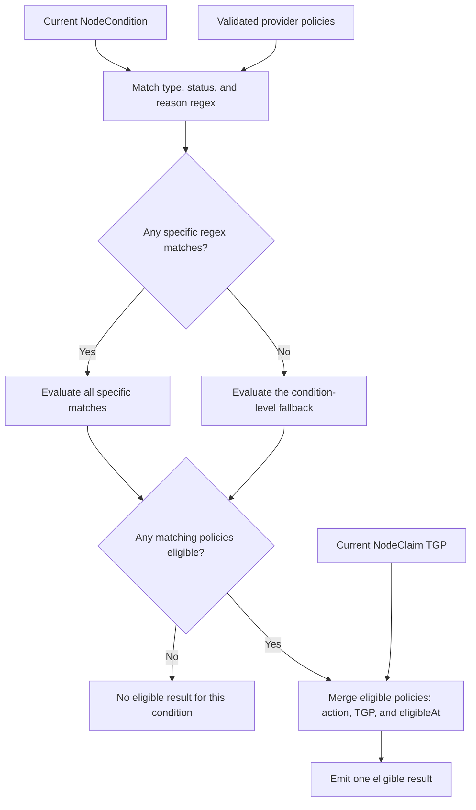

# Node Repair: Reason-Aware Policy Matching and Eligibility

## Motivation

Karpenter node repair currently maps a `NodeCondition` type and status to one
toleration before replacing the Node. The
[reboot RFC](https://github.com/kubernetes-sigs/karpenter/pull/3259) introduces
a provider-neutral reboot primitive and lifecycle, giving repair a less
disruptive response when the current instance can recover. Once more than one
response is available, the diagnosis within a condition matters. Two diagnoses
reported under the same condition may need different confidence delays, drain
limits, and repair actions.

The current health contract also presents a matching problem. A condition has
one `reason` and one `lastTransitionTime`, while cloud providers may need several
rules for the reason currently reported. Those rules can overlap and can become
eligible at different times. Karpenter needs deterministic behavior that does
not depend on policy order and can be reconstructed after a controller restart.

This RFC defines how Karpenter matches the current `NodeCondition.reason`
against cloud-provider repair policy and determines when the resulting behavior
is eligible. It builds on the voluntary repair work proposed in
[#3192](https://github.com/kubernetes-sigs/karpenter/pull/3192) and the original
node repair design in
[#1768](https://github.com/kubernetes-sigs/karpenter/pull/1768). The reboot RFC
owns action execution. This RFC owns the policy decision that requests reboot
or replacement.

### Terminology

- **Reason regex:** A Go regular expression that a provider uses to select the
  current `NodeCondition.reason`.
- **Condition-level fallback:** A policy with an empty `ReasonRegex` that
  preserves replacement behavior when no reason-specific policy matches.
- **Eligible policy:** A matching policy whose toleration has elapsed.
- **Eligible result:** The behavior produced by combining the eligible policies
  for one current condition.

### Use Cases

1. A diagnostic agent reports several machine-readable failure codes under one
   condition. Some codes are suitable for reboot, while others require
   replacement.
2. Several failure codes share the same repair behavior. A cloud provider wants
   one policy to recognize that family without enumerating every complete
   reason string.
3. A diagnostic agent introduces a reason before its cloud-provider policy is
   updated. Karpenter must preserve the existing condition-level replacement
   behavior.
4. More than one policy matches a reason. A short-toleration reboot may become
   eligible before a longer-toleration replacement without policy list order
   changing the result.

### Non-Goals

- Changing how health is produced or represented, including preserving multiple
  simultaneous reasons, independent reason timestamps, freshness, or a new
  health API.
- Exposing repair policy as customer configuration.
- Resolving eligible conditions into one candidate for a Node.
- Defining or changing cross-Node ordering, including the repair-policy priority
  proposed in [#3192](https://github.com/kubernetes-sigs/karpenter/pull/3192).
- Defining admission, commitment, repair execution, retry, or post-attempt
  escalation.

## What This Review Needs Consensus On

1. Cloud providers select stable reason values with Go regular expressions and
   define an explicit replacement fallback with an empty `ReasonRegex` for each
   supported condition state.
2. Karpenter evaluates overlapping policies independently, then combines their
   eligible action, termination grace period, and eligibility time without
   relying on list order.
3. Eligibility uses the existing condition `lastTransitionTime` and is
   reconstructed from current API state, accepting the reason-overwrite and
   timestamp limitations of `NodeCondition`.

## Proposal

Cloud providers continue to supply one static `RepairPolicy` list to Karpenter.
Each policy can select the current condition reason with a Go regular
expression and request either reboot or replacement. Karpenter validates the
complete list before enabling node repair.

The ownership boundary remains the same as condition-level repair. Health
producers classify and publish observations. Cloud-provider policy determines
how Karpenter responds to observations that the provider supports. This keeps
repair behavior out of the health signal and lets a provider change its
toleration, drain limit, or action without changing the producer.

For each current condition, Karpenter evaluates all matching reason-specific
policies. Once policies become eligible, it combines their action, termination
grace period, and eligibility time using fixed rules. An explicit condition-level
replacement policy with an empty `ReasonRegex` preserves the behavior used by
node repair today when no reason-specific policy matches.

### Proposed Spec

The complete `RepairPolicy` is shown because matching consumes its existing
condition and toleration fields together with the fields added here.
`ReasonRegex` and `Action` are added by this RFC. `TerminationGracePeriod` is
defined by the voluntary repair RFC. This RFC specifies how overlapping
policies combine it.

```go
type RepairAction string

const (
	RebootNode  RepairAction = "RebootNode"
	ReplaceNode RepairAction = "ReplaceNode"
)

type RepairPolicy struct {
	// ConditionType identifies the NodeCondition to evaluate.
	ConditionType corev1.NodeConditionType
	// ConditionStatus identifies the unhealthy state.
	ConditionStatus corev1.ConditionStatus
	// ReasonRegex selects the current NodeCondition.reason.
	// An empty value defines the condition-level fallback.
	ReasonRegex string
	// TolerationDuration is the time the matching condition must persist
	// before this policy becomes eligible.
	TolerationDuration time.Duration
	// TerminationGracePeriod is this policy's optional drain bound.
	TerminationGracePeriod *time.Duration
	// Action is the repair response requested by this policy.
	Action RepairAction
}
```

The action set contains only operations Karpenter can commit and execute.
`ReplaceNode` uses shared disruption's replacement path. `RebootNode` hands the
committed action to the lifecycle defined by the
[reboot RFC](https://github.com/kubernetes-sigs/karpenter/pull/3259).
`NoAction` is not a third repair operation. A provider omits condition states
that Karpenter should never repair. Within a supported condition state, the
explicit fallback preserves today's replacement behavior for reasons without a
specific rule. Introducing a policy-level suppression result would change that
compatibility contract and belongs with future customer policy and veto
semantics.

A provider can group stable reason values that share behavior:

```go
[]cloudprovider.RepairPolicy{
	{
		ConditionType:          "AcceleratorReady",
		ConditionStatus:        corev1.ConditionFalse,
		ReasonRegex:            `NvidiaXID(48|63|95)Error`,
		TolerationDuration:     10 * time.Minute,
		TerminationGracePeriod: ptr.To(5 * time.Minute),
		Action:                 cloudprovider.RebootNode,
	},
	{
		ConditionType:          "AcceleratorReady",
		ConditionStatus:        corev1.ConditionFalse,
		TolerationDuration:     30 * time.Minute,
		TerminationGracePeriod: ptr.To(10 * time.Minute),
		Action:                 cloudprovider.ReplaceNode,
	},
}
```

The second policy is the required condition-level fallback. It gives a new
`AcceleratorReady=False` reason the same replacement behavior it would receive
from a condition-level policy today.

#### Policy Validation

Regular expressions and overlapping policies are provider-owned input to core
repair behavior. Karpenter validates the complete policy set before registering
node repair so malformed input cannot partially enable repair.

Validation rejects a policy set containing:

- An empty condition type, invalid condition status, invalid non-empty
  `ReasonRegex`, or unsupported `Action`.
- A negative toleration or negative termination grace period.
- Missing or multiple policies with an empty `ReasonRegex` for one supported
  condition type and status.
- A condition-level fallback whose action is not `ReplaceNode`.
- A `RebootNode` policy when the cloud provider does not implement
  `CloudProvider.Reboot`.

Karpenter compiles each non-empty pattern once during validation using Go's
[`regexp`](https://pkg.go.dev/regexp) package. Go's implementation guarantees
linear-time execution, which avoids backtracking behavior in the repair loop.

Karpenter validates the policy set before registering repair as a disruption
method. An invalid set reports a startup configuration error and skips only
repair registration. The manager, provisioning, and other disruption methods
continue. Karpenter does not revert to direct forceful repair because that
would bypass the voluntary repair controls.

### How It Works

#### Reason Matching and Fallback

A reason-specific policy matches when its condition type and status equal the
current condition and its regular expression matches
[`NodeCondition.reason`](https://pkg.go.dev/k8s.io/api/core/v1#NodeCondition).
Kubernetes defines `reason` as a brief, machine-readable explanation for the
condition's last transition. Supplying a reason-specific policy declares that
the condition type has stable machine-readable reasons. Karpenter does not
assign policy meaning to arbitrary Kubernetes reason strings.

```text
matches(policy, condition) =
    policy.ReasonRegex != ""
    && policy.ConditionType == condition.type
    && policy.ConditionStatus == condition.status
    && regexp(policy.ReasonRegex).MatchString(condition.reason)

eligibleAt(policy, condition) =
    condition.lastTransitionTime + policy.TolerationDuration
```

Go's `MatchString` performs unanchored substring matching. Providers add `^`
and `$` when a policy must match the complete reason. An empty `ReasonRegex` is
not compiled and identifies the condition-level fallback. Using absence for the
fallback keeps the policy role separate from regex syntax and follows the Go
zero-value convention for optional matching. A non-empty match-all expression
such as `.*` remains a reason-specific policy rather than a fallback alias.

Karpenter first evaluates every policy with a non-empty `ReasonRegex`. If at
least one reason-specific policy matches, only those policies participate in
eligibility. A specific match that is still within its toleration suppresses
the fallback. This prevents a generic replacement policy from bypassing the
confidence delay selected for a known diagnosis.

Karpenter evaluates the condition-level fallback only when no reason-specific
policy matches the current reason. Conditions without reason-specific behavior
can use a single fallback. For example, `Ready=Unknown` can retain its
condition-level repair behavior without assigning meaning to its reason.

#### Eligible Policy Merging

More than one specific regular expression may match the same reason. Karpenter
evaluates each match independently, and a policy participates in merging only
after its own `eligibleAt`.

The eligible policies for one condition are combined as follows:

1. Select the more disruptive action using `RebootNode < ReplaceNode`.
2. Select the shortest defined `TerminationGracePeriod` across all eligible
   policies.
3. Retain the earliest `eligibleAt` among eligible policies that request the
   selected action.

Suppose a reboot policy becomes eligible after 10 minutes and an overlapping
replacement policy becomes eligible after 30 minutes. At 10 minutes, only the
reboot policy participates. At 30 minutes, both participate and replacement
wins. The result carries the shortest termination grace period from either
eligible policy. It keeps the replacement policy's own
eligibility time rather than borrowing the reboot policy's shorter toleration.

This merge makes the result independent of policy list order. It also allows
providers to add a more urgent overlapping policy without rewriting an
existing expression.

#### Termination Grace Period

This RFC defines how overlapping eligible reason policies contribute their
termination grace period. Karpenter selects the shortest defined provider limit
and combines it with the immutable value stored on the NodeClaim. For a
NodePool-owned NodeClaim, this is the NodePool setting captured at creation.
Standalone NodeClaims carry their own value. In either case, matching uses the
same bound that execution observes:

```text
policyTGP = min(nonNil(eligiblePolicies[].TerminationGracePeriod))
terminationGracePeriod =
    minDefined(policyTGP, NodeClaim.spec.terminationGracePeriod)
```

The shortest defined value preserves the most urgent drain bound among the
eligible policies. The voluntary repair RFC defines the general nil, zero, and
positive semantics and resolution with the NodeClaim value.

#### Reconciliation and Restart

Voluntary repair evaluates unhealthy managed Nodes during each shared
disruption loop. Matching reads the current Node, NodeClaim, and static provider
policy, then recomputes matches, eligibility, and merged behavior. It does not
persist a match or timer.

This keeps eligibility reconstructible. A controller restart or leader change
loses no matching state because the next loop derives the same result from API
state. A policy change takes effect when the cloud provider process rolls out
with the new static policy list.

#### Matching Output

Each current condition produces at most one merged eligible result. The result
contains:

- Node and NodeClaim names and UIDs.
- The current condition type, status, and reason.
- The selected `Action`.
- The selected action's `eligibleAt`.
- The resolved nullable `TerminationGracePeriod`.

Matching writes no durable state. A separate candidate-resolution stage
chooses among eligible conditions on the same Node and applies shared
disruption controls.



### Interaction with Existing Features

This RFC depends on repair moving into shared voluntary disruption as proposed
in [#3192](https://github.com/kubernetes-sigs/karpenter/pull/3192). Matching only
determines eligible repair behavior. Disruption budgets, vetoes, Pod Disruption
Budgets, replacement capacity, and commitment remain owned by shared
disruption.

Existing condition-level repair behavior is represented by an explicit policy
with an empty `ReasonRegex`. This makes compatibility visible in provider policy
and prevents an unknown reason from silently disabling repair.

Matching emits no ordering field. Cross-Node ordering remains owned by shared
disruption and is outside this RFC.

`RebootNode` requires the provider-neutral primitive and lifecycle proposed in
[#3259](https://github.com/kubernetes-sigs/karpenter/pull/3259). Matching emits
its selected action and resolved `TerminationGracePeriod` with each eligible
result. Candidate resolution may tighten the value when combining results for
the same Node. Commitment carries the candidate's resolved value unchanged. For
`RebootNode`, commitment supplies it to the reboot lifecycle as
`drainGracePeriod`.

### Observability

Operators need to distinguish a specific match from a fallback and a waiting
policy from an eligible one. Reasons, regular expressions, and Node identities
are unsuitable metric labels, so matching keeps those details in structured
logs. Each decision records the Node, current reason, whether fallback was
used, the number of matching and eligible policies, selected action,
eligibility time, and resolved termination grace period.

Matching adds no new metric state. The voluntary repair RFC's existing
`karpenter_voluntary_disruption_eligible_nodes{reason="unhealthy"}` gauge reports
the bounded number of Nodes eligible for repair. The component that commits an
action owns durable status and action metrics. The termination and reboot
lifecycles own deadline-expiration and reboot-outcome observability because
matching only resolves their inputs.

### Edge Cases

| Case | Behavior |
|---|---|
| A specific policy matches but remains within toleration | The fallback is suppressed and the condition produces no eligible result. |
| Several specific policies match | Only policies whose own toleration has elapsed participate in all three merge rules. |
| The reason changes without a status transition | Matching uses the new reason with the existing `lastTransitionTime`. The new policy may become immediately eligible. |
| A condition disappears or changes status | It no longer matches and produces no result on the next disruption loop. |

Kubernetes defines
[`NodeCondition.lastTransitionTime`](https://pkg.go.dev/k8s.io/api/core/v1#NodeCondition)
as the last time the condition moved between statuses. It does not change when
only the reason changes. A newly visible reason can therefore inherit an older
condition age and become immediately eligible. A reason overwritten before
Karpenter observes it produces no match. This RFC accepts those false-repair
and missed-repair risks. Correcting them requires a health representation with
independent reason identity and timing, which remains outside this proposal.
A future structured health source can replace `NodeCondition` as the matching
input without changing provider ownership of repair policy or the deterministic
merge rules.

## Alternatives Considered

### Exact Reason Strings or First-Match Regex

Exact strings would make overlap impossible but require providers to enumerate
every producer value. They also cannot identify a stable code inside a reason
that carries additional context. First-match regex retains grouping but makes
list order part of repair policy.

**Why It Falls Short.** Providers need to group related reason values, and
overlapping rules may legitimately become eligible at different times.
Independent evaluation followed by semantic merging preserves that flexibility
without policy-order precedence.

### Producer-Supplied Repair Action

A diagnostic agent could publish reboot or replacement advice with each health
observation. Karpenter would consume that advice and apply disruption controls.

**Why It Falls Short.** The health producer would become another repair-policy
authority. Changing toleration, drain behavior, or action would require a
health-output change and rules for reconciling that advice with provider
policy. Keeping action in `RepairPolicy` lets providers change repair behavior
without reclassifying the observation.

### Preserve Every Reason and Its Own Clock

Karpenter could require a richer health API where each active diagnosis has an
independent activation time. Matching could then evaluate coexisting reasons
without inheriting the condition's older clock.

**Why It Falls Short.** This would provide stronger health semantics but
requires a new producer and transport contract before reason-aware repair can
ship. The current proposal intentionally operates on the existing
`NodeCondition` interface and documents its timing limitation.

## Backward Compatibility

`ReasonRegex` and `Action` extend the Go cloud-provider contract. Providers must
set `Action` on every policy and `ReasonRegex` on reason-specific policies. The
feature remains gated while providers migrate, and validation disables node
repair when required fields are absent.

An existing condition-level policy leaves `ReasonRegex` empty and sets
`Action: ReplaceNode`. Keeping its existing condition type, status, and
toleration preserves which Nodes become eligible. The voluntary repair RFC
separately defines how eligible replacement is admitted and executed.

This RFC adds no customer-facing Kubernetes API and requires no changes to
existing NodePool or NodeClaim manifests.

## Graduation Criteria

Reason-aware matching ships behind the existing `NodeRepair` feature gate and
graduates with Node Repair rather than introducing another gate.

Before Node Repair reaches beta:

- The voluntary repair behavior in
  [#3192](https://github.com/kubernetes-sigs/karpenter/pull/3192) and the reboot
  lifecycle in [#3259](https://github.com/kubernetes-sigs/karpenter/pull/3259)
  are available for the actions defined here.
- Every supported cloud provider supplies a validated policy set with explicit
  replacement fallbacks and documents which reasons are stable
  machine-readable policy inputs.
- Tests cover complete-set validation, repair-only disablement, overlapping
  expressions, fallback suppression, all three merge rules, restart
  reconstruction, and reason-only changes.
- Logs and existing voluntary-disruption metrics explain why a condition is
  waiting, eligible, or using fallback.

The stable provider contract and action set remain part of Node Repair's GA
review. This RFC adds no separate GA gate.
