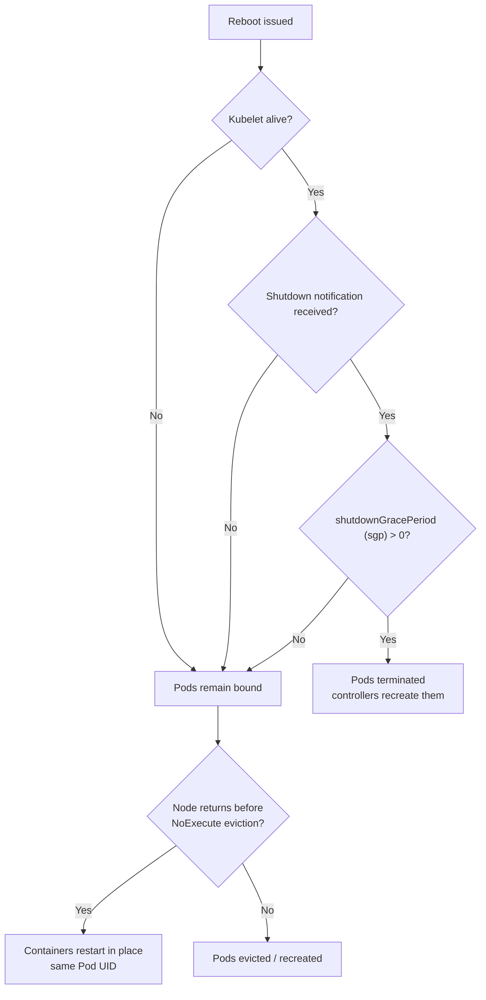
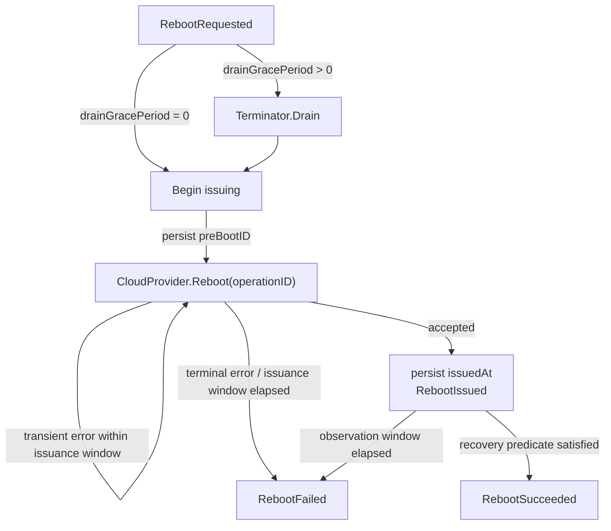
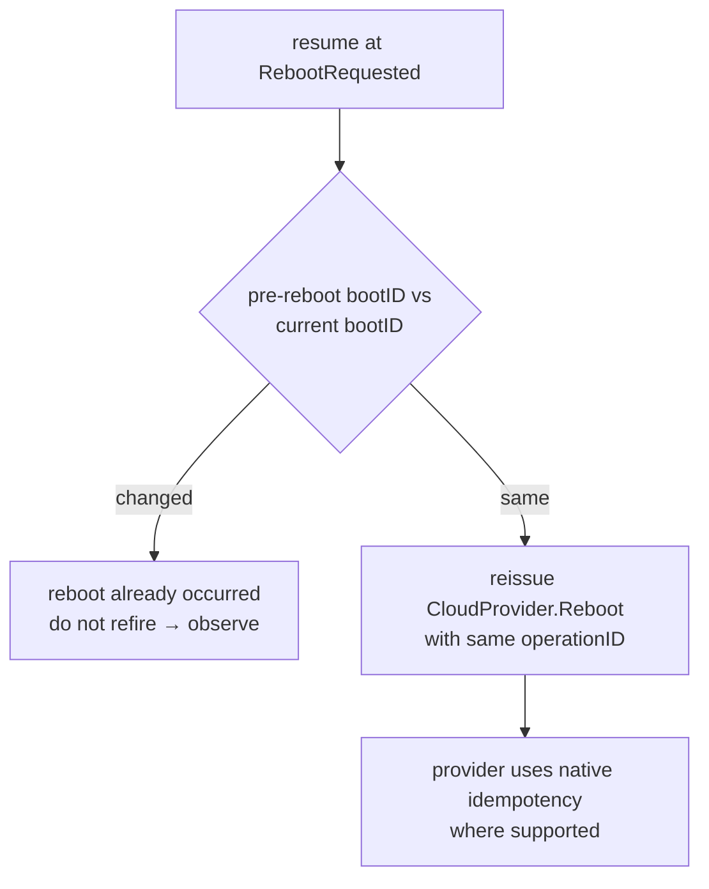

# Reboot as a Node Action in Karpenter

**Status:** Review 
**Author:** Sarthak (sarthnu)

---

## Motivation

Today Karpenter can only **replace** unhealthy nodes. Often times, it is not the correct remediation and a reboot would be better. There is no reboot verb in the `CloudProvider `interface today. This RFC adds `Reboot` as a first-class action, wired through the disruption pipeline. In the future, we will reuse this reboot lifecycle for other in-place actions like root volume replacement or GPU device resets.

### Cases where Reboot is useful

- **Reboot-clearable faults:** Faults like a transient GPU XID, a wedged kubelet or a hung container runtime are often cleared by a restart, making replace heavy handed in such situations.
- **Capacity-constrained fleets:** Users relying on difficult-to-acquire capacity would prefer rebooting their instances over terminating them. A reboot preserves the existing backing instance and capacity, whereas a terminate-and-replace releases it and may fail to reacquire equivalent capacity.
- **Node-local storage workloads:** Stateful applications using node-local storage may prefer rebooting the underlying instance over replacing it. Replacement can discard node-local state and make recovery substantially slower.

## Goals

- **Reboot primitive:** `CloudProvider.Reboot`.
- **Reboot lifecycle:** A controller that drives a reboot from start to a terminal outcome.
- **Reboot contract:** Define the core/provider boundary and the handoff to and from the controller.
- **Forceful vs graceful**: Support both, reboot immediately or drain first via the eviction API.
- **Replacement-provisioning suppression:** Prevent Karpenter from launching a replacement node for pods displaced by a reboot.
- **Observability:** Use conditions, events, and metrics so operators can always see what reboot is doing and why.

## Non-goals

- **Deciding to reboot:** Why or who triggers the reboot is out of scope.
- **Escalation semantics:** Reboot controller returns a terminal outcome to the consumer. What the consumer does with it is out of scope.
- **Reboot solving the fault:** Reboot restarts the node and observes its return. Whether the underlying fault actually cleared (repair-success) is the consumer's to judge, reboot doesn't guarantee a fix.
- **Provider-specific implementation details:** Cloud API selection, permissions, and provider-specific reboot behavior are owned by each CloudProvider implementation and are out of scope for this RFC.

---

## What this review needs consensus on

1. **Reboot primitive and provider idempotency contract.**
2. **Reboot lifecycle and restart-safety semantics.**
3. **Reboot success and failure semantics.**
4. **Residual workload semantics during reboot.**
5. **Operator observability during reboot.**
6. **Observation-window strategy and beta default.**

---

## Background

### Workload behavior during reboot

A reboot takes the node out of service for the duration of the restart. What happens to workloads depends on whether kubelet performs graceful node shutdown:



Two outcomes:

- **Destroy and recreate:** if kubelet gets the shutdown notification with `sgp > 0`, pods are terminated and recreated by their controllers.
- **Survive:** otherwise kubelet writes no terminal status; pods stay bound and if the node returns before eviction, containers restart in place.

### Customer-POV tradeoffs:

- On the **destroy** branch, a reboot disrupts workloads much like a replace. Reboot's value here lies in preserving the instance, its local data, and clearing the fault that triggered the reboot.
- On the **survive** branch, pod status remains stale as `Running` while the node is down, creating an observability gap for operators.
- Reboots exceeding the default 300s `NoExecute` toleration may trigger pod eviction, so in-place survival is best-effort, not guaranteed.
- A bounded drain may leave residual pods on the node. Karpenter does not force-delete them or introduce a reboot-specific eviction mechanism; after the reboot is issued, existing kubelet and Kubernetes node-failure semantics determine whether they restart in place or are eventually evicted.

### Why reboot needs provisioning suppression

When a node reboots it becomes `NotReady`, and pods that are terminated or evicted may become `Pending`. These look like ordinary unschedulable workload to Karpenter. Without suppression, Karpenter may launch replacement capacity even though the original node is expected to return.

### Storage across a reboot

A reboot preserves the backing instance rather than replacing it. What the workload keeps depends on the storage type and whether workload pods return to the same node.

| Storage | Behavior across a reboot |
|---|---|
| Persistent volumes | The volume itself survives. If the pod is recreated elsewhere, normal CSI detach/attach and scheduling semantics apply. |
| Local PV / node-local storage | The data remains available only with the same backing node. Local PV `nodeAffinity` constrains replacement pods back to that node. |
| Memory-backed `emptyDir` | Lost across the reboot. |

Node-local state is valuable only if the same backing instance returns, which is the property reboot preserves.

---

## Design

### The Reboot primitive: `CloudProvider.Reboot`

A new method on the `CloudProvider` interface:

```go
// Reboot requests that the instance backing the NodeClaim be restarted.
// It returns nil once the provider accepts the request; recovery is observed
// by the reboot controller.
//
// idempotencyKey identifies one logical reboot attempt. Providers that support
// native request idempotency map the key to that mechanism.
Reboot(
    ctx context.Context,
    nodeClaim *v1.NodeClaim,
    idempotencyKey string,
) error
```

The implementation must:

- **Return immediately:** Return once the provider accepts the reboot request; node recovery is observed by the lifecycle controller.
- **Honor operation identity where supported:** Core passes a stable `operationID` for the committed reboot attempt and reuses the same value on repeated invocations. Providers map it to native idempotency mechanisms where available; providers without one may ignore the key.
- **Be optional:** Providers that do not support in-place reboot return `NotImplemented`.

Provider implementations choose the underlying reboot API and map `operationID` to a native idempotency mechanism where one exists. Providers without native idempotency may ignore the key.

### The Reboot contract

Reboot follows the same split as termination: the disruption pipeline requests a reboot, and a separate controller carries it out. Core owns everything except the single fire-and-forget API call, which resides in the provider.
The handoff is persisted on the NodeClaim, so reboot survives controller restarts without in-process coordination. Reason Matching selects a `RepairPolicy`; disruption applies budget/veto, then generates a stable `operationID` for the committed reboot and patches the NodeClaim with `Rebooting(reason=RebootRequested)`, the `operationID`, and the resolved `drainGracePeriod`. The `operationID` identifies one logical reboot attempt and remains unchanged across retries and controller restarts.

```yaml
metadata:
  annotations:
    karpenter.sh/reboot-operation-id: "550e8400-e29b-41d4-a716-446655440000"
    karpenter.sh/reboot-drain-grace-period: "0s"   #from RepairPolicy; 0 = forceful, >0 = drain bound
status:
  conditions:
  - type: Rebooting
    status: "True"
    reason: RebootRequested        
    message: "rebooting for AcceleratedHardwareReady/NvidiaFabricError" 
  - type: DisruptionReason         
    status: "True"
    reason: Repair
```

The executor watches active `Rebooting` conditions, advances the lifecycle, and writes terminal `RebootSucceeded` or `RebootFailed`. The driving fault is retained for observability only; the executor does not interpret it.

### The Lifecycle

The reboot controller drives the drain-reboot-observe lifecycle for each NodeClaim, using the `Rebooting` condition's `reason` as the durable phase. After a controller restart, reconciliation resumes from the recorded phase.

```
RebootRequested ──(drain if needed)──▶ RebootIssued ──┬──▶ RebootSucceeded
                                                      └──▶ RebootFailed
```



**Draining reuses termination’s existing** `Terminator.Drain`**.** The phase remains `RebootRequested` until drain completes. For `drainGracePeriod > 0`, the executor drains with `deadline = drainStart + drainGracePeriod`, honoring PDBs and pod grace up to the deadline; residual pods ride the reboot. For `0`, drain is skipped and reboot is issued immediately.
**Karpenter does not inspect or branch on kubelet shutdown configuration.** After the reboot is issued, workload fate is governed by kubelet graceful-node-shutdown behavior and normal Kubernetes node-failure handling.

#### Issuing

Before the first provider call, the executor records the current Node `bootID` as `karpenter.sh/reboot-pre-boot-id` (used in restart safety later) then calls `CloudProvider.Reboot` with the persisted `operationID`. Transient provider errors remain in `RebootRequested` and are retried with controller backoff and jitter using the same `operationID`. A terminal provider error advances to `RebootFailed`.

On acceptance, the executor stamps `rebootIssuedAt` and advances to `RebootIssued`.

```yaml
metadata:
  annotations:
    karpenter.sh/reboot-pre-boot-id: "4e3a..."
    karpenter.sh/reboot-issued-at: "2026-08-14T10:32:04Z"

status:
  conditions:
    - type: Rebooting
      status: "True"
      reason: RebootIssued
```

#### Observing recovery

`RebootIssued` is the waiting state. Recovery requires the Node to prove a new boot, rejoin Kubernetes, and re-register the resources expected by the NodeClaim.

```go
recovered := node.Status.NodeInfo.BootID != preBootID &&
    node.Ready.Status == corev1.ConditionTrue &&
    requestedResourcesRegistered(node, nodeClaim) &&
    expectedDRAResourcesPublished(node, nodeClaim)
```

A changed `bootID` proves that the Node actually restarted. `Ready=True` proves that kubelet rejoined, while the resource checks prevent the lifecycle from completing before extended resources such as GPUs are registered again. `Initialized` is not reset or used as the recovery signal; it remains `True` across reboot. Once the recovery predicate is satisfied within the observation window, the lifecycle advances to `RebootSucceeded`; otherwise it advances to `RebootFailed`.

```yaml
status:
  conditions:
  - type: Rebooting
    status: "False"
    reason: RebootSucceeded
```

If the observation window expires before the recovery predicate is satisfied:

```yaml
status:
  conditions:
  - type: Rebooting
    status: "False"
    reason: RebootFailed
    message: "node did not recover within observation window"
```

Success here means *reboot-success* i.e. the node rebooted, rejoined, and re-registered the resources expected by the NodeClaim.

#### Observation window

- Beta uses a fixed **20-minute observation window**, starting at `rebootIssuedAt`, with early exit as soon as the recovery predicate is satisfied. The value is sized to cover slower instance types; a later refinement can make the window instance-type-aware.

#### Restart-safety

Every lifecycle phase is durable, so reconciliation resumes from the recorded state after a controller restart. The only ambiguous window is around `CloudProvider.Reboot`: the provider may have accepted the call before the executor persisted `RebootIssued`.
For recovery, the executor persists the Node's current `status.nodeInfo.bootID` **before the first provider call**. Karpenter can read this directly from the Kubernetes Node associated with the NodeClaim. The committed `operationID` is also durable and remains stable across reconciliation.
If reconciliation resumes in `RebootRequested`, the executor compares the stored pre-reboot `bootID` with the Node's current value:



A changed `bootID` is sufficient evidence that the reboot already happened, so Core does not issue another provider request. If the `bootID` is unchanged, Core reissues the same logical operation using the persisted `operationID`. Providers with native request idempotency can use the key to deduplicate the replay. Providers without native idempotency cannot provide that stronger guarantee, so a duplicate provider reboot request is possible.

#### Provisioning suppression

While a node is rebooting, Karpenter must continue advertising its capacity as returning capacity rather than treating the node as gone. While the `Rebooting` condition is active, Karpenter must not provision replacement capacity for the displaced pods. They stay `Pending` and reschedule once the node returns, or onto other existing capacity if it is available.

#### Concurrency with other disruption

While `Rebooting` condition is present on the node, it's excluded from all other disruption methods through the existing candidate eligibility check. This prevents consolidation, drift, or another repair action from racing with an active reboot; exclusion is per-node and does not block disruption elsewhere in the cluster.

#### Repeat suppression

Preventing repeated reboot attempts for the same fault is the consumer's responsibility. After requesting a reboot, the consumer should durably record the fault episode(s) covered by that attempt. If the same fault remains active after the reboot, the consumer can decide if they want to reboot again.
The reboot executor does not interpret or persist this state. It executes every committed `RebootRequested` as a new action.

---

## Observability

We will use **conditions, events, and metrics** to let operators understand why a node is out of service during a reboot and how the action progressed.

- **Condition.** The `Rebooting` NodeClaim condition is the durable source of truth for the current phase and outcome.

```
status:
  conditions:
    - type: Rebooting
      status: "True"
      reason: RebootIssued
      message: "rebooting for AcceleratedHardwareReady/NvidiaFabricError"
```

- **Events.** The reboot controller emits a NodeClaim event at each significant transition: `RebootRequested`, `RebootIssued`, and `RebootSucceeded` or `RebootFailed`.

```
type: Normal
reason: RebootIssued
message: "reboot requested for AcceleratedHardwareReady/NvidiaFabricError"
regarding:
  kind: NodeClaim
  name: default-abc123
```

- **Metrics**

```
karpenter_node_reboot_total{condition="AcceleratedHardwareReady",outcome="succeeded"}
karpenter_node_reboot_duration_seconds{condition="AcceleratedHardwareReady"}
```

---

## Risks and Mitigation

- **Reboot causes workload disruption.** On the destroy path, pods are terminated and may bind to existing capacity elsewhere; they are not guaranteed to return to the rebooting node.


  **Mitigation:** reboot is disruption-budgeted, and provisioning suppression avoids launching unnecessary replacement capacity while the node is expected to return.

- **Residual pods may remain bound and unavailable.** After the bounded drain expires, reboot proceeds with any residual pods still bound to the node. On the survive path, Pod status may remain stale as `Running` while the node is unavailable; sufficiently slow reboots may also trigger normal `NotReady`/`Unreachable` `NoExecute` eviction. In-place survival is therefore best-effort, not guaranteed.


  **Mitigation:** expose reboot as a first-class `Rebooting` NodeClaim condition, with Events and metrics, rather than relying on Pod status to communicate availability. Karpenter does not force-delete residual pods or introduce a reboot-specific eviction policy; workload-defined tolerations remain authoritative.


* **A failed reboot can leave StatefulSets stuck.** A pod using an RWO persistent volume may remain associated with the unavailable node while the reboot is unresolved, preventing the volume from being attached elsewhere and leaving the workload stuck.

  **Mitigation**: Escalating to replacement allows normal storage detach/attach recovery to proceed. Whether and when the consumer escalates `RebootFailed` is out of scope here. Until then, `RebootFailed` is a terminal execution outcome that the consumer must act on.


- **Providers without native idempotency may receive a duplicate reboot request after a controller restart.** This can occur if the provider accepted `Reboot` but the controller restarted before persisting `RebootIssued`, while the Node's `bootID` has not yet changed.


  **Mitigation:** Core persists a stable `operationID` and reuses it for the logical reboot, allowing providers with native idempotency to deduplicate replays. Core also avoids reissuing once a changed `bootID` proves the reboot occurred. Providers without native idempotency cannot provide an exactly-once reboot guarantee across this narrow window.


- **Observation-window default.** Beta uses a fixed observation window. If too short, slow-rebooting nodes may be incorrectly marked `RebootFailed`; if too long, failure detection is delayed.

  **Mitigation**: set the default from measured reboot times across various instance types and implement the dynamic window as a fast-follow.

---

## Alternatives considered

- **Executor-owned repeat suppression.** Persist fault episodes already covered by reboot (`{reason, activeSince}`) in the executor so it can reject repeated attempts for the same fault. Rejected: deciding whether a fault is eligible for another reboot is action-selection policy and belongs to the consumer. The executor treats every committed `RebootRequested` as a new action.
- `bootID` **as the recovery signal.** Use a change in `node.status.nodeInfo.bootID` alone to declare success. Rejected: a changed boot ID proves the instance rebooted, but not that kubelet rejoined or that expected extended resources registered again. Recovery therefore requires changed `bootID`, `Ready=True`, and expected resource registration.
- **Force-delete residual pods.** Force-delete pods that remain after the drain deadline before issuing reboot. Rejected: deleting the API object does not prove the old process stopped when kubelet is unavailable, can create unsafe duplicate identity for stateful workloads, and removes the possibility of in-place recovery.
- **Apply a reboot-specific `NoExecute` taint.** Use a dedicated taint to evict residual pods before or during reboot. Rejected: Kubernetes already uses `NotReady`/`Unreachable` `NoExecute` taints and workload-defined tolerations to control how long pods remain bound to an unavailable node. A reboot-specific taint would override that customer policy and duplicate existing node-failure semantics.
- **Apply `node.kubernetes.io/out-of-service`.** Mark the node out of service during reboot so pods are force-deleted and volumes detach. Rejected: `out-of-service` is a fencing/non-graceful-shutdown recovery mechanism for a node known to be out of service, while reboot expects the same node to return. It may be considered by later escalation logic after a failed reboot when the node is known to be safely fenced.

---