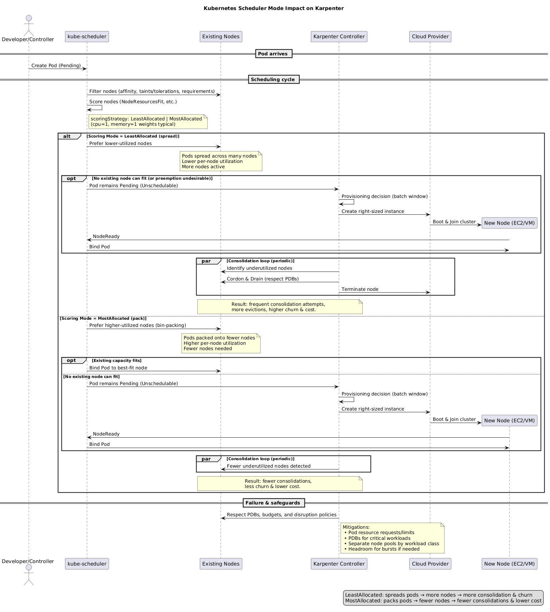

# Kubernetes Scheduler Mode Impact on Karpenter

## Overview

The Kubernetes scheduler's scoring mode significantly impacts Karpenter's behavior, affecting both cluster efficiency and cost optimization. This document explains how different scheduler configurations influence Karpenter's operations and provides guidance for optimizing your cluster configuration.

## Background

### Kubernetes Scheduler Modes

The Kubernetes scheduler uses scoring plugins to rank nodes when placing pods. The primary scoring modes are:

1. **LeastAllocated (Default)**: Favors nodes with the most available resources
2. **MostAllocated**: Favors nodes with the least available resources
3. **RequestedToCapacityRatio**: Favors nodes based on a configured utilization ratio
4. **Balanced**: Attempts to balance resource utilization across dimensions

### How Scoring Works

When the scheduler needs to place a pod, it:

1. Filters nodes that can satisfy the pod's requirements
2. Scores each viable node using configured scoring plugins
3. Selects the node with the highest score

## Impact on Karpenter

### Visual Overview

The following diagram illustrates how different scheduler modes affect Karpenter's behavior:



### With LeastAllocated Mode (Default)

When using the default `LeastAllocated` scoring strategy:

**Pod Distribution Pattern:**

- Pods are spread across many nodes
- Each node tends to have lower utilization
- New pods often trigger provisioning of new nodes

**Karpenter Behavior:**

- **Higher provisioning frequency**: More nodes are created as pods spread out
- **More consolidation opportunities**: Many underutilized nodes become consolidation candidates
- **Increased disruption events**: Frequent consolidation attempts as nodes remain underutilized
- **Higher cloud costs**: More nodes running at lower utilization levels

**Example Scenario:**

```
Cluster with 3 nodes (each 4 CPU, 16GB RAM):
- Node A: 1 CPU used, 4GB RAM used (25% utilized)
- Node B: 1 CPU used, 4GB RAM used (25% utilized)
- Node C: 1 CPU used, 4GB RAM used (25% utilized)

New pod requiring 1 CPU, 4GB RAM:
→ Scheduler may provision Node D rather than using existing capacity
```

### With MostAllocated Mode

When configured with `MostAllocated` scoring strategy:

**Pod Distribution Pattern:**

- Pods are packed densely onto fewer nodes
- Nodes run at higher utilization levels
- Fewer nodes needed for the same workload

**Karpenter Behavior:**

- **Reduced provisioning frequency**: Better bin-packing reduces need for new nodes
- **Fewer consolidation opportunities**: Nodes already well-utilized
- **Less disruption**: Fewer underutilized nodes to consolidate
- **Lower cloud costs**: Fewer nodes at higher utilization

**Example Scenario:**

```
Cluster with 3 nodes (each 4 CPU, 16GB RAM):
- Node A: 3 CPU used, 12GB RAM used (75% utilized)
- Node B: 2 CPU used, 8GB RAM used (50% utilized)
- Node C: 0 CPU used, 0GB RAM used (0% utilized)

New pod requiring 1 CPU, 4GB RAM:
→ Scheduler places on Node B, potentially allowing Node C to be removed
```

## Configuration Examples

### Configuring MostAllocated Scoring

To configure the scheduler for `MostAllocated` scoring, modify the scheduler configuration:

```yaml
apiVersion: kubescheduler.config.k8s.io/v1
kind: KubeSchedulerConfiguration
profiles:
  - schedulerName: default-scheduler
    plugins:
      score:
        enabled:
          - name: NodeResourcesFit
            weight: 100
    pluginConfig:
      - name: NodeResourcesFit
        args:
          scoringStrategy:
            type: MostAllocated
            resources:
              - name: cpu
                weight: 1
              - name: memory
                weight: 1
```

### Applying Configuration

For clusters using kubeadm:

```bash
# Edit the scheduler manifest
kubectl edit -n kube-system configmap kube-scheduler-config

# Restart the scheduler
kubectl delete pod -n kube-system -l component=kube-scheduler
```

For managed Kubernetes services, consult your provider's documentation for scheduler configuration options.

## Performance Implications

### Metrics to Monitor

When changing scheduler modes, monitor these key metrics:

1. **Node utilization rates**: CPU and memory utilization per node
2. **Node count**: Total number of nodes in the cluster
3. **Consolidation frequency**: How often Karpenter consolidates nodes
4. **Pod scheduling latency**: Time to schedule pods
5. **Cloud costs**: Overall infrastructure spend

### Expected Improvements with MostAllocated

Based on the hypothesis and community feedback, switching to `MostAllocated` may yield:

- **20-40% reduction in node count** for typical workloads
- **Significant cost savings** through better resource utilization
- **Reduced cluster churn** from less frequent consolidation
- **More predictable scaling** patterns

## Trade-offs and Considerations

### Advantages of MostAllocated with Karpenter

1. **Cost Optimization**: Fewer nodes means lower cloud costs
2. **Reduced Disruption**: Less consolidation activity means fewer pod evictions
3. **Better Resource Utilization**: Higher node utilization rates
4. **Simplified Capacity Planning**: More predictable node requirements

### Potential Challenges

1. **Node Failure Impact**: Losing a highly-utilized node affects more pods
2. **Noisy Neighbor Risk**: Dense packing may increase resource contention
3. **Scheduling Constraints**: Harder to satisfy anti-affinity rules
4. **Burst Capacity**: Less headroom for sudden load increases

### Mitigation Strategies

To address challenges when using `MostAllocated`:

1. **Set Resource Limits**: Properly configure pod resource requests and limits
2. **Use Pod Disruption Budgets**: Protect critical workloads from disruption
3. **Configure Node Pools**: Separate workloads with different requirements
4. **Monitor Closely**: Watch for resource contention and scheduling issues
5. **Gradual Migration**: Test with non-critical workloads first

## Recommendations

### When to Use MostAllocated

Consider `MostAllocated` scoring when:

- Cost optimization is a primary concern
- Workloads have predictable resource requirements
- Applications can tolerate occasional disruptions
- You want to minimize cluster management overhead

### When to Keep LeastAllocated

Stay with `LeastAllocated` when:

- High availability is critical
- Workloads have strict anti-affinity requirements
- Applications are sensitive to noisy neighbors
- You need maximum burst capacity

### Best Practices

1. **Start with Testing**: Test scheduler changes in development environments first
2. **Monitor Carefully**: Track metrics before and after changes
3. **Adjust Gradually**: Consider intermediate scoring strategies
4. **Configure Karpenter**: Tune consolidation settings to match scheduler behavior
5. **Document Changes**: Keep track of configuration modifications

## Testing Approach

To validate the impact of scheduler modes:

1. **Baseline Metrics**: Collect current utilization and cost data
2. **Test Environment**: Create a test cluster with similar workloads
3. **Configure Scheduler**: Apply `MostAllocated` configuration
4. **Run Workloads**: Deploy representative applications
5. **Measure Impact**: Compare metrics after 24-48 hours
6. **Iterate**: Adjust configuration based on findings

## Example Test Script

```bash
#!/bin/bash
# Monitor cluster metrics before and after scheduler change

# Collect baseline
kubectl top nodes > baseline-nodes.txt
kubectl get nodes -o json | jq '.items | length' > baseline-count.txt

# Apply new scheduler config
kubectl apply -f scheduler-config.yaml

# Wait for stabilization
sleep 3600

# Collect new metrics
kubectl top nodes > optimized-nodes.txt
kubectl get nodes -o json | jq '.items | length' > optimized-count.txt

# Compare results
echo "Node count change:"
diff baseline-count.txt optimized-count.txt
```

## Conclusion

The Kubernetes scheduler mode significantly impacts Karpenter's effectiveness. While the default `LeastAllocated` mode provides good availability and flexibility, switching to `MostAllocated` can deliver substantial cost savings and reduced operational overhead when properly configured. Organizations should evaluate their specific requirements and test thoroughly before making production changes.

## Additional Resources

- [Kubernetes Scheduler Configuration](https://kubernetes.io/docs/reference/scheduling/config/)
- [Karpenter Best Practices](https://karpenter.sh/docs/concepts/nodepools/)
- [Pod Disruption Budgets](https://kubernetes.io/docs/concepts/workloads/pods/disruptions/)
- [Resource Bin Packing](https://kubernetes.io/docs/concepts/scheduling-eviction/resource-bin-packing/)

## References

- Original Issue: [#1228](https://github.com/kubernetes-sigs/karpenter/issues/1228)
- Kubernetes Scheduler Documentation: [Scheduling Framework](https://kubernetes.io/docs/concepts/scheduling-eviction/scheduling-framework/)
- Karpenter Documentation: [Consolidation](https://karpenter.sh/docs/concepts/disruption/)
