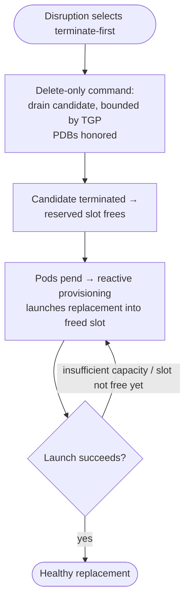

# Terminate-First Disruption for Capacity-Constrained NodePools

## Motivation

Karpenter cannot voluntarily disrupt a node on a fleet that has no room to grow. Voluntary disruption replaces a node by launching its replacement first and removing the original only once the replacement is ready, which requires spare capacity. Fleets on reserved capacity (e.g. on-demand capacity reservations) have none, so drift stalls and voluntary repair can't fire. The operator is left to swap nodes by hand — a large reserved GPU fleet can sit un-rolled for weeks because Karpenter will not remove a node it cannot first replace.

This RFC proposes a second replacement strategy for those fleets: **terminate the node first, then let normal reactive provisioning launch the replacement into the slot that frees.** Karpenter selects between the two strategies automatically from the fleet's capacity posture; the disruption budget continues to pace terminations, and PDBs bound how much of a workload is down at once.

The replacement strategy is aligned with turning node repair into a voluntary disruption, but repair is not the only caller. Drift is another driver (see [#2906](https://github.com/kubernetes-sigs/karpenter/pull/2906) and its draft implementation [#2955](https://github.com/kubernetes-sigs/karpenter/pull/2955)), so the strategy is designed as a primitive both share.

### Use Cases

1. **Reserved-capacity GPU fleet.** An operator pins a NodePool to a capacity reservation sized to exactly N accelerators and runs N nodes, with no on-demand fallback because the workload requires the reserved hardware. An AMI rolls; drift wants to replace nodes but can't replace-first, because the replacement would be an (N+1)th instance the reservation doesn't cover, so drift stalls indefinitely.
2. **Static NodePool at `limits`.** An operator caps a NodePool at a fixed node count. A replacement would exceed the cap, so voluntary disruption can't stage one, and the pool cannot self-heal or roll without manual intervention.

### Non-Goals

- **Handling launch *failures* (insufficient capacity, a bad AMI, transient errors).** This RFC targets capacity that is *structurally* full, known before acting, not a launch that was attempted and failed. A failure must never flip a NodePool to terminate-first; that case keeps replacing-first under the existing per-NodePool launch backoff.
- **Structurally guaranteeing against a runaway.** The design bounds blast radius with the budget and PDBs (no worse than a delete-first disruption); it does not add machinery to make over-termination *impossible*. That stronger guarantee is a documented alternative (below), not the proposal.
- **Replace Root Volume.** Drift on capacity-constrained pools could also be addressed by replacing the root volume in place. That applies to drift but not repair, and requires that the instance/AMI support it. This feature is still necessary even with replace-root-volume, and they complement each other.

## Proposal

Terminate-first is two steps: Karpenter *selects* the strategy from the fleet's capacity posture, then *executes* it.

### Proposed Spec

No user-facing API. The strategy is derived from configuration the operator has already supplied (the reservation binding or the static `limits`), so there is no new field, annotation, or CRD. An explicit field was considered and rejected (see Alternatives).

### How It Works

Karpenter derives the choice from configuration the operator already supplied:

- **Static capacity** — read the NodePool directly: at `NodePool.Spec.Replicas` (the static-drift controller already compares against it), there is no room to grow, so terminate-first.
- **Dynamic capacity** — run the pipeline's scheduling simulation as if the candidate were already gone, which frees its slot in the reservation. If the simulation can only place the replacement back into that same reservation, capacity can't grow and we terminate-first; if it finds any other option (including on-demand), we replace-first as today.

**Executing — a delete-only command, then reactive provisioning.** Once terminate-first is selected, the disruption command carries **no replacement** — it is delete-only, the same shape consolidation already emits when it removes a node whose pods fit elsewhere. Karpenter cordons and drains the candidate (bounded by TGP, honoring PDBs), then deletes it. Its pods go pending, and the ordinary provisioning loop creates a replacement for them, scheduling into the slot the terminated node freed. If the slot isn't free yet (reservation not yet released, or a shared reservation was claimed by another consumer), the launch hits insufficient capacity and provisioning retries on its normal requeue cadence until it succeeds.

Nothing here is new mechanism: delete-only commands, drain, and reactive provisioning all exist today. What this adds is only the *decision* to issue a delete-only command where Karpenter would otherwise replace-first.

### Interaction with Existing Features

- **Disruption budgets** continue to pace terminations. They bound the *delete* side only: the intended replacement is not represented until reactive provisioning creates it, so a budget of N caps the fleet to N concurrent terminate-first swaps. This is the primary limit on blast radius.
- **PDBs.** The drain honors them, so no more of a workload is down at once than its PDB allows. That backstop bounds the capacity gap on the workload side.
- **`terminationGracePeriod` (TGP)** bounds the drain (see Edge Cases). TGP and the capacity configuration are both NodePool/NodeClass-scoped, so the same operator owns both.
- **Reactive provisioning** is unchanged. It remains the replacement path; terminate-first hands it the pending pods it already serves.

### Observability

- **Metric.** Add a `replacement_mode` label (`replace_first` / `terminate_first`) to the existing per-NodePool disruption-decision counter (`karpenter_voluntary_disruption_decisions_by_nodepool_total`). Terminate-first is otherwise recorded as `decision=delete`, which conflates with ordinary empty-node deletion; the label disambiguates and makes adoption graphable per pool.
- **Event.** Keep the existing disruption termination Event; add a distinct reason/message on it when the strategy is terminate-first (e.g. "terminating before replacement: reserved capacity full") so `kubectl describe node` explains why the node went without a pre-staged replacement. No new Event type.
- **Capacity-gap window.** Covered initially by existing signals: `karpenter_pods_unschedulable_count` (the freed pods flow through it while the slot is unavailable) plus `karpenter_nodeclaims_disrupted_total{nodepool}`. A dedicated per-NodePool "replacement pending" gauge would attribute the gap more cleanly but has no state owner in this no-new-object design; it is deferred (Open Questions).

### Edge Cases

- **Indefinite drain → indefinite downtime.** With no replacement serving yet, evicted pods have nowhere to go *during* the drain, so drain time is downtime; if one pod drains indefinitely, the node's other pods are unavailable indefinitely. TGP bounds it. For pools that set no TGP, terminate-first supplies a default so the drain is still bounded and never hangs indefinitely. (Where that default is injected is an Open Question.)
- **Pod-trickle.** Neither target case is affected. As a node drains, pods are recreated gradually, so the provisioner may bin-pack a few at a time into several small nodes instead of one full-size replacement. But for a reservation the instance type is fixed, and for a static pool size is immaterial. It would only need attention if the strategy were extended to size-sensitive pools.
- **Slot claimed on a shared reservation.** After the candidate terminates, another consumer of the same reservation can claim the freed slot before Karpenter relaunches. The relaunch hits insufficient capacity and reactive provisioning retries; the pool is short a node until a slot frees again. The same budget/PDB envelope bounds it, and the pool self-recovers once a slot frees.

## Alternatives Considered

### Alternative 1: An explicit `disruption.resolutionPolicy: Terminate` field

[#2955](https://github.com/kubernetes-sigs/karpenter/pull/2955) is a counter-proposal in which an operator sets a NodePool field to opt into terminate-first. Rejected because Karpenter prefers deriving over new config where it can, and the operator has *already* declared the posture by pinning a reservation or setting a static limit; a field would restate that and could contradict it. It remains the fallback if the posture proves not reliably derivable at runtime.

### Alternative 2: A gated replacement NodeClaim

Represent the intended replacement as a real NodeClaim held pre-launch by a new `AwaitingCapacity` status condition, created when the candidate is terminated and launched once the slot frees: a durable, counted intent, so the budget can hold its slot and never over-terminate. This is the structural fix for the runaway that the proposal only bounds (budgets pace the delete side but not the recreation). Rejected for the first cut because it costs real new machinery: a `cluster.Synced()` carve-out so a provider-ID-less claim doesn't wedge scheduling, budget-counting that treats candidate and replacement as one, injecting the gated claim into the scheduler as in-flight capacity to avoid a double-launch, and a give-up bound on the wait. The proposal builds none of it and is compatible with adding it later, so this is the natural escalation if the budget/PDB bound proves too loose for reserved fleets.

## Backward Compatibility

No API changes, so all existing YAML keeps working unchanged and there is no migration. Terminate-first only ever activates where replace-first cannot run, so no headroom fleet changes behavior. On downgrade to a Karpenter without this logic, affected pools revert to today's behavior (replace-first stalls on a full reservation) with no orphaned state, because the design introduces no new object or field to leave behind.

## Graduation Criteria

Ship terminate-first behind its own feature flag, **on by default**, with the goal of removing the flag once it is proven. On-by-default is the right posture because terminate-first only activates where replace-first cannot run — so it never touches a healthy fleet — and an operator who does not want it already has the lever: disruption budgets and `do-not-disrupt`. A pool that sets its drift/repair budget to zero opts out entirely, and the behavior change is called out in the release upgrade guide, so no one inherits it unaware. The flag itself is the fleet-wide kill-switch for the case where the blast-radius bound (budget + PDBs) proves too loose in practice.

- **Beta (flag exists, on by default).** The flag guards the new speculative-disruption posture while the shared-reservation contention and reservation-release-timing behaviors (Open Questions) get real-world validation. Budgets remain the per-pool opt-out.
- **GA (flag removed).** Remove the flag once the behavior is stable across releases and the observability (Observability section) has demonstrated the capacity-gap bound holds at scale. At that point terminate-first is simply how capacity-constrained pools are disrupted.

## Open Questions

1. **Default TGP injection.** Terminate-first can result in unbounded downtime if there is unbounded drain. This design does not propose adding a new default TGP.
2. **Per-NodePool capacity-gap metric.** Whether to add a dedicated "replacement pending" gauge (net-new, needs a state owner) or rely on the existing `pods_unschedulable_count` + disrupted-counter signals initially.
3. **Reservation release timing.** How long a reserved slot takes to become available after our instance terminates is not well characterized; the relaunch-retry behavior tolerates it, but it should be validated end-to-end, especially against the shared-reservation contention case.
4. **Static-`limits` scope for the first cut.** Whether to ship both reserved and static-at-`limits` together, or land reserved first (where the slot is contractually the operator's) and defer static, is a launch-sequencing decision for review.

## References

- [#2905 — Support disruption policies that allow terminate-before-create for fixed capacity use cases](https://github.com/kubernetes-sigs/karpenter/issues/2905) — the request this RFC answers.
- [#2906 — docs: RFC to introduce node replacement strategies during drift, starting with optionally not requiring replacements](https://github.com/kubernetes-sigs/karpenter/pull/2906) — the drift-side driver of the same primitive.
- [#2955 — feat: Add driftResolutionPolicy to NodePools](https://github.com/kubernetes-sigs/karpenter/pull/2955) — draft implementation and the explicit-field alternative (Alternatives).
