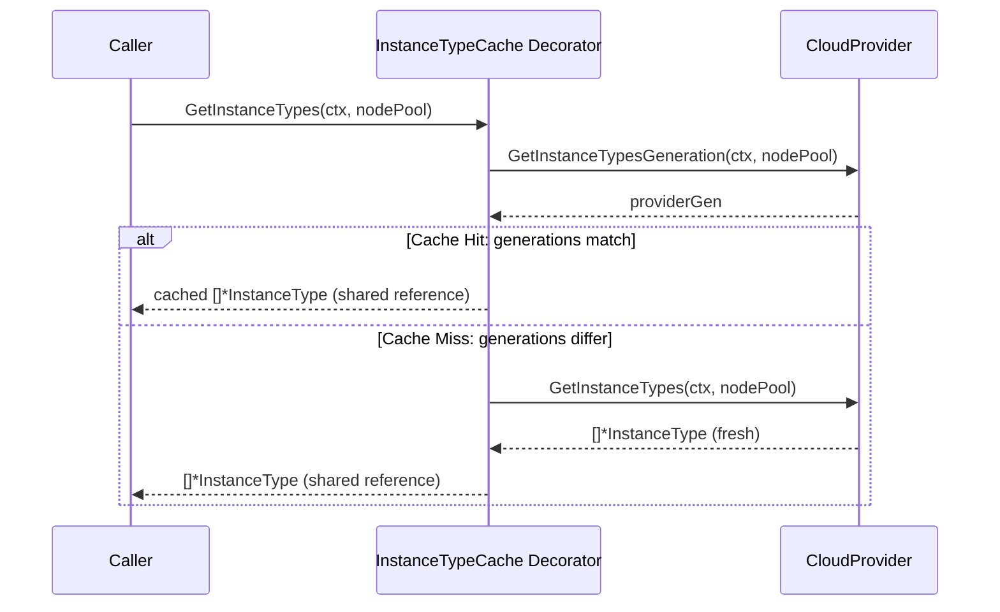
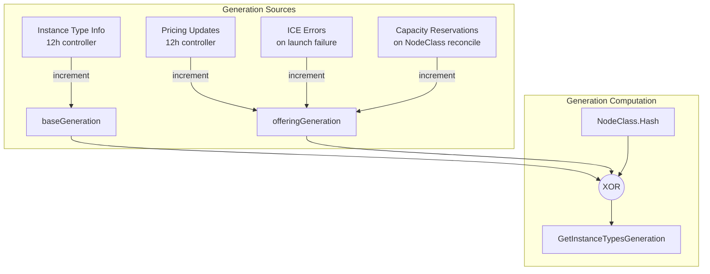

# RFC: Upstream Instance Type Caching

## Overview

This design proposes moving instance type caching upstream to Karpenter core via a CloudProvider decorator that eliminates deep copying overhead. Currently, providers may cache instance types internally and core Karpenter must regularly call GetInstanceTypes to validate that there is no staleness. Because providers cannot guarantee that core Karpenter won't modify the returned instance types and core Karpenter can't guarantee that providers won't modify the returned instance types, all instance types must be deep copied. This wastes memory and cpu.

- https://github.com/kubernetes-sigs/karpenter/issues/2605

## User Stories

1. As a cluster operator, I want instance type lookups to be fast so that provisioning decisions happen quickly without unnecessary CPU overhead.
2. As a Karpenter developer, I want a single caching layer so that cache invalidation logic is centralized and easier to maintain.
3. As a cloud provider implementer, I want a simple interface for signaling data staleness so that I don't need to implement complex caching logic in my provider.

## Problem Statement

**Current Architecture:**
```
AWS Provider (caches) → returns []*InstanceType → Overlay Decorator (deep copies every call) → Caller
                                                  ↑ expensive deep copy on EVERY call
```

Every call to `GetInstanceTypes` triggers a deep copy of all instance types with all their offerings. This is wasteful because:
- The overlay decorator must deep copy to safely apply NodeOverlay modifications
- Multiple callers (provisioner, drift controller) each trigger separate deep copies
- Some providers already cache, creating redundant caching layers

## Proposal

Introduce a generation-based caching decorator in core Karpenter that:
1. Combines caching and overlay application into a single component
2. Uses generation numbers for cache invalidation (no TTL)
3. Returns shared references to callers (no deep copy)

**Proposed Architecture:**
```
AWS Provider (no caching) → InstanceTypeCache Decorator (caches + applies overlays once) → Caller
                            ↑ returns shared references, NO deep copy
```

### CloudProvider Interface Addition

```go
type CloudProvider interface {
    // ... existing methods
    
    // GetInstanceTypesGeneration returns a generation number for instance type data.
    // The generation changes when any data that affects GetInstanceTypes output changes.
    // The decorator polls this on each GetInstanceTypes call. If the generation
    // differs from the cached generation, the decorator refetches from GetInstanceTypes.
    GetInstanceTypesGeneration(ctx context.Context, nodePool *v1.NodePool) (uint64, error)
    
    GetInstanceTypes(context.Context, *v1.NodePool) ([]*InstanceType, error)
}
```

### InstanceTypeCache Decorator

```go
// pkg/cloudprovider/instancetypecache/decorator.go (NEW FILE in core Karpenter)

type Decorator struct {
    cloudprovider.CloudProvider
    overlayStore *nodeoverlay.InstanceTypeStore
    
    mu    sync.RWMutex
    cache map[string]*cachedInstances // keyed by NodePool name
}

type cachedInstances struct {
    instanceTypes      []*cloudprovider.InstanceType
    providerGeneration uint64
    overlayGeneration  uint64
}
```


## Design Options

### Option 1: Generation-Based Caching Decorator - Recommended

A single decorator in core Karpenter that:
- Wraps the CloudProvider and caches `GetInstanceTypes` results
- Polls `GetInstanceTypesGeneration()` on each access to check staleness
- Applies NodeOverlay modifications once when caching, not on every call
- Returns shared references to callers

Pros:
- Reduces Deep Copy overhead
- Single source of truth for caching logic
- Simple invalidation model (generation comparison)
- Provider stays simple - just exposes a generation number
- Standard decorator pattern, easy to compose

Cons:
- Requires interface change to CloudProvider (new method)
- All cloud providers must implement `GetInstanceTypesGeneration()`
- Callers must treat returned data as read-only

### Option 2: TTL-Based Caching with Deep Copy

Keep the current architecture but optimize the deep copy operation.

Pros:
- No interface changes required
- Callers can safely modify returned data

Cons:
- Deep copy overhead remains (even if optimized)
- TTL-based invalidation can serve stale data or invalidate too eagerly
- Dual caching layers (provider + decorator) remain

### Option 3: Copy-on-Write with Immutable Types

Make `InstanceType` immutable and use copy-on-write semantics for modifications.

Pros:
- Safe sharing without deep copy
- No interface changes

Cons:
- Significant refactor of InstanceType usage patterns
- Complex implementation
- May not eliminate all copying scenarios

## Recommendation

Option 1 (Generation-Based Caching Decorator) is recommended because:
1. It significantly reduces deep copy overhead
2. Generation-based invalidation is precise - cache refreshes exactly when data changes
3. The interface change is minimal (one new method)
4. It simplifies the provider implementation by removing caching responsibility
5. It allows for further refactors that introduce immutable instance types

## Architecture Diagrams

### Component Interaction Flow



### Generation Sources (AWS Provider)



## Implementation Details (illustrative)

### Decorator Implementation

```go
func (d *Decorator) GetInstanceTypes(ctx context.Context, nodePool *v1.NodePool) ([]*cloudprovider.InstanceType, error) {
    providerGen, err := d.CloudProvider.GetInstanceTypesGeneration(ctx, nodePool)
    if err != nil {
        return nil, fmt.Errorf("getting instance types generation, %w", err)
    }
    
    var overlayGen uint64
    if options.FromContext(ctx).FeatureGates.NodeOverlay {
        overlayGen = d.overlayStore.Generation(nodePool.Name)
    }
    
    d.mu.RLock()
    entry, exists := d.cache[nodePool.Name]
    d.mu.RUnlock()
    
    if exists && entry.providerGeneration == providerGen && entry.overlayGeneration == overlayGen {
        return entry.instanceTypes, nil // Cache hit - shared reference
    }
    
    // Cache miss - fetch and cache
    instanceTypes, err := d.CloudProvider.GetInstanceTypes(ctx, nodePool)
    if err != nil {
        return nil, err
    }
    
    if options.FromContext(ctx).FeatureGates.NodeOverlay {
        instanceTypes, err = d.overlayStore.ApplyAll(nodePool.Name, instanceTypes)
        if err != nil {
            return nil, fmt.Errorf("applying nodeoverlays, %w", err)
        }
    }
    
    d.mu.Lock()
    d.cache[nodePool.Name] = &cacheEntry{
        instanceTypes:      instanceTypes,
        providerGeneration: providerGen,
        overlayGeneration:  overlayGen,
    }
    d.mu.Unlock()
    
    return instanceTypes, nil
}
```

### AWS Provider Generation Implementation

```go
func (p *DefaultProvider) Generation(ctx context.Context, nodeClass NodeClass) uint64 {
    p.generationMu.RLock()
    baseGeneration := p.generation
    p.generationMu.RUnlock()
    
    offeringGeneration := p.offeringProvider.Generation()
    nodeClassHash := nodeClass.Hash()
    
    return baseGeneration ^ offeringGeneration ^ nodeClassHash
}
```

### Generation Change Triggers (AWS)

| Trigger | Component | Frequency |
|---------|-----------|-----------|
| Instance type info update | `instancetype.Provider` | Every 12h |
| Zone offerings update | `instancetype.Provider` | Every 12h |
| On-demand pricing update | `offering.Provider` | Every 12h |
| Spot pricing update | `offering.Provider` | Every 12h |
| ICE error | `offering.Provider` | On launch failure |
| ICE error expiry | `offering.Provider` | On 3min TTL expiry |
| Capacity reservation change | `offering.Provider` | On NodeClass reconcile |
| NodeClass change | Via `nodeClass.Hash()` | On user edit |

## Migration Path

1. **Phase 1**: Add `GetInstanceTypesGeneration()` to CloudProvider interface and `InstanceTypeCache` decorator to core Karpenter
3. **Phase 2**: Providers implement GetInstanceTypesGeneration() when bumping core Karpenter version.

## Next Steps

- [ ] Add `GetInstanceTypesGeneration()` to CloudProvider interface
- [ ] Implement InstanceTypeCache decorator in core Karpenter
- [ ] Implement generation tracking in AWS provider's instancetype and offering providers
- [ ] Wire decorator into operator initialization
- [ ] Remove existing overlay decorator
- [ ] Update KWOK and other providers to implement the new interface
- [ ] Add metrics for cache hit/miss rates
